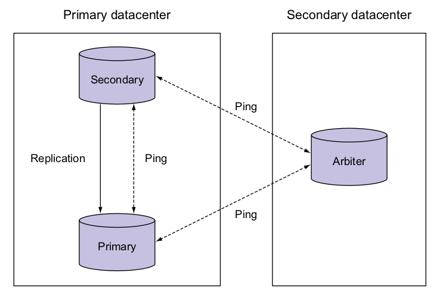

# MongoDB Replications


### Minimum recommended replicas: THREE 
Two members that hold data and an arbiter



Two of these three nodes serve as first-class, persistent *mongod* instances (full data), one of which is a primary.

The third node is an arbiter, a lightweight *mongod* server, does not replicate data

A primary node is the only
member in the set that can accept write operations.

A secondary node provides read services and replicates data from primary.

An arbiter participates in voting/selecting/managing which of the other nodes are secondary and which one is primary.

### Replication Mechanism
An *oplog* and a *heartbeat*

* *Oplog* 

is a capped collection that lives in a database called local on every replicating node and records all
changes to the data.

First, the write is recorded and then added to the primary’s oplog. Meanwhile, all secondaries have their own oplogs that replicate the primary’s oplog by polling.

Change oplog temp record storage size:
```
mongod --replSet myapp --oplogSize 1024
```
If too small, secondaries might easily miss replication data and causing replication failure.

* *Heartbeat*

is for secondaries knowing the sync point from which sync should start. Heartbeat fails for not knowing where to start sync.

Whole dataset re-sync is required for failed heartbeat.

## Setup A Replication Set Practice

```bash
# mkdir for three mongod nodes
mkdir ~/node1
mkdir ~/node2
mkdir ~/arbiter

# set replication set named `myapp`
mongod --replSet myapp --dbpath ~/node1 --port 40000
mongod --replSet myapp --dbpath ~/node2 --port 40001
mongod --replSet myapp --dbpath ~/arbiter --port 40002
```

Select one as primary
```bash
mongo --port 40000
```

Login into this mongo node and run
```bash
# primary init
rs.initiate()
# add a secondary
rs.add("iron.local:40001")
# add an arbiter
rs.addArb("iron.local:40002")
# check is primary
db.isMaster()
# check configs
rs.status()
```