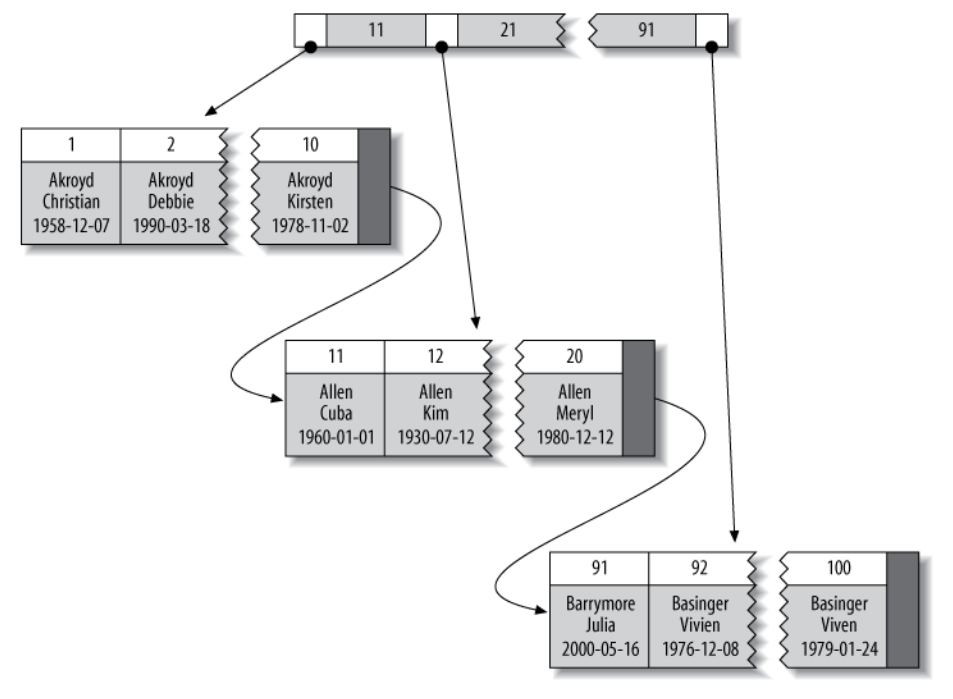

# Indexing

Rule of thumb: always remember to make most selective columns as keys.

## B-Tree Indexing

MYSQL engine uses *B-Tree* indexing, where key/index columns are used as the reference to sort data entries in order.

B-Tree indexes work well for lookups by the full key value, a key range, or a key prefix.

Indexing does not work when non-indexed columns are used as search condition (e.g., by `WHERE`)

## Hash Indexing

Engine may compute a hash value for one or a set of keys and store it into a hash table. The hash value maps to a pointer to the row entry.

It only supports lookup (value match), does not work for range search or complex 

Declared as
```sql
CREATE TABLE testhash (
    firstname VARCHAR(50) NOT NULL,
    lastname VARCHAR(50) NOT NULL,
    KEY USING HASH(firstname)
) ENGINE=MEMORY;
```

## Clustered/Non-clustered index

* clustered index

A clustered index defines the order in which data is physically stored in a table (by which column it constructs a tree). Table data can be sorted in only way, therefore, there can be only one clustered index per table.

For example, given a B-tree physical storage structure below, entry rows have individual index column (marked as shadow rectangle), which is a pointer linked to relevant `WHERE` condition rows (as specified in `KEY`).



* non-clustered index

A non-clustered index is stored at one place (separately as a reference list (also a tree with nodes storing key-address pairs) to where corresponding rows are addressed) and table data is stored in another place.

Query over non-clustered indices needs to first look over a reference list then to fetch row data, hence slower than clustered indexed query.

## Covered index

In contrast to non-clustered index that uses a lookup table to find the memory addresses of rows then further locate the `WHERE` column values, covered index has `WHERE` columns values directly attached to the lookup table, saving the time of performing additional row data access.

## Multi Indexing

The `UNION` operator is used to combine the result-set of two or more SELECT statements. Columns being `SELECT`ed should have same name and similar datatype across tables.

For example, both Customers and Suppliers have a column named City: 
```sql
SELECT City FROM Customers
UNION
SELECT City FROM Suppliers
ORDER BY City;
```

Multi-indexing works similar as `UNION` by combining multiple indices's results. Each query from a `UNION` results runs independently by a thread. 

It is created via 
```sql
CREATE TABLE t (
    c1 INT,
    c2 INT,
    c3 INT,
    KEY(c1),
    KEY(c2),
    KEY(c3)
);
```

## Packed (Prefix-Compressed) Indexes

For example, if the first value is
“perform” and the second is “performance,” the second value will be stored analogously to “7,ance”.