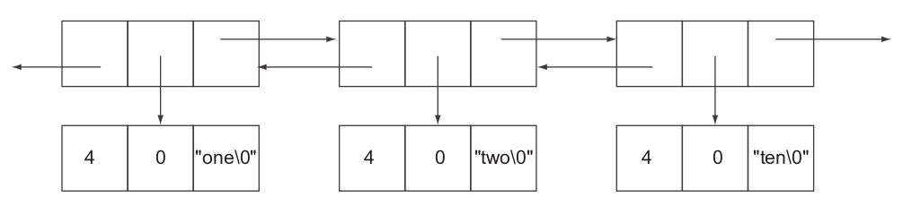

# Redis Performance Discussions

## Indexing

* Sorted Set (`ZSET`) can load float/int data as index, work on string by lexicographical encoding for roughly alphabetic sorting.

* `GEOADD` encodes the latitude and longitude into the score of the sorted set using a geohash algorithm:
```bash
GEOADD cars -115.17087 36.12306 carid:1 
```
which is semantically identical to (pseudo code)
```bash
ZADD cars geohash(-115.17087,36.12306) carid:1
```

* Networking services see an IP address as a 32-bit number, we can do (pseudo code)
```bash
ZADD ip-loc ip2hex("74.125.43.99") us-loc-id:1
```

* About word searching (need to locate which sentence a word is present), index can be a number of sets that define words as keys and their present sentence ids as values.
```bash
# Data of sentences
SADD sentence:1 redis is very fast
SADD sentence:2 cheetahs are very fast

# Indices of each word
SADD redis sentence:1
SADD is sentence:1
SADD cheetahs sentence:2
SADD are sentence:2
SADD very sentence:1 sentence:2
SADD fast sentence:1 sentence:2
```

## Short Structures

### `ziplist`
A `ziplist` is an unstructured representation of one of `LIST`s, `HASH`es, and `ZSET`s.

`LIST` in redis is a doubly linked list, containing three pointers in each node: one points to previous node, one points to data block (including data itself and metadata such as string length) and another one points to next node.



For example, to store three byte string item "one", it needs 21 bytes of overhead (pointer and metadata). By `ZIPLIST`, list nodes are stored continuously thus no need of pointer address overhead. Each node/entry only has content itself, and previous and following node's content length. 

Below are `ziplist` config for reference:
```bash
# max number of entries allowed in a list
list-max-ziplist-entries 512
# max length of a node
list-max-ziplist-value 64
```

Same rules apply to `HASH` and `SET` as well:
```bash
hash-max-ziplist-entries 512
hash-max-ziplist-value 64

zset-max-ziplist-entries 128
zset-max-ziplist-value 64
```

### `intset`

Usually redis stores set data as char arrays. However, if data can be interpreted as int (`setint`), it can save much space. 

## Sharding

Partitioned index is used when an index needs to span across multiple instances. 

Sharding in redis is managed by user, that user when dealing with large volume of data, user set additional shard keys for partition.

The example below turns a string into a numeric by `CRC32` algorithm, and `%` denotes a modula operation (indicates a total of 5 instances)
```bash
HSET CRC32Encoding(“my-key-id”)%5 itemKey itemValue
```

## Scaling

* Horizontal scaling allows you to change the number of node groups (shards) in the replication group by adding or removing node groups (shards). 

* Vertical Scaling - Change the node type to resize the cluster; use larger instances.

### Master-to-Slave Replication Model

Master nodes serve as write servers while slave nodes serve as read servers.

### Two major concerns

* Sharding (hash slot): 

Automatically split your dataset among multiple nodes/instances.

Keys are split by user's defined rules and sent to designated servers.

There are $16384$ hash slots in Redis Cluster by taking `CRC16` of a key with modula-ing $16384$, so that for a cluster of three nodes, we can load data into node $A$ with shard key values between $0$ - $5555$, node $B$'s between $5556$ - $11000$, node $C$'s between $11001$ - $16384$.

* Resilience: 

Continue operations when a subset of the nodes/instances are experiencing failures.

There is a data propagation time gap between when a master receives a write and a slave read operation, that a redis cluster takes time for data be transmitted to all slaves. A slave can implement a trivial `WAIT` for querying recent added data/keys.

After node timeout has elapsed, a master node is considered to be failing, and can be replaced by one of its replicas. When no master node takes over the write task, this redis cluster fails.

### Configs

Inside `redis.conf`, you can config a redis cluster:
```yaml
cluster-enabled: yes
cluster-config-file: "path/to/file.conf" # auto generated by redis
cluster-node-timeout: 60000 # ms
```