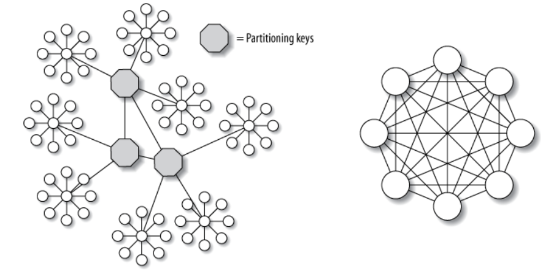

# Sharding and Partitioning

## Sharding: 
Sharding is a special case of partitioning, a horizontal partition of data in a database.

Horizontal partitioning is a database design principle whereby rows of a database table are held separately (vertical partitioning is for column held data).

Each partition forms part of a shard, which may in turn be located on a separate database server or physical location. 

One typical partition key is date-based timestamp (Unix date count starting from 1970.01.01), that data entries generated from the same date are grouped into a shard (contiguous disk addresses).

