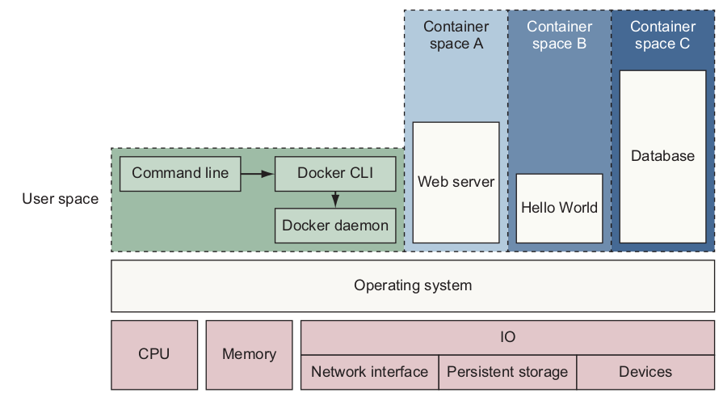

# Docker

Docker can package an application and its dependencies in a virtual container on OS using less resources than virtual machine.



Docker images are "compiled" from Dockerfile; depending on the levels of inclusion, an image can be with or without dependencies such as SDKs.

## Docker Sock

Docker.sock is a Unix socket that enables the Docker server-side daemon, dockerd, to communicate with its command-line interface via a REST API.

The socket appears as the /var/run/docker.sock file. Because it is a file, admins can share and run docker.

## Registry
A Docker registry is a repository for Docker images. Two main public registries are Docker Hub (the default registry where Docker looks for images) and Docker Cloud. 

## Docker Swarm

Docker swarm is a container orchestration tool, provides native clustering functionality for Docker containers,

### *Service* in Docker

*Service* is an abstraction of a network, over which processes, functionality, or data that must be discoverable and available.

Docker services run on swarm mode.

```bash
# enable services
docker swarm init
# launch service
docker service create \
--publish 8080:80 \
--name hello-world \
dockerinaction/ch11_service_hw:v1
```

Service can be used to monitor health of nodes and resume nodes' services once nodes shutdown. 

It helps scale a cluster.
```bash
docker service scale hello-world=3
```

## Docker-Compose

Docker-Compose is used for configuring multiple containers in the same host. It uses `docker-compose.yml` files to configure the application's services