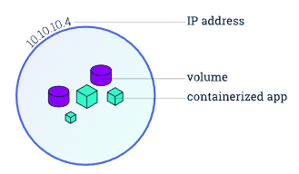
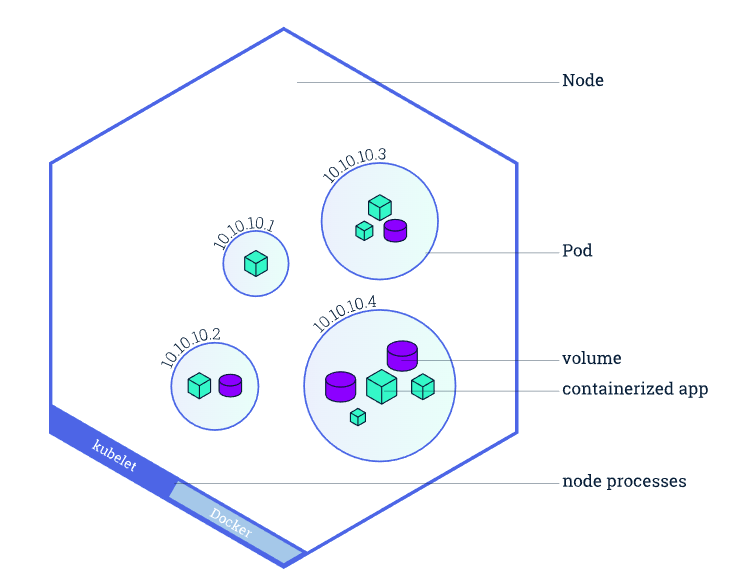

# Kubernetes

## Pod

A Pod is a Kubernetes representation of a functioning "logic host", included of one or many containers and shared resources

Some shared resources for those containers. Those resources include:
1. Shared storage, as Volumes
2. Networking, as a unique cluster IP address
3. Information about how to run each container, such as the container image version or  specific ports to use



### Pod vs Deployment

In Kubernetes we can deploy our workloads using different type of API objects like Pods, Deployment, ReplicaSet, ReplicationController and StatefulSets.

Pods are smallest deployable unit on k8s, with not changeable configurations, volumes, etc.

For better application management, deployment comes into picture which maintains the desired state (how many instances, how much compute resource application uses) of the application. 

Deployment is declared by
```yaml
apiVersion: apps/v1
kind: Deployment
metadata:
  name: webapp
```

### StatelessSet vs StatefulSet

A stateless application is one that does not care which network it is using, and it does not need permanent storage. Examples of stateless apps may include web servers (Apache, Nginx, or Tomcat).

On the other hand, a stateful applications have persistent/modifiable data, such as DBs.

```yaml
apiVersion: apps/v1
kind: StatefulSet
metadata:
  name: webapp
```

### Image

A container image represents binary data that encapsulates an application and all its software dependencies.

## Node

Nodes are the workers that run applications

A node is a VM or a physical computer.

There are master nodes and worker nodes:

### Master Node

* API Server: acts as Cluster Gateway, functions such as authentication, routing requests to diff processes

* Scheduler: receives request from API Server and schedule launching pods based on rules (such as CPU and memory usage)

* Controller Manager: detects/monitors cluster, and launches new pods when pods fail

* etcd: has key/value store that tells pods' and nodes' information, such as health of running pods

### Worker Node

* Kubelet: the primary "node agent" that runs on each node. It takes a set of PodSpecs (yaml or json config files) and make sure a pod run accordingly to the PodSpecs.

* Kube Proxy

* Container Runtime

### Pods run on nodes

Each node has a Kubelet, which is an agent for managing the node and communicating with the Kubernetes control plane.



## Volume

A *PersistentVolume* (PV) is a piece of storage in the cluster that has been provisioned by an administrator or dynamically provisioned using Storage Classes.

A *PersistentVolumeClaim* (PVC) is a request for storage by a user. Claims can request specific size and access modes (e.g., they can be mounted ReadWriteOnce, ReadOnlyMany or ReadWriteMany, see AccessModes).

For use of persistent volume, there should be two declared resources: PV and PVC

## Services help match traffic to designated pods and manage pod creations/terminations

Services match a set of Pods using labels and selectors,

When a worker node dies, the Pods running on the Node are also lost. A ReplicaSet might then dynamically drive the cluster back to desired state via creation of new Pods to keep your application running.

Services can be exposed in different ways by specifying a type in the ServiceSpec:

1. ClusterIP (default) - Exposes the Service on an internal IP in the cluster. This type makes the Service only reachable from within the cluster.
2. NodePort - Exposes the Service on the same port of each selected Node in the cluster using NAT. Makes a Service accessible from outside the cluster using `<NodeIP>:<NodePort>`. Superset of ClusterIP.
3. LoadBalancer - Creates an external load balancer in the current cloud (if supported) and assigns a fixed, external IP to the Service. Superset of NodePort.
4. ExternalName - Maps the Service to the contents of the externalName field (e.g. foo.bar.example.com), by returning a CNAME record with its value. No proxying of any kind is set up. This type requires v1.7 or higher of kube-dns, or CoreDNS version 0.0.8 or higher.

### External Service vs Internal Service


## Useful cmds

`kubectl get` - list resources
`kubectl describe` - show detailed information about a resource
`kubectl logs` - print the logs from a container in a pod
`kubectl exec` - execute a command on a container in a pod