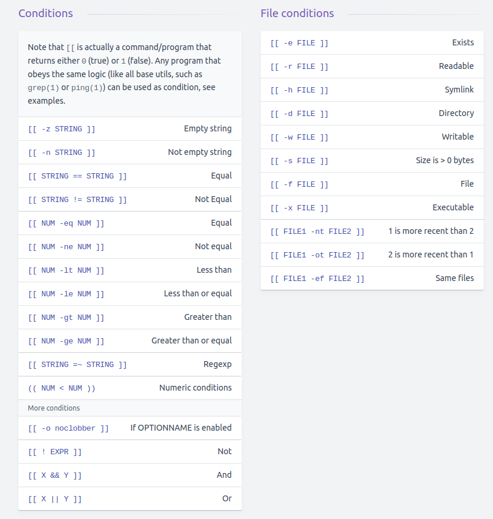

# Bash common ooperations

## Cheat sheets： 

https://devhints.io/bash

https://mywiki.wooledge.org/BashSheet#:~:text=An%20ampersand%20does%20the%20same,for%20the%20former%20to%20end.


1. find a keyword contained in a specified file name

```bash
find -name "<filename>" | xargs grep <keyword>

# find "abc" from files on dir 
find ./ -type f | xargs grep -Hni "abc"
```

2. echo "Hello World" for every 2 second

```bash
while true
do 
    echo "Hello World"
    sleep 2
done

# or equivalent in one liner
while sleep 2; do echo "Hello World"; done
```
3. write a function that takes one argument and return a result

```bash
function myfunc() {
    echo "hello $1"
}
result=$(myfunc "John")
echo $result
```

4. how to test an if condition

```bash
# test a string
string=hello
if [[ -z "$string" ]]; then
  echo "String is empty"
elif [[ -n "$string" ]]; then
  echo "String is not empty, it is $string"
else
  echo "This never happens"
fi

# test a file
if [[ -e "file.txt" ]]; then
    echo "file exists"
else
    echo "file does not exist"
fi
```
condition reference:


5. ./ vs source

    `./script` runs the script as an executable file, launching a new shell to run it.

    `source script` reads and executes commands from filename in the current shell environment

    *Note*: `./script` is not `. script`, but `. script` == `source script`

6. current shell vs sub shell

Whenever you run a shell script, it creates a new process called subshell and your script will get executed using a subshell. If you start another shell on top of your current shell, it can be referred to as a subshell.
```bash
# to see whether this shell is a parent shell
echo $BASH_SUBSHELL

# a sub shell does not inherit variable env, use export to sync var
# export: Export the given variable to the environment so that child processes inherit it.
var=1
export var
```

7. processes in shell

`jobs`: List the current shell's active jobs.

`bg`: Send the previous job (or job denoted by the given argument) to run in the background.

`fg`: Send the previous job (or job denoted by the given argument) to run in the foreground.

```bash
# The exec command replaces this shell with the specified program without swapping a new subshell or proces (after execution, the shell exits)
exec echo "hello"
```
About running processes in background
```bash
# In Linux, /dev/null is a special device file which writes-off (gets rid of) all data written to it, in the command above, input is read from, and output is sent to /dev/null.
# For example:

grep -r hello /sys/ 2> /dev/null # here /dev/null disables many Permission denied std err output
```
Use nohup command, which also enables a process to continue running in the background when a user exits a shell。
```bash
nohup cmd & exit
nohup nice cmd & exit # nice makes the cmd low priority to run
```

Alternatively, a trailing `&` can run a command in background, such as
```bash
echo $! # returns a proc id

jobs # use jobs to see currently running jobs in this shell

fg # this job can be brought to front (if not yet finished/done)
```

8. `<<` vs `<<<`

Both are implemented via temp files, usually in the form `/tmp/sh-thd`, run by anonymous pipes.

`<<` is known as *here-document* structure.
```bash
$ wc << EOF
> one two three
> four five
> EOF
2  5 24
```

`<<<` is known as *here-string*, that can be used to directly passing a string to a program.
```bash
$ bc <<< 4*5
20
```