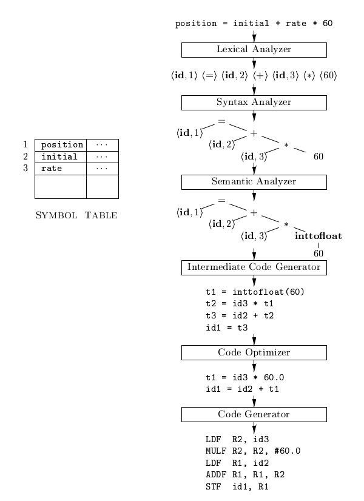
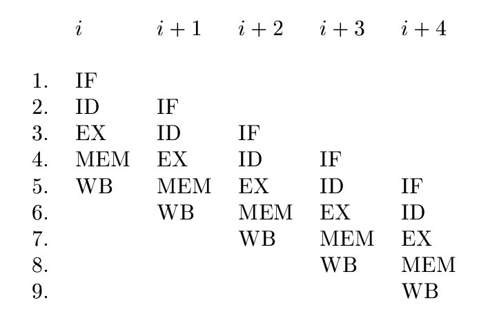
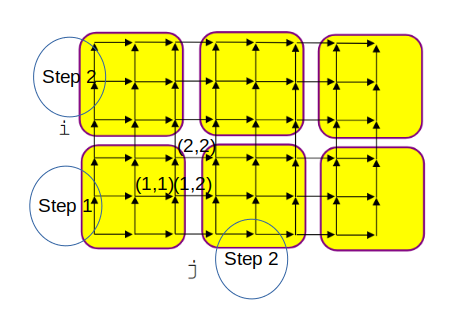

# Compilation Principles

### Compiler vs Interpreter

* Interpreter: compile and execute one by one line of code

* Compiler: translate source code into intermediate code (such as bytecodes) then into machine code.

### Compilation Flow



1. syntax analysis

Tokenization (by regular expression and DFS (Depth Frist Search)) of source code and check source code by syntax rules (such as `position` into `<id,1>`). `=` is an operator and is loaded as `<=>` (since `=` is likely universally same treated as assignment, no need for indexing).

Write into a syntax table of these tokens and associated attributes. For example, `position` is a left value, might be double, etc.

2. build syntax tree

Take into consideration of precedence, such as `*` has higher computtaion priority than `+`.

3. semantic analysis

Given the computation context, to perform induction on elements of the syntax tree, such as deducting the immediate number `60` as a float/double rather than an int.

4. intermediate code generation

Compiler/Interpreter translates the aforementioned results into intermediate code. It does not mean C-style code. For example, python intermediate bytecodes are assembly-style.

Intermediate code is usually easy being translated into Assembly, such as (a typical three-addressing code)

```cpp
a = a + 1;
```
into
```asm
ADD eax 1;
```

* code optimization

Remove unnecessary instructions, some common occurances are replacing vars with const values and setting condition to const true/false when condition's computation result does not change.

A sequence of a three-addressing code is partitioned into a number of *basic blocks*, forming a directed acyclic/cyclic graph (basic blocks `goto`/branching to another one).

* machine code generation

Produce actual machine code ready to be loaded into CPU. Within the same basic blocks, data may store inside cache that renders fast data retrieval.

A typical 5-step instruction execution in pipelining.

1. IF Instruction Fetch
2. ID Instruction Decode
3. EX Execution
4. MEM Memory Access
5. Write Back results



Parallelism happens in various circumstances.

For example, code below can be executed in parallel since array `a`'s element access has no dependency.
```cpp
int a[10];
for (int i = 0; i < 10; i++) {
    a[i] = i * 2;
}
```

Given different number of registers, there are different optimization strategies, such as
```
(a + b) + c + ( d + e )
```
There are parallel operations during loading and non-dependency arithmetic operations.

| i | i+1 | i+2 | i+3 |
|-|-|-|-|
|LD r1, a| ADD r1, r1, r2 | ADD r1, r1, r5 | ADD r1, r1, r3
|LD r2, b| ADD r3, r3, r4 |
|LD r3, d| 
|LD r4, e|
|LD r5, c|

The level of parallelism can be described by Amdahl's Law
$$
\frac{1}{(1-f)+\frac{f}{p}}
$$
in which, $f$ is the percentage of parallelised code running on $p$ processors.

## Parallelism

### Parallelism by rank

Defines a $n \times m$ matrix X, 

Such as
```cpp
int X[n][m];
for (int i = 0; i < n; i++ ) {
    for (int j = 0; j < m; j++){
        X[j] = 0;
    }
}
```
where `X[j]` has $O(n)$ access operation complexity, which means the `i`-th dimension is parallelizable.

This rule is summarised by `rank` of dimensionanlity. Full rank matrix access operations do not have parallelism.

`X[i][j]` has access operation $O$ of
$$
\begin{bmatrix}
      1 & 0 \\
      0 & 1
\end{bmatrix}
$$


`X[i]` has access operation $O$ of
$$
\begin{bmatrix}
      1 & 0 \\
      0 & 0
\end{bmatrix}
$$

Defines `Z[n][m][l]` of three dimensionalities. `Z[i][j][i+j]` has access operation $O$ of 
$$
\begin{bmatrix}
      1 & 0 & 0 \\
      0 & 1 & 0 \\
      1 & 1 & 0
\end{bmatrix}
\begin{bmatrix}
      i \\
      j \\
      k
\end{bmatrix}
$$
which has a rank of $2$, hence parallelizable.

### Space-temporal partition

Consider the code
```cpp
int A[m][n];
for (int i = 1; i < m; i++) {
  for (int j = 1; j < n; j++) {
    A[i,j] = c * (A[i-1,j] + A[i,j-1]) 
  }
}
```
which as data computations can be parallelized given the dependencies below. Each arrow-pointed point represents an entry `(i,j)` of the matrix `A[i][j]` and each yellow block represents a sequence of computations of one processor.

*Step 1* block is handled by one processor, *Step 2* blocks are processed by two processors in parallel after *Step 1* finishes. The list goes on and on with more space-temporal partitions.



### Inter-procedural analysis

Inter-procedural analysis considers procedure invocations (typically a function call in c/c++).

Many functions are labelled as `inline` due to high frequency invocations.