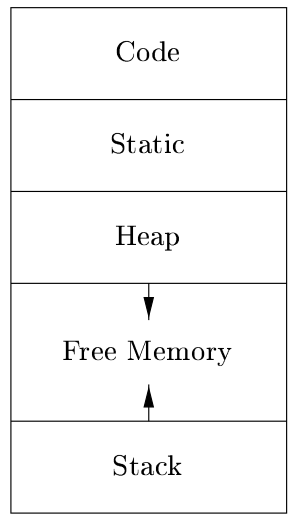
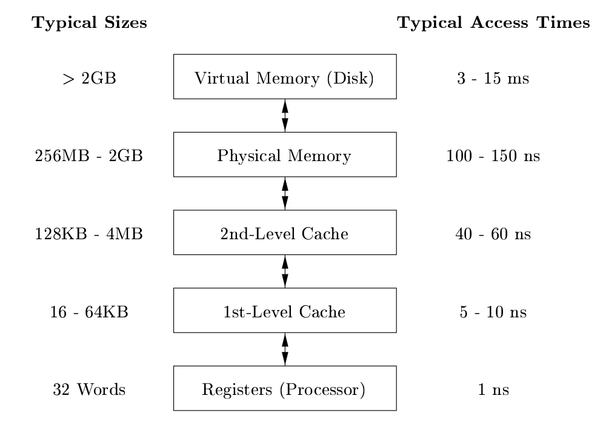
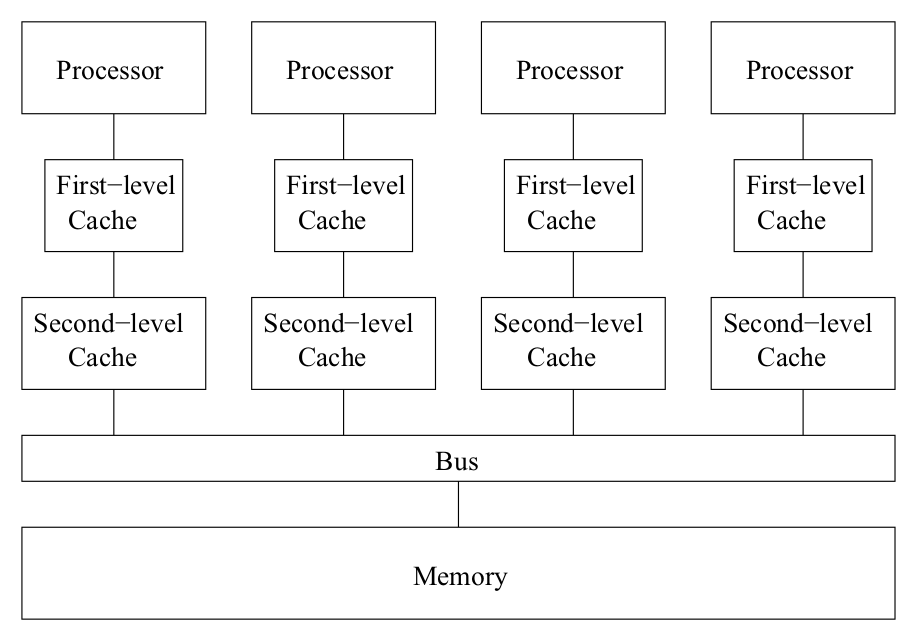

# Computer Architecure

## Run-time env

A typical program storage allocation is shown as below. In practice, the stack (names local to a procedure) grows towards lower addresses, the heap (data that may outlive the call to the procedure) towards
higher.



### Activation record

Activation record refers to calling procedures in a run time env.

### Garbage collection

Garbage collection, which is the process of finding spaces within the heap that are no longer used by the program and can therefore be reallocated to house other data items.

A dependency tree can be drawn to illustrate pointers' claimed memory. Traversal over the tree determines if the chained memory can be freed.

### Memory Arch




## Machine Code Archs

* RISC (Reduced Instruction-Set
Computer) architecture

Many registers and simple addressing modes

* CISC (Complex Instruction-Set Com-
puter) architecture

Few registers and complex addressing modes

* VLIW (Very Long Instruc-
tion Word) architecture

Wider than normal
instruction words that encode the operations to be issued in a single clock.

Classified as superscalar machines automatically that detect dependences among instructions and issue them as their operands become available.

### Multi-processor and cache

A processor's caches are on high priority data fetch list; if not found, it goes further either from other processors' caches or from memory through bus.



## SIMD

The acronym stands for “single instruction, multiple data”. In short, it’s an extension to the instruction set which can apply same operation onto multiple values. These extensions also define extra set of registers, wide ones, able to hold these multiple values in a single register.

Every 64-bit PC processor in the world is required to support at least SSE 1 and SSE 2.

A multiplication example:
```cpp
void mul4_scalar( float* ptr )
{
    for( int i = 0; i < 4; i++ )
    {
        const float f = ptr[ i ];
        ptr[ i ] = f * f;
    }
}
```
Here’s a vectorized SIMD version which does the same thing:
```cpp
void mul4_vectorized( float* ptr )
{
    __m128 f = _mm_loadu_ps( ptr );
    f = _mm_mul_ps( f, f );
    _mm_storeu_ps( ptr, f );
}
```