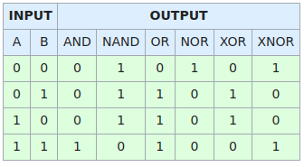

# FPGA and Verilog

FPGA (field-programmable gate array) is an integrated circuit designed to be configured by a customer or a designer after manufacturing, by hardware description language (HDL), one of which is Verilog, standardized as IEEE 1364.

Verilog is a high level circuit schema description programming language of how the circuit should work. It is compiled into low level transistor circuit schema (see binary logic gates below).

Logic gates describes the output from given the same clock cycle, synchronized multiple 0/1 (representing low/high level volt) inputs to a groups of logic gates.

* Binary Input Logic Gate Table



Number representations such as below
```v
// decimal 10 represented in different formats
4'hA = 4'd10 =4'b1010
```

* Table of states

| State | Meaning |
|-----|------------|
| 0 | logic zero, low level volt, false | 
| 1 | logic one, high level volt, true | 
| x | unknown | 
| z | high impedence | 

Usually, $V_{dd}$ ranges between 0.8V to 3V;     `x` means unknown at the time; Unconnected wires/components have high impedence.

* circuit visualization (converting to schematics)

Software such as Cadence and Synopsys can help convert Verilog code into circuit schematic.
