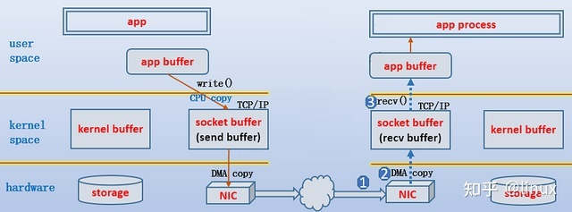
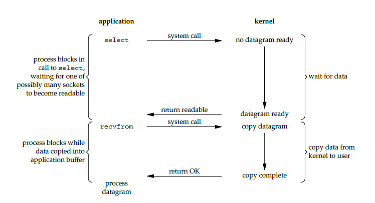
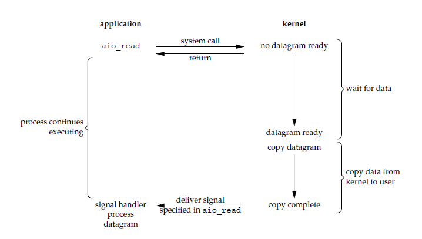

# Linux IO

## Five IO modes

Below is example of Linux IO arch for TCP/IP communication.



reference: https://programmerall.com/article/37681060266/

### Synchronous blocking IO

1) During `recv()`/`recvfrom()` system call, kernel waits until at least one complete data packet arrives (such as one UDP/TCP packet). User process is blocked during the wait. 

2) Once arrived, kernel copies data from kernel memory to user process memory. 


### Synchronous non-blocking IO

1) While kernel waits for at least one complete data packet arrives, user process is not blocked by `recv()`/`recvfrom()`, but continues running next line of code. However, `recv()`/`recvfrom()` receives `err_no` from system call indicating the data is not yet ready.

2) `recv()`/`recvfrom()` returns positive result when data is ready, and it is up to user process when to call `recv()`/`recvfrom()` again.


### IO multiplexing

IO multiplexing is what we call `select`, `poll`, `epoll`, and some places also call this IO method as event driven IO. 

Kernel checks data by polling, same as sync blocking and non-blocking IO modes, but multiplexing use one process to check many sockets in charge, thus cost-efficient.

This behavior is same as sync blocking IO's, with addition of being cost-efficient for multiple socket communication. If socket number is small, sync blocking IO is even better.

1) when a user process calls `select`, user process is blocked, and kernel monitors all sockets registered under the `select`.

2) Kernel returns ready to notify the user process to invoke `read` to retrieve data.




### Signal-driven IO (signal-driven IO)

1) A user process calls a `read` then continues running next line of code. Kernel notifies the user process by system signal `SIGIO` to the process. 

2) The user process invokes a `recvfrom` function on receiving `SIGIO`.

CPU utilization rate is higher than polling for signal-driven mode.


### Asynchronous non-blocking IO (asynchronous IO)

A user process inits/invokes `aio_read` which immediately returns. When data is ready, kernel signals the user process to invoke a callback function.




## File descriptor

Given an open file cmd:
```cpp
int fd;
fd = open(pathname, O_RDWR);
```
The returned `fd` is a file descriptor (an  int greater than zero). Linux OS create a process mapping `fd` onto a table (`files_struct` inside *linux/fdtable.h*) describing this opened file, such as
```cpp
struct file_struct {
    atomic_t count;
    bool resize_in_progress;
    // ... many other attrinutes
}
```

There are three defined file descriptor integers: 
* stdin: 0 (standard input)
* stdout: 1 (standard output)
* stderr: 2 (standard error output)

Typical they refer to keyboard input and monitor/shell output.

## Shell Redirection

Shell redirection is not even *C* nor *Linux* standard, but rather for *bash* of the given syntax for input
```bash
[fd]<string_stream
```
and for output
```bash
[fd]>string_stream
```
where by defult `fd=0` when no `fd` is present, such as
```bash
>new_file.txt # create a new file
echo "hello world" > new_file.txt # input "hello world" into a new file 
```
