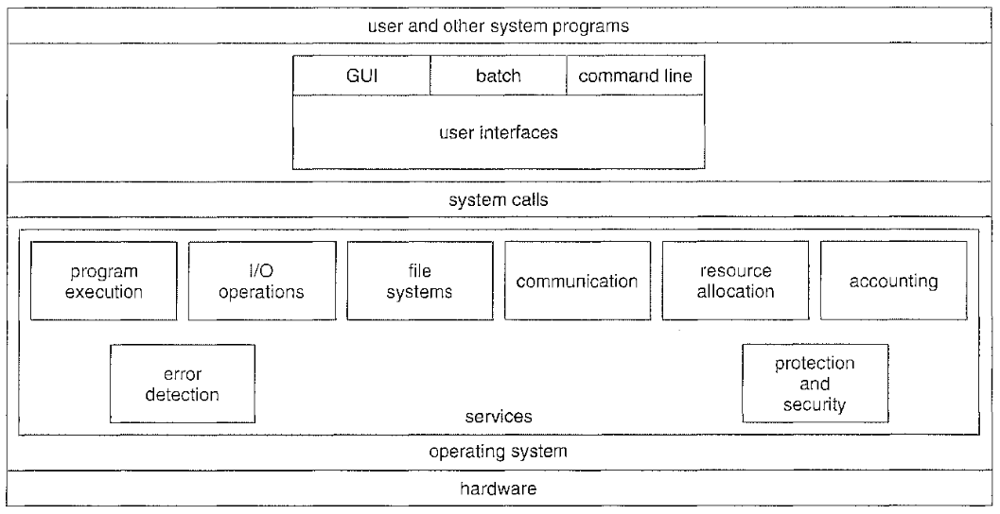
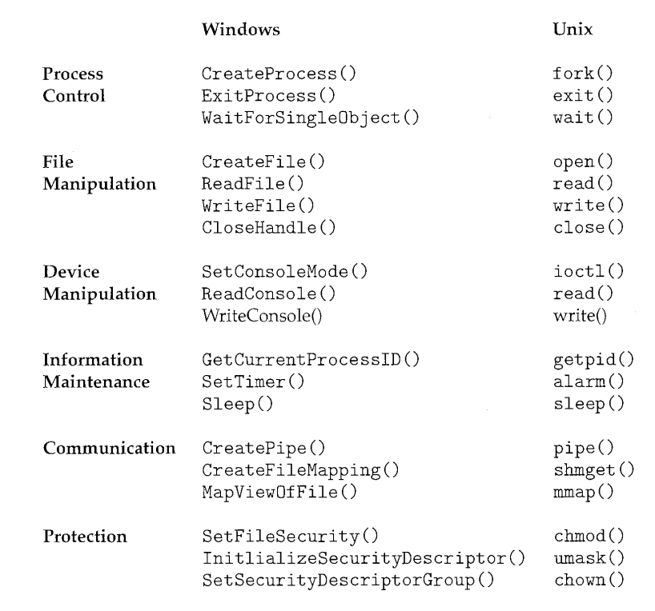
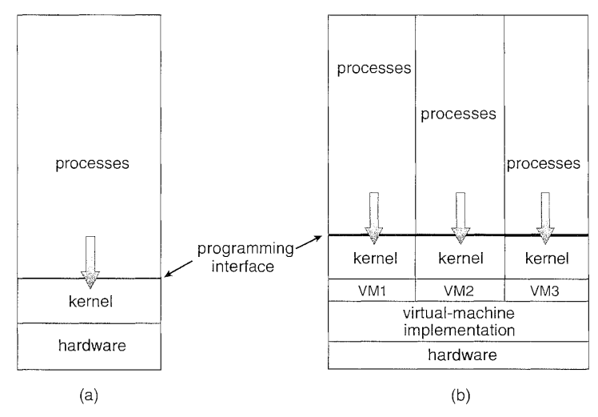

# Operating System

## OS service overview

* support for user interactions, such as *Command Line Interface* (CLI), *Graphic User Interface* (GUI), *Batch Interface* (bat)

* program management, providing system calls and file access services, resource allocation (such as CPU, memory, etc) to requesting processes, accounting for resource usage

* I/O operations, peripheral device interactions (such as keyboard, touchpad, printer.)

* File system management

* Security and fault detection, such as user authentication.

### System calls

Example system calls:

### Virtual Machine

The fundamental idea behind a virtual machine is to abstract hardware into different kernel environments.

### Bootstrap OS

A bootstrap program from ROM is first executed and starts OS program from disk. GRUB is an example of an open-source bootstrap program for Linux systems.

### Real-time system

A real-time system is a computer system that requires not only that the
computing results be "correct" but also that the results be produced within
a specified deadline period.