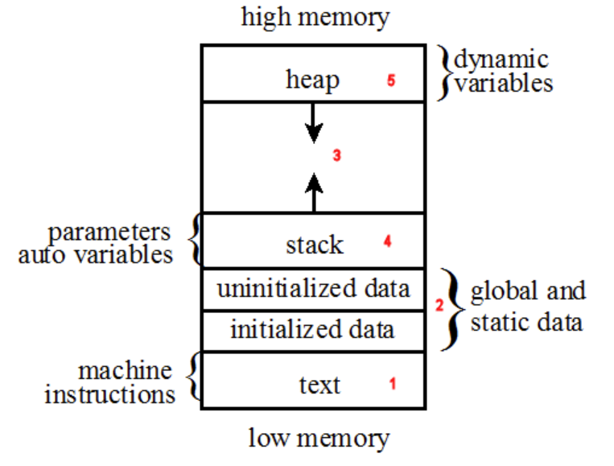
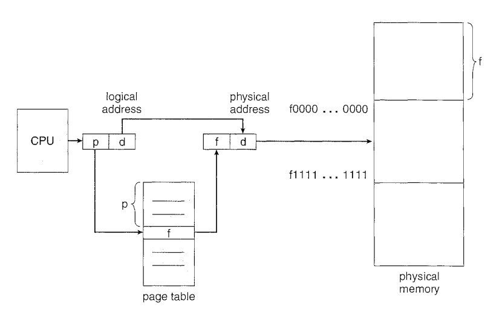
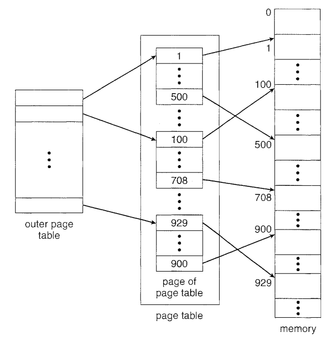
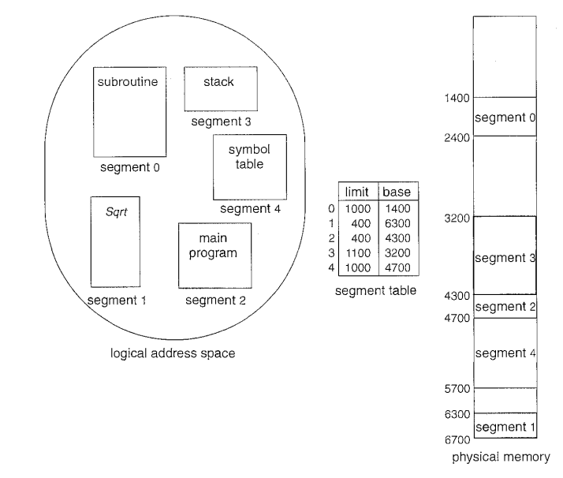
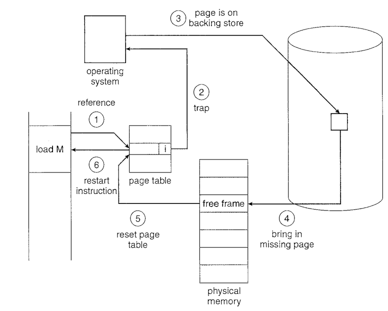

# Memory OS management

## MMU (Memory Management Unit)

The memory management unit logically sits between the processor internal bus and the memory hierarchy—the first level of the hierarchy is most likely the processor’s first level cache on modern embedded processors. The MMU provides the following key features:

* Address translation. The MMU provides per process address translation of linear (virtual) address to physical addresses (see paging for detail).

* Protection. The MMU entries provide privilege checking and read/write protection of memory. Privilege checking ensures that the processor has the correct privilege level to access a particular memory region.

* Cache control. Different memory regions requires different cacheability attributes.

When using the MMU, the memory map is divided into pages (typically 4 kB each). The operating system maintains a page directory and a set of page tables to keep track of the pages. 

## Swap

Swap is the operation swapping data between primary memory (RAM) and secondary storage (disk). The time cost is mainly associated with transferring data. There are memory lock implemented when data undergoing transferring/swapping.

## Program Memory Allocation Schema



The text area contains the program's machine instructions (i.e., the executable code).

Heap and stack areas grow as program runs.

## Fragmentation

As processes are loaded and removed from memory, the free memory space is broken into little pieces, left many "holes" in contiguous memory addresses. Process requested memory allocations are fit into these holes.

It can be addressed by *compaction* (shuffling memory blocks into a bug contiguous memory block). Other techniques include *paging* and *segmentation*.

### Slab allocation

Slab allocation is a memory management mechanism intended for the efficient memory allocation of objects, reduced fragmentation caused by object allocations and deallocations.

It pre-allocates a few chunks of memory (named slabs) that suits the expected allocated memory of a program's variables/objects. 

When the program allocates/deallocates the objects, the slab mechanism just labels the memory used/unused. Therefore, if this object class type is frequently used/destroyed, the slab mechanism helps save memory search/allocation/deallocation time.

## Paging

A page table is consisted of mapping relationships between logical and physical addresses. $p$ and $f$ are indices for memory blocks, and $d$ is the offsets to locate data in each block. 

* frames: break physical memory into fixed-size blocks 
* pages: break logical memory into fixed-size blocks



* shared pages: data that can be shared across multiple processes, such as compiler, system libs.

### Paging practice

When memory is large, page indexing might go out of $2^{32}$ bit-wide size and further action is required to address it.

* Hierarchical Paging

Use multi-level page indexing methods to map logical addresses to physical addresses. Besides, mapped physical blocks are not of same sizes, such as some are $2^{16}$ bytes ($64$ kb) and some are smaller of $2^{10}$ bytes ($4$ kb).



* Hash Paging

Each entry of a mapping hash table contains a list of elements, each element has 
1) virtual page page number
2) mapped page frame number
3) a pointer to the next element 

Each hash table entry is associated with a number of pages scattered in different memory blocks. This is an advantage as it can link pages based on running process's semantics.

## Segmentation

Segmentation is a user-view memory management scheme, that allocates memory into variable size blocks such as code section, global variables, process heap and thread stacks, etc.

Segmentation works on top of paging in terms of better mapping from logical memory addresses to physical addresses.



## Virtual Memory

Virtual memory makes the primary storage (RAM) hold more data than its max capability by paging data and exchanging data between the primary storage (RAM) and secondary storage (disk).

In practice, only partial code/data is (frequently) executed/used, and there is no need of allocating memory for all declared/requested variables at the same time. 
However, at the code execution level, user still regards memory ready for all code variables, while actually there are only small chunks of memory blocks used at the physical memory layer. 
Virtual memory is the abstract layer for this purpose, viewed by user as full and ready memory for all required data, while translated to physical layer occupying small memory blocks.

Virtual memory allows extremely large memory provided for user while only small physical memory is available. Techniques include use of shared kernel memory.

### Thrashing

In a virtual memory system, thrashing is the excessive swapping of pages of data between memory and the hard disk, causing the application to respond more slowly. The virtual memory function tracks page usage and keeps often-used pages in memory as much as possible.

### Locality

Given the code below, `data[i][j]` is accessed with granularity of row major and column major, respectively. Row major access is allocated with much more pages ($128 \times 128$) than column major's ($128$). This correlates better memory management such as low page fault rate.
```cpp
int i, j;
int [128] [128] data;

// row major access
for (j = 0; j < 128; j++)
    for (i = 0; i < 128; i++)
        data[i][j] = 0;

// col major access
for (i = 0; i < 128; i++)
    for (j = 0; j < 128; j++)
        data[i][j] = 1;
```

### Page Fault

An exception that the memory management unit (MMU) raises when a process accesses a memory page without proper preparations (disk-resided data not yet added a mapping.loading to the process's virtual memory/RAM). 

As described below, first, a process attempts to reference data from a page table. If the data is not yet ready, the page table labels the data entry as invalid and OS is notified. OS fixes it by loading data (triggers I/O operations) into virtual memory/RAM and set valid back on the page table entry. OS then resumes previously halted instructions for the process. 



* Thrashing under page faults

A process is thrashing if it is
spending more time paging than executing. 

This happens when the number of frames (physical memory blocks) is small while the use of pages is frequent, as a result, 

OS might send signal to the process for thrashing (typically a process termination signal).

### Segmentation Fault

Memory Access violation raised by hardware for memory protection, handled by notified OS sending signal to the process raising an exception (such as process termination).