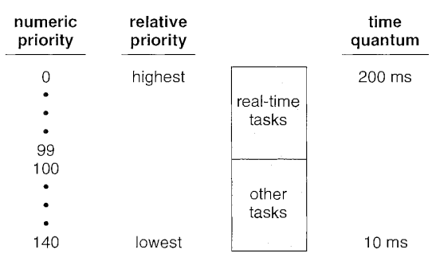

# Process and thread management

Each process is represented in OS as a process control block. Most typical information is
* process state (new, ready, waiting, running, terminated)
* process number (PID)
* program counter (a dedicated CPU register to record next instruction for execution)
* CPU scheduling
* Memory management
* accounting (used memory, cpu, etc.)

## Process scheduling

A process scheduler manages executions of programs to optimize the use of CPU and memory, such as managing process context switch (push/pop registers and memory addrs).

Use `ps -elf` to list currently running processes on an OS. Each PID is forked from PPID (Parent PID). 

* PID 0 swapper/sched: scheduler, memory paging, to load data from secondary memory (disk) into main memory (RAM) 
* PID 1 init: process primarily responsible for starting and shutting down the system. 
* PID 2 kthreadd: is the kernel thread daemon. All kthreads are forked from this thread. 

### CPU scheduler

Whenever the CPU becomes idle, the operating system must select one of the
processes in the ready queue to be executed. 
The selection process is carried out by the short-term scheduler (or CPU scheduler). The queued processes are selected (expected to be executed) by various best performance scheduling algorithms such as priority order.

* nonpreemptive or cooperative: process be terminated or moved to wait state.

* preemptive: a process switches from the waiting state to the ready state (for example, at completion of I/0) or from running state to wait state (e.g., system interrupt)

A preemptive scheduler will allow a particular process to run for a short amount of time called a *quantum* (or time slice). After this amount of time, the process is placed back in the ready queue and another process is placed into the run state.

### Linux Scheduling

Linux scheduler is a preemptive, priority-based algorithm with two separate priority ranges: a real-time range from $0$ to $99$ and a nice value ranging from $100$ to $140$:



Synchronizations of threads' code are handled by `mutex`/`semaphore`.

## Process communications

Processes communicate to each other via

* `send`/`recv` message passing 
* declare a shared memory.
```cpp
/* allocate a shared memory segment */
segment_id = shmget(IPC_PRIVATE, size, s_IRUSR I s_IWUSR);
/* attach the shared memory segment */
shared_memory = (char*) shmat(segment_id, NULL, 0);
/* write a message to the shared memory segment */
sprintf (shared_memory, "Hi there!");
```

* use socket, such as unix socket by TCP/IP

* unix pipe

UNIX treats a pipe as a special type of file for data streaming
```cpp
pipe (int fd []) // fd: file descriptor
```

On bash, `|` is a pipe communication directing data from previous process to next's.

## Thread

A thread is a basic unit of CPU utilization; it comprises a thread ID, a program
counter, a register set, and a stack.

Thread has two parts: user threads and kernel threads; One program typically have both. 

For Unix, `Pthread` refers to the POSIX standard (IEEE 1003.lc) defining an API for thread
creation and synchronization.

It depends on OS to implement `fork()` from a parent process, whether all threads from a parent process got duplicated, or just  the main thread.

## Parallelism and Sync

A collection of instructions (or operations) that performs a single logical
function is called a *transaction*. *Atomic transaction* refers to the block of logic/data being executed by only one thread. When 

*Deadlock* happens when a lock $LA$ check waits for another lock ($LB$)'s release, while $LB$ waits for $LA$'s release. It can be remedied by

1) drawing a lock-dependency graph and avoid deadlock in advance, 
2) terminate a process releasing all locks simultaneously, 
3) starvation that forces release/rollback a section of code/state after a period of time

## Lock

Deadlock occurs when there are multiple processes. Each process holds a resource while waiting for a resource held by another process. 

### Prevention and Avoidance

Deadlock prevention ensures that at least one of the necessary conditions to cause a deadlock will never occur, while deadlock avoidance ensures that the system will not enter an unsafe state (an unsafe state is when locks are mutually depending on each other for release).

### Banker’s algorithm

Banker’s algorithm is a safety + resource-request algorithm that whenever a process makes a request of the resources then this algorithm checks that if the resource can be allocated or not.

Let $n$ be the number of processes in the system and $m$ be the number of resources types.

$Available_m[j] = k$ means there are $k$ instances of resource type $R_j$.

$Max_{n \times m}[i,j] = k$ means process $P_i$ may request at most $k$ instances of resource type $R_j$.

$Allocation_{n \times m}[i,j] = k$ means process $P_i$ is currently allocated $k$ instances of resource type $R_j$

$Need_{n \times m}[i,j] = k$ means process $P_i$ currently need $k$ instances of resource type $R_j$

$$
Need_{n \times m}[i,j] = 
Max_{n \times m}[i,j] - Allocation_{n \times m}[i,j]
$$

* Safety State Check

1) Let $Work$ and $Finish$ be vectors of length $m$ and $n$ respectively. 
Initialize: 
* $Work$ = $Available$ 
* $Finish[i]$ = false; for $i=1, 2, 3, 4….n$
2) Find an $i$ such that both 
* $Finish[i]$ = false 
* $Need_i$ <= $Work$ 
* if no such $i$ exists goto step (4)
3) $Work = Work + Allocation[i]$ 
* $Finish[i]$ = true 
* goto step (2)
4) if $Finish[i]$ = true for all $i$ 
* then the system is in a safe state 

```cpp
// Banker's Algorithm
#include <iostream>
using namespace std;
 
int main()
{
    // P0, P1, P2, P3, P4 are the Process names here
 
  int n, m, i, j, k;
  n = 5; // Number of processes
  m = 3; // Number of resources
  int alloc[5][3] = { { 0, 1, 0 }, // P0 // Allocation Matrix
                     { 2, 0, 0 }, // P1
                     { 3, 0, 2 }, // P2
                     { 2, 1, 1 }, // P3
                     { 0, 0, 2 } }; // P4
 
  int max[5][3] = { { 7, 5, 3 }, // P0 // MAX Matrix
                   { 3, 2, 2 }, // P1
                   { 9, 0, 2 }, // P2
                   { 2, 2, 2 }, // P3
                   { 4, 3, 3 } }; // P4
 
  int avail[3] = { 3, 3, 2 }; // Available Resources
 
  int f[n], ans[n], ind = 0;
  for (k = 0; k < n; k++) {
    f[k] = 0;
  }
  int need[n][m];
  for (i = 0; i < n; i++) {
    for (j = 0; j < m; j++)
      need[i][j] = max[i][j] - alloc[i][j];
  }
  int y = 0;
  for (k = 0; k < 5; k++) {
    for (i = 0; i < n; i++) {
      if (f[i] == 0) {
 
        int flag = 0;
        for (j = 0; j < m; j++) {
          if (need[i][j] > avail[j]){
            flag = 1;
            break;
          }
        }
 
        if (flag == 0) {
          ans[ind++] = i;
          for (y = 0; y < m; y++)
            avail[y] += alloc[i][y];
          f[i] = 1;
        }
      }
    }
  }
   
  int flag = 1;
   
  // To check if sequence is safe or not
  for(int i = 0;i<n;i++)
  {
        if(f[i]==0)
      {
        flag = 0;
        cout << "The given sequence is not safe";
        break;
      }
  }
 
  if(flag==1)
  {
    cout << "Following is the SAFE Sequence" << endl;
      for (i = 0; i < n - 1; i++)
        cout << " P" << ans[i] << " ->";
      cout << " P" << ans[n - 1] <<endl;
  }
 
    return (0);
}
```

* Resource Request

Let $Request_i$ be the request array for process $P_i$. $Request_i[j] = k$ means process $P_i$ wants $k$ instances of resource type $R_j$. When a request for resources is made by process $P_i$, the following actions are taken:

1) If $Request_i <= Need_i$
Goto step (2) ; otherwise, raise an error condition, since the process has exceeded its maximum claim.
2) If $Request_i <= Available$ 
Goto step (3); otherwise, $P_i$ must wait, since the resources are not available.
3) Have the system pretend to have allocated the requested resources to process $P_i$ by modifying the state as 
follows: 

$$
Available = Available – Request_i 
$$
$$
Allocation_i = Allocation_i + Request_i 
$$
$$
Need_i = Need_i– Request_i
$$