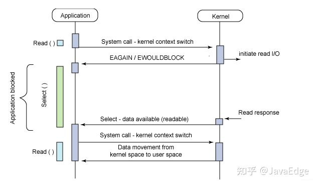

# Socket Select

Required APIs are shown as below.

```cpp
#include <sys/time.h>
#include <sys/select.h>

struct timeval {
    long    tv_sec;         /* seconds */ 
    long    tv_usec;        /* microseconds */
};

int select (int nfds, 
            fd_set *readfds, fd_set *writefds,
            fd_set *exceptfds, struct timeval *timeout);

void FD_CLR (int fd, fd_set *set); 
int  FD_ISSET (int fd, fd_set *set); 
void FD_SET (int fd, fd_set *set); 
void FD_ZERO (fd_set *set); 
```

`select` system call monitors these three file descriptors:
* `fd_set *readfds`: monitored if any of these is ready for reading
* `fd_set *writefds`: monitored whether there is space for a write operation
* `fd_set *exceptfds`: monitored whether any descriptor is having an exceptional condition

`nfds` (number of file descriptors) specifies the number of file descriptors to use (one file descriptor represents one data stream). The max number can be set is `/proc/sys/fs/file-max`.

`timeout` is used to `select` force return when timeout.

An `fd_set` is file descriptor set (a fixed size buffer, bits represents flags of control signals of `fd`). Executing `FD_CLR()` or `FD_SET()` with a value of fd that is negative or is equal to or larger than `FD_SETSIZE` will result in undefined behavior.

## Process

`select` is a blocked/sync action that initiates read/write signal to OS kernel and wait for a reply.

When there is data arrived to any of the file descriptor, `select` returns. `select` needs to go through all file descriptors to find out which file descriptor has data.

If none of the descriptors in the three sets becomes ready, `select` would return after the interval pointed by timeout. If timeout is `NULL`, `select` would block till at least one descriptor in the three sets is ready.

Once `select` returns, file descriptors are re-init.




## Ues Example

```cpp
// Define protocol
struct addrinfo hints;
memset(&hints, 0, sizeof (struct addrinfo));
    hints.ai_family = AF_UNSPEC;    /* allow IPv4 or IPv6 */
    hints.ai_socktype = SOCK_STREAM; /* Stream socket */
    hints.ai_flags = AI_PASSIVE;    /* for wildcard IP address */

// make sure the socket addr is available, and get the addr info to result
// struct addrinfo {
//     int              ai_flags;
//     int              ai_family;
//     int              ai_socktype;
//     int              ai_protocol;
//     socklen_t        ai_addrlen;
//     struct sockaddr *ai_addr;
//     char            *ai_canonname;
//     struct addrinfo *ai_next;
// };
struct addrinfo *result;
int s; 
char* SERVER_PORT = "8080";
getaddrinfo(NULL, SERVER_PORT, &hints, &result);

// iterate over the addrs and create socket connections
int listener = 0;
int optval = 1;
socklen_t length = 0;
struct addrinfo *rptr;
for (rptr = result; rptr != NULL; rptr = rptr -> ai_next) {
    listener = socket (rptr -> ai_family, rptr -> ai_socktype,
                    rptr -> ai_protocol);
    if (listener == -1)
        continue;
    if (setsockopt (listener, SOL_SOCKET, SO_REUSEADDR, &optval, sizeof (int)) == -1)
        error("setsockopt");
    if (bind (listener, rptr -> ai_addr, rptr -> ai_addrlen) == 0)  // Success
        break;
    if (close (listener) == -1)
        error ("close");
}

fd_set fds, readfds;
FD_ZERO (&fds);
FD_SET (listener, &fds);
int fdmax = listener;
char recv_message[64];
while (1) {
        readfds = fds;
        // monitor readfds for readiness for reading
        if (select (fdmax + 1, &readfds, NULL, NULL, NULL) == -1)
            error ("select");
        
        // Some sockets are ready. Examine readfds
        for (int fd = 0; fd < (fdmax + 1); fd++) {
            if (FD_ISSET (fd, &readfds)) {  // fd is ready for reading 
                memset (&recv_message, '\0', sizeof (recv_message));
                // locate which fd has data and retrieve it
                ssize_t numbytes = recv (fd, &recv_message, sizeof (recv_message), 0);
            }
        }
}
```