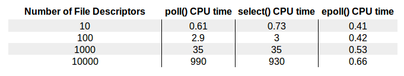

# Performance

* Upon ready IO, select/poll are $O(n)$, epoll is $O(n_{ready})$, where $n$ is the total number of all `fd`s, $n_{ready}$ is the number of `fd` with buffers arrived of data.

* `epoll` has the best performance results since it passively received data notification then run data retrieval, rather than the other two scanning through all registered `fd`

* If the number of listening `fd`s is small, `select` might actually faster than `epoll` since `epoll` requires many kernel function invocation.

