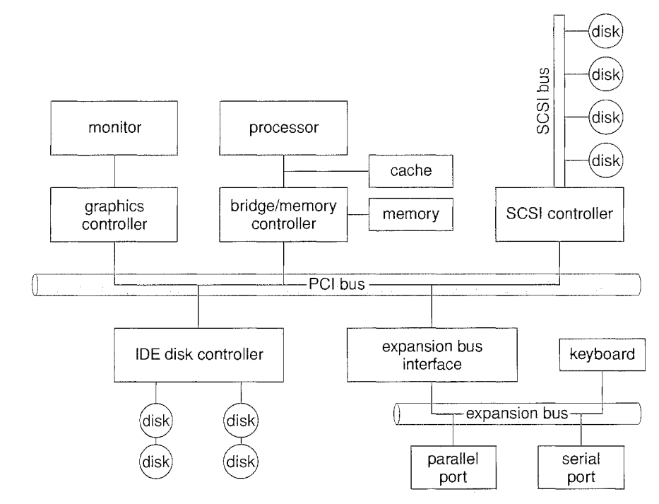
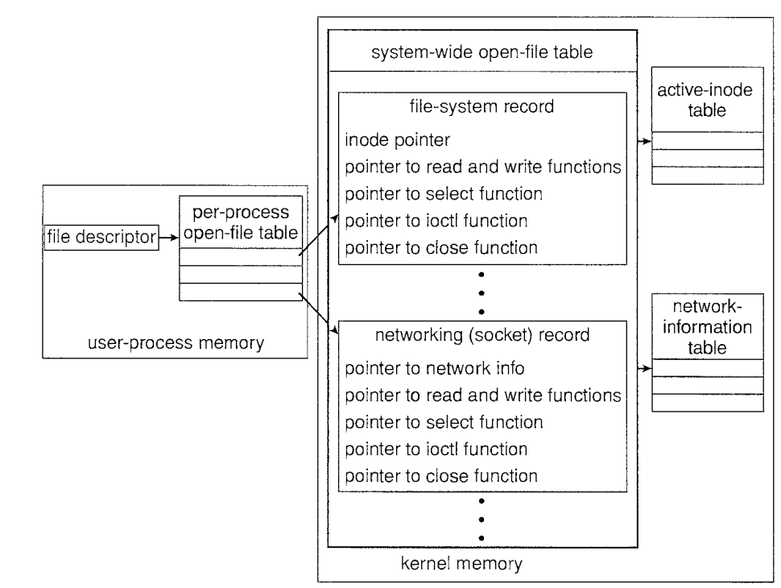

# Storage and Peripherals

## Files

* Common file extensions:

| Services | extension |
|-|-|
|executable|.exe, .com, .bin|
|object (compiled not linked machine language)|.o, .obj|
|source code|.cpp, .java, .py|
|terminal scripts|.sh, .bat|
|library (libs for programmer users)|.lib, .a, .so, .dll|
|archive|.zip, .tar|

Storage (one or more connected devices) can be partitioned into slices. A file system can be setup on such slices also known as volumes. Volumes contain information (e.g., entry location, size) about all files in a device directory (a.k.a., volume table content).

* Typical Linux file systems:

|directory|type|explained|
|-|-|-|
|/|ufs|general-purpose file systems|
|/dev|dev|
|/proc|procfs|a virtual file system that presents information on all processes as a file system|
|/tmp, /var/run|tmpfs|temporary file system, on volatile main memory erasable when crash/reboot|
|/opt|ufs|general-purpose file systems|

* Directory

A typical three level directory has a Master File Directory (MFD) and multiple User File Directory (UFD), and each UFD has permission to manage its own sub-directories. Files in a directory are managed with diff access permissions for individual/shared users.

Linux uses `chown <groupname>:<username> <filename>` to change ownership under a directory, `chmod <0-7user><0-7group><0-7others> <filename>` managing access rights by users belonged to different groups.

### File System

File system controls how data is stored and retrieved. Different file systems have different implementations, such as index-based storage mechanism for database system and fast random access for normal disk.

Virtual file is presented as virtually a contiguous memory file to user, while at physical layer the file's data is scattered across various memory frames/blocks.

* File operation structure

|Hierarchy|Explained|
|-|-|
|application program| a process who initiates file action, such as write and read |
|logical file system| such as *inode* in most UNIX file systems, containing information about the file, including ownership, permissions, and location of the file contents; provides APIs such as `open`, `write`, `read`, etc.|
|file organization module| translate logical block addresses to physical block addresses for the basic file system given a logical file|
|basic file system| only to issue generic commands to the appropriate device driver to read and write physical blocks on the disk |
|I/O and devices| perform hardware I/O operations by instructions from basic file system|

* Typical file operations

|File Commands|Explained|
|-|-|
|`open()`| passes a filename to logical file system, who registers info about the file, such as *inode* for UNIX; returns a pointer to the appropriate entry in the per-process file-system table |
|`read()`, `write()`| a pointer points to the exact byte address where a process is currently reading/writing |
|`close()`| the per-process table entry is removed, and the system-wide entry's open count is decremented. |

## Disk

Modern disk drives are addressed as large one-dimensional arrays of *logical blocks*
where the logical block is the smallest unit of transfer.

Before a disk can store data, it must be divided into sectors that the disk controller can read and write, known as *disk formatting* or *physical formatting*.

Low-level formatting fills the disk with a special data structure for each sector. The data structure for a sector typically consists of a header, a data area (usually 512 bytes in size), and a trailer.

File system should be installed: partitioning disk into groups of sections, then logical formatting for file system creation.

* Partitions and Mounting

A boot loader that understands multiple file systems and multiple operating systems can occupy the boot space. Once loaded, it can boot one of the operating systems available on the disk.

A mount operation includes the name of the remote directory to be
mounted and the name of the server machine storing it.

* RAID

RAID (redundant array of inexpensive disks or redundant array of independent disks) is a data storage virtualization technology that combines multiple physical disk drive components into one or more logical units.

|RAID Level|Explained|
|-|-|
|0|no addition action|
|1|mirroring, Data is written identically to two or more drives|
|2|striping with dedicated Hamming-code parity|
|3|byte-level striping with dedicated parity|
|4|block-level striping with dedicated parity|
|5|block-level striping with distributed parity|
|6|block-level striping with double distributed parity|

stripping: separate a file binary into sections and store on different physical storage sections.

## I/O and Peripherals

I/O devices/peripherals vary widely in their function and speed (consider a mouse, a hard disk, and a CD-ROM jukebox).

* Hardware Naming

|Hardware|Explained|
|-|-|
|port|a point of communication by cable or even through the air|
|bus|a set of wires|
|daisy chain|bus connection network|
|PCI|Peripheral Component Interconnect|
|controller|a collection of electronics (typically chips) that can operate a port, a bus, or a device, transfer data between PCI and peripherals|

* Controller

A controller might write data into memory, disk, or other devices such memory of GPU. 
A controller typically has  
1) data-in register
2) data-out register
3) status register (indicate instruction execution and controller states)
4) control register (store control signal)

A controller checks port by 
1) polling
2) interrupt (processor hardwired to an interrupt request line, ready to receive an interrupt signal at anytime for error handling)

* DMA

Direct Memory Access (DMA) is designed to connect port controller to memory without too much engagement of CPU for data transfer.

* device driver

A device driver is a software dedicated to handling data transfer between unified OS kernel API and device controller (hardware chip).

* buffer

A buffer is a memory area that stores data being transferred between two devices or between a device and an application.

* Kernel 

How OS manages 

### I/O Performance

I/O operations result in significant performance reductions:
1) context switches for CPU resulting forfeiting/reloading cache
2) expose inefficiencies in the interrupt-handling mechanisms in the kernel
3) handling between peripheral controllers, physical memory/disk, and kernel memory/buffer