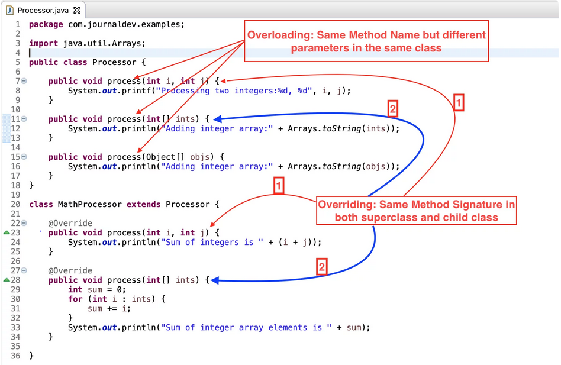

# Terminology Explain

* Concurrency & Parallelism

`Concurrency` means executing multiple tasks roughly at the same time but NOT simultaneously. E.g. two tasks works in overlapping time periods.

`Parallelism` means performing two or more tasks simultaneously, e.g. performing multiple calculations at the same time.

`Coroutines` are computer program components that generalize subroutines for non-preemptive multitasking, by allowing execution to be suspended and resumed. Most typical are exception handling, event loop and interrupt callback.

* Serialization

In computing, serialization is the process of translating a data structure or object state into a format that can be stored (for example, in a file or memory data buffer) or transmitted (for example, over a computer network) and reconstructed later (possibly in a different computer environment).

This process of serializing an object is also called `marshalling` an object in some situations.

For example, `Go` natively supports unmarshalling/marshalling of JSON and XML data, while Java provides automatic serialization which requires that the object be marked by implementing the java.io.Serializable interface.


* Servlet

A code snippet running on a server. Every HTTP request is sent and processed in a web container. Business user sends requests from browser (applet, applet container), through HTTP SSL a web container handles the request. A servlet consists of a number of components, such as object instantiations when receiving a request, and garbage collection after a complete HTTP request/response finishes. After, an EJB container runs that provides multi-threading execution.

A web container can be regarded as a special JVM tool interface that manages the servlets and a thread pool. One example is that a JSP page is translated between HTML and java code.

* ABI (application binary interface)

In general, an ABI is the interface between two program modules, one of which is often at the level of machine code. The interface is the de facto method for encoding/decoding data into/out of the machine code.

In Linux, one example is ELF-format executable that defines how to run binary code.

In Ethereum, it's basically how you can encode Solidity contract calls for the EVM and, backwards, how to read the data out of transactions.

* dry run

Program execution rehearsal. The most observed use is running the the whole program lifecylel without actually committing any action, and printing out the list of expected behavior. For example, `terraform plan` is a dry run of `terraform apply`.

* Lazy evaluation

lazy evaluation, or call-by-need, is an evaluation strategy which delays the evaluation of an expression until its value is needed (non-strict evaluation).

For example, in python 2.x, `range()` stores the entire list of elems on memory. 
```py
r = range(10)
print r
# [0, 1, 2, 3, 4, 5, 6, 7, 8, 9]
```

However, in python 3.x, `range()` uses lazy evaluation and returns elem on demand.
```py
r = range(10)
print(r)
# range(0, 10)
print(r(3))
# 3
```

* Shallow vs deep copy

Shallow copy: none of the variables of the object are defined in the heap section of memory.

* Override vs overload

Override: same method signature (same func name and args) both in super and child classes, materialized at run time. 

Overload: same function names but different in args in the same class, materialized at compile time.



* Coroutine

*Coroutines* are computer program components that generalize subroutines for *non-preemptive multitasking*.

*Cooperative multitasking*, also known as *non-preemptive multitasking*, is a style of computer multitasking in which the operating system never initiates a context switch from a running process to another process. Instead, in order to run multiple applications concurrently, processes voluntarily yield control periodically or when idle or logically blocked. 

It is useful in event-driven callback scenarios.

* Closure

* Read-copy-update (RCU)

Read-copy-update (RCU) is a synchronization mechanism that avoids the use of lock primitives while multiple threads concurrently read and update elements that are linked through pointers and that belong to shared data structures (e.g., linked lists, trees, hash tables).