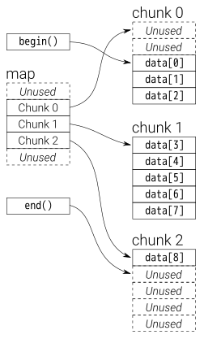

# STL 

## Containers

vector、deque、stack/queue、map/set、unordered_map/unordered_set

### `std::map`

`std::map` uses red-black tree, that renders high computation cost when having too many insertion and deletion operation (to balance the tree). Read/write operations on the map is $O\big(log(n)\big)$.

### `std::string`


### `std::unordered_map`

`std::unordered_map` does not have order hence the read/write operations on the map is always $O(1)$.

Key/value pairs in `std::unordered_map` are stored in bucket depending on hash result of keys. There is no mandated implementations, that linked lists are used in the libstdc++ and Microsoft implementations, while other might use a number of vectors to represent buckets.

### `std::vector`

A vector grows exponentially, such as by $2^n$: $2$, $4$, $8$, $16$ ..., and every time it grows, there need copy operations that assigns elements from old memory to new memory addresses.

* `std::vector<bool>` 

It is an exception that `operator[]` returns `std::vector<bool>::reference` rather than a `bool`. Using `auto& elem = std::vector<bool>(1, false)[0]` to retrieve elements results in undefined behavior.

Consider use `auto highPriority = static_cast<bool>(std::vector<bool>(1, false)[0]);`

* `emplace_back` vs `push_back`

`emplace_back` is generally preferred as it does additional memory check.

`emplace_back` does type deduction so that it can be written with templates such as
```cpp
template<class T, class Allocator = allocator<T>>
class vector {
public:
    template <class... Args>
    void emplace_back(Args&&... args);
};
```
while `push_back` can only be used after instantiation (cannot be used in template)
```cpp
class vector<Widget, allocator<Widget>> {
public:
    void push_back(Widget&& x);
};
```

A better example:
```cpp
class MyKlass {
public:
  MyKlass(int ii_, float ff_) {...}

private:
};

void function() {
  std::vector<MyKlass> v;

  v.push_back(MyKlass(2, 3.14f));
  v.emplace_back(2, 3.14f);
}
```

By using `push_back`, it creates a temp obj every time:
1. Constructor for a temporary `MyKlass` object
2. Move constructor (if one was defined for `MyKlass`, otherwise a copy constructor) for the object actually allocated inside the vector
3. Destructor for the temporary

This is unnecessary since the object passed to push_back is obviously an rvalue that ceases to exist after the statement is completed.

By using `emplace_back`, only `MyKlass` constructor is called. This is the object constructed inside the vector. No temporaries are needed.

### `std::list`

`insert()`/`erase()` in a list need $O(n)$ since it iterates over the whole list to determine where to insert/delete an element.

`push_back()` only needs $O(1)$.

### `std::array`

`std::array` is a container that encapsulates fixed size arrays, init by such as 
```cpp
std::array<int, 3> a {1, 2, 3};
```

### `std::deque`

`std::deque` (double-ended queue) is an indexed sequence container that allows fast insertion and deletion at both its beginning and its end.

Deque implements pointer to the queue's first and end elements, while elements inside are chopped into chunks, each chunk is a vector, linked through a map:



### `std::bitset`

The class template bitset represents a fixed-size sequence of N bits. Bitsets can be manipulated by standard logic operators and converted to and from strings and integers.

```cpp
template< std::size_t N >
class bitset;
```

## Algorithms

`std::all_of`, `std::any_of` and `std::none_of` can used to compute an expression over a range of vars. 
```cpp
std::vector<int> v(10, 2);

if (std::all_of(v.cbegin(), v.cend(), [](int i){ return i % 2 == 0; })) {
    std::cout << "All numbers are even\n";
}

if (std::none_of(v.cbegin(), v.cend(), std::bind(std::modulus<>(), 
                                                    std::placeholders::_1, 2))) {
    std::cout << "None of them are odd\n";
}
```

* `std::all_of`
```cpp
template< class InputIt, class UnaryPredicate >
constexpr bool all_of(InputIt first, InputIt last, UnaryPredicate p)
{
    return std::find_if_not(first, last, p) == last;
}
```

* `std::any_of`
```cpp
template< class InputIt, class UnaryPredicate >
constexpr bool any_of(InputIt first, InputIt last, UnaryPredicate p)
{
    return std::find_if(first, last, p) != last;
}
```

* `std::none_of`
```cpp
template< class InputIt, class UnaryPredicate >
constexpr bool none_of(InputIt first, InputIt last, UnaryPredicate p)
{
    return std::find_if(first, last, p) == last;
}
```

## Tools

### `std::sort()`

The algorithm used by `sort()` is *IntroSort*. Introsort being a hybrid sorting algorithm uses three sorting algorithm to minimize the running time, *Quicksort*, *Heapsort* and *Insertion Sort*. 

## `condition_variable`

`condition_variable` is a synchronization primitive that can be used to block a thread, or multiple threads at the same time, until another thread both modifies a shared variable (the condition), and notifies the condition_variable. 

A typical usage is force return an executing function when timeout:
1. Pass a bond function `f` to a timeout service function
2. Set a mutex lock
3. Branch a thread that runs the func `f`, notifies the main thread when finished
4. Conditional Var throws exception either on timeout or unlocked mutex
5. If Conditional Var does not throw exception, the function return with success
```cpp
template<typename T_ret, typename... T_inputs>
T_ret SpClient::functionWrapperReturnWhenTimeout(std::function<T_ret(T_inputs ...)>& f, T_inputs inputs...) {

    std::mutex mutex_FunctionWrapperReturnWhenTimeout;
    std::condition_variable condVar_FunctionWrapperReturnWhenTimeout;
    T_ret result = 0;

    std::unique_lock<std::mutex> mutexLock_FunctionWrapperReturnWhenTimeout(mutex_FunctionWrapperReturnWhenTimeout);

    std::thread thread_functionWrapperReturnWhenTimeout([&]() {
        result = f(arg1, arg2, arg3);
        condVar_FunctionWrapperReturnWhenTimeout.notify_one();
    });
    thread_functionWrapperReturnWhenTimeout.detach();

    if (condVar_FunctionWrapperReturnWhenTimeout.wait_for(
        mutexLock_FunctionWrapperReturnWhenTimeout, std::chrono::seconds(20)) == 
            std::cv_status::timeout)  {
        throw std::runtime_error("Timeout");
    }

    return result; 
}
```