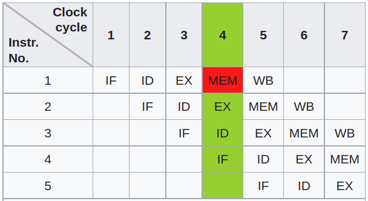

# Optimization

##  `g++` embedded optimization flags

|option|optimization level|execution time|code size|memory usage|compile time|
|-|-|-|-|-|-|
|`-O0`|optimization for compilation time (default)|+|+|-|-|
|`-O1` or `-O`|optimization for code size and execution time|-|-|+|+|
|`-O2`|optimization more for code size and execution time|--||+|++|
|`-O3`|optimization even more for code size and execution time|---||+|+++|
|`-Os`|optimization for code size||--||++|
|`-Ofast`|O3 with fast none accurate math calculations|---||+|+++|

Work from behind

https://gcc.gnu.org/onlinedocs/gcc/Optimize-Options.html

## Return Value 

Compiler can optimize the "copy" return value by such as *placement new*, and it is discouraged using `std::move` as the lifecycle of local memory is not guaranteed.

This method is referred to as *copy elision*: a compiler optimization technique that eliminates unnecessary copying of objects.

```cpp
Widget makeWidget()
{
Widget w;
return w; // "copy" w into return value
}
```
vs
```cpp
Widget makeWidget()
{
Widget w;
return std::move(w);// Moving version of makeWidget
                    // move w into return value
                    // (don't do this!)
}
```

## Small String Optimization (SSO)

When a string length is smaller than 20, data is stored on stack rather than on heap, as heap storage requires additional operation costs such as `new`.

However, from user side, a `std::string` works consistently regardless of its length.

## MemCpy Optimization

Write a `memcpy` function that copies data of size `len` from `src` to `dst`, such as 
```cpp
void* memcpy_v1(void* dst, const void* src, size_t len) {
    char* d = (char*) dst;
    const char* s = (const char*) src;
    while (len--)
        *d++ = *s++;
    return dst;
}
```

### CPU Pipeline

CPU running typically follows this order, and can be run parallel:



(IF = Instruction Fetch, ID = Instruction Decode, EX = Execute, MEM = Memory access, WB = Register write back).

```cpp
void* memcpy_v2(void* dst, const void* src, size_t len) {
    char* d = (char*) dst;
    const char* s = (const char*) src;
    
    size_t i = 0;
    for (; i + 4 < len; i += 4, d = d + 4, s = s + 4) {
        *d = *s;
        *(d + 1) = *(s + 1);
        *(d + 2) = *(s + 2);
        *(d + 3) = *(s + 3);
    }
    while (i < len) {
        i++;
        *d++ = *s++;
    }
    return dst;
}
```

### Cast to `int*` rather than `char*`

`char` copy only takes one byte per time, while `int` takes 4 bytes.

```cpp
void* memcpy_v3(void* dst, const void* src, size_t len) {
    int* d = (int*) dst;
    const int* s = (const int*) src;
    
    for (size_t i=0; i < len; i += 4) {
        *d++ = *s++;
    }
    return d;
}
```
