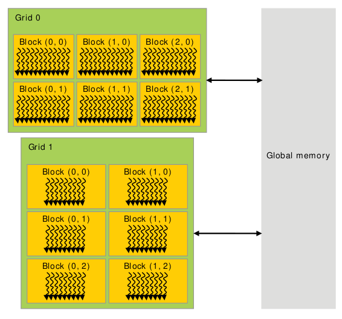
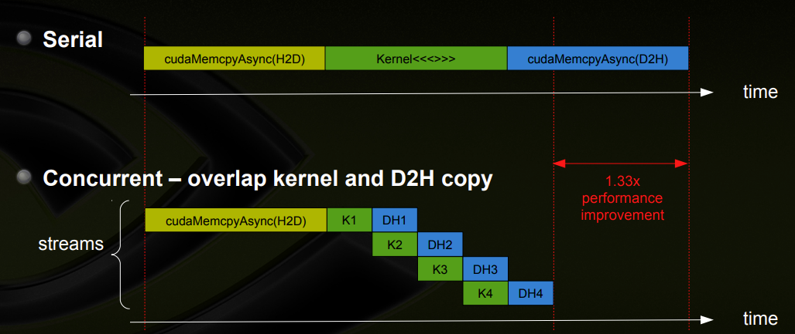
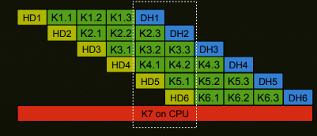

# CUDA

CUDA (or Compute Unified Device Architecture) is a parallel computing platform and application programming interface (API) that allows software to use certain types of graphics processing units (GPUs) for general purpose processing.

.png "CUDA_processing_flow_(En)")

### Driver and cuda version

* Nvidia driver includes driver kernel module and user libraries.

NVIDIA's System Management Interface (`nvidia-smi`) is part of nvidia driver (run `nvidia-smi` to check driver version).

`nvidia-driver-xxx-server` is a subset of `nvidia-driver-xxx`. `nvidia-driver-xxx` has additional vendor support such as 
```bash
linux-modules-nvidia-xxx-aws  
linux-modules-nvidia-xxx-azure  
linux-modules-nvidia-xxx-gcp  
linux-modules-nvidia-xxx-oem-20.04  
linux-modules-nvidia-xxx-oracle  
```

* Cuda toolkit is an SDK contains compiler, api, libs, docs, etc...

Cuda installs `nvcc`, which reveals cuda version by `nvcc --version`.

For example, driver version 515 corresponds to cuda version 11.7

#### Debug

This list shows cuda hardware and driver specifications: https://docs.nvidia.com/cuda/cuda-toolkit-release-notes/index.html

`nvidia-smi` might throw error 
```bash
Failed to initialize NVML: Driver/library version mismatch
```

`dpkg -l | grep nvidia` looks at nvidia-utils-xxx package version

`cat /proc/driver/nvidia/version` looks at the version of Kernel Module

`sudo dpkg --purge remove '^nvidia-.*'` removes all nvidia driver packages, and run `sudo apt-get install nvidia-utils-xxx`


## Memory hierarchy

Each grid has $n \times m$ number of thread blocks; each thread blocks has some threads.

Each thread block has shared memory visible to all threads of the block and with the same lifetime as the block. All threads have access to the same global memory.

* each thread has its local memory
* each thread block has shared memory across all threads in this block
* all threads has shared global memory.



### Cuda memory copy process

If the memory is not pinned (i.e. not page-locked), data is first copied to a page-locked "staging" buffer and then copied to GPU through DMA (Direct Memory Access). 

By using the pinned memory you save the time to copy from pageable host memory to page-locked host memory.

Use `cudaMallocHost` to make data's memory persistent on host device, rather than `malloc` or `new` operation. For memory discharge, use `cudaFreeHost`.

## CUDA C++ extensions and code

`__global__ void func<<<numBlocks, threadsPerBlock>>>` is the CUDA device kernel function c++ extension syntax that runs on CUDA for parallel computation.

CUDA C++ provides keywords that let kernels get the indices of the running threads. Specifically, for one-dimensional block, `threadIdx.x` contains the index of the current thread within its block, and `blockDim.x` contains the number of threads in the block, referenced by `blockIdx.x`. 

Currently, CUDA supports 3-dimensional block concept: for a thread, the flattening mapping can be defined as $(x,y,z)=x+yD_x+zD_xD_y$, where $D_x$ and $D_y$ are `blockDim.x` and `blockDim.y`, respectively. 

```cpp
// Kernel definition
__global__ void MatAdd(float A[N][N][N], float B[N][N][N],
float C[N][N][N])
{
    int idx = blockIdx.x * blockDim.x + threadIdx.x;
    int idy = blockIdx.x * blockDim.y + threadIdx.y;
    int idz = blockIdx.x * blockDim.z + threadIdx.z;
    if (idx < N && idy < N && idz < N)
        C[idx][idy][idz] = A[idx][idy][idz] + B[idx][idy][idz];
}
```

Given a 3d grid with 3d blocks residing inside, the mapping relationship to 1d is (gridDim is not provided by cuda)
```cpp
dim3 grid( GridDim, GridDim, GridDim );
dim3 block( BlockDim, BlockDim, BlockDim );
int gridDim = GridDim;
int idx = 
        gridDim*gridDim*blockDim.z*blockDim.y*blockDim.x*blockIdx.z + 
        gridDim*blockDim.z*blockDim.y*blockDim.x*blockIdx.y + 
        blockDim.z*blockDim.y*blockDim.x*blockIdx.x +
        threadIdx.x*blockDim.z*blockDim.y +
        threadIdx.y*blockDim.z +
        threadIdx.z;
```

### Kernel syntax

Given a `kernel<<<Dg,Db,Ns,S>>>(args**)`, there is
* `Dg` (`dim3`) specifies the dimension and size of the grid.
* `Db` (`dim3`) specifies the dimension and size of each block
* `Ns` (`size_t`) specifies the number of bytes in shared memory that is dynamically allocated per block for this call in addition to the statically allocated memory, default is 0.
* `S` (`cudaStream_t`) specifies the associated stream, is an optional parameter which defaults to 0.

### Common extension usage

* `__global__`

* `__device__`

## Async

### Kernel calls

Kernel calls are asynchronous from the point of view of the CPU so if you call 2 kernels in succession the second one will be called without waiting for the first one to finish. It only means that the control returns to the CPU immediately.

On the GPU side, if you haven't specified different streams to execute the kernel they will be executed by the order they were called (if you don't specify a stream they both go to the default stream and are executed serially). Only after the first kernel is finished the second one will execute.

### Streams

Cuda uses *streams* to manage GPU concurrency, mainly for memCpy and kernel.

A stream is a sequence of operations executed in issue-order on GPU, that cuda operations in diff streams may run concurrently.

All cuda operations are by default sync, using stream $0$, unless stream index and async flag is specified.

### Use of `event` and `stream`

Illustrated in the figure below, cudaMemCpy from host to device is sync, the kernel run and cudaMemCpy from device to host can be run in parallel.



Depending on GPU hardware, there can be multiple kernel runs.



Cuda uses *event* to include stream to perform "wait" to sync operation in the main thread, by `cudaEventCreate(&event);` and `cudaStreamCreate(&stream);`, `cudaEventRecord(event1, stream1);` then `cudaStreamWaitEvent(stream1, event2);`. It uses two events to control one stream (notice here that `event1` and `event2` are used to listen to `stream1`).


### Example code

```cpp
cudaStream_t stream1, stream2, stream3, stream4 ;
cudaStreamCreate ( &stream1) ;
cudaStreamCreate ( &stream2) ;
cudaStreamCreate ( &stream3) ;
cudaStreamCreate ( &stream4) ;
cudaEvent_t event1;
cudaEventCreate(&event1);

cudaMalloc ( &dev1, size ) ;
cudaMallocHost ( &host1, size ) ; // pinned memory required on host
cudaMalloc ( &dev2, size ) ;
cudaMallocHost ( &host2, size ) ; // pinned memory required on host

cudaEventRecord(event1, stream1); // record event1
cudaMemcpyAsync ( dev1, host1, size, H2D, stream1 ) ;
cudaStreamWaitEvent(stream2, event1);    // wait for event in stream1 
kernel2 <<< grid, block, 0, stream2 >>> ( …, dev2, … ) ; 
kernel3 <<< grid, block, 0, stream3 >>> ( …, dev3, … ) ;
some_CPU_method();  // cpu work can be run in parallel
cudaMemcpyAsync ( host4, dev4, size, D2H, stream4 ) ;
```

## Profiling

### Performance check by `nvtop`

`nvtop` is a GUI Nvidia GPU tool that monitors general GPU performance.

Install by (If found any err, do `sudo apt-get update` and manually install dependencies)
```bash
sudo apt-get install nvtop
```