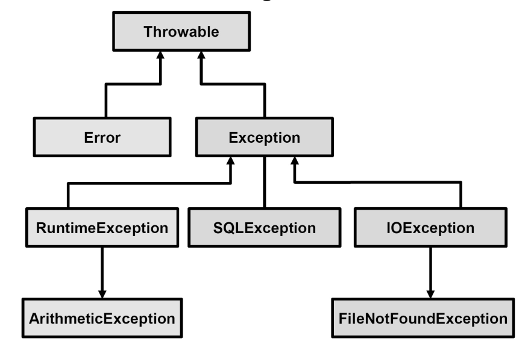

# Java OOP (Object Oriented Programming)

* Inheritance
```java
class Super {
    // code
}
class Sub extends Super {
    // code
}
```

The Superclass reference variable can hold the subclass object, but using that variable you can access only the members of the superclass, so to access the members of both classes it is recommended to always create reference variable to the subclass.

If a class is inheriting the properties of another class. And if the members of the superclass have the names same as the sub class, to differentiate these variables we use `super` keyword.

Generally, the `implements` keyword is used with classes to inherit the properties of an interface. Interfaces can never be extended by a class.

The nearest reached functions are called when there are multiple functions with same signatures (same name and arguments).

`super` can directlly call parent's methods.
```java
public class Animal {
   Animal(){}
   public void eat(){}
}

public class Dog extends Animal {
   super(); // calls Animal's constructor
   super.eat(); // calls Animal's eat method
}
```

* Overriding

Member functions of subclass with same names as that of a super class, these member functions override that of the super class.

* Polymorphism

Polymorphism is the ability of an object to take on many forms. Any Java object that can pass more than one IS-A test is considered to be polymorphic. 

IS-A is a way of saying: This object is a type of that object, e.g., Animal is the superclass of Mammal class -> Mammal IS-A Animal.

```java
// All the reference variables d, a, v, o refer to the same Deer object in the heap.
Deer d = new Deer();
Animal a = d;
Vegetarian v = d;
Object o = d;
```

At compile time, compiler validates statements by the variable type, while at runtime, JVM runs statements by what `new` operator has constructed.

```java
// In the example below, e is checked at compile time by the Employee class, while JVM (at runtime) runs code inside Salary.

public class Employee {}
public class Salary extends Employee {}

public class VirtualDemo {
    public static void main(String [] args) {
        Salary s = new Salary();
        Employee e = new Salary();
    }
}
```

* Abstruction

Object-oriented programming, abstraction is a process of hiding the implementation details from the user, only the functionality will be provided to the user. A class which contains the abstract keyword in its declaration is known as `abstract` class. Implementation of abstruct class can be done via inheritance. This draws similarity with `virtual` declaration in cpp.

```java
// Employee is now abstruct and actual methods inside Employee can be coded in Salary
public abstract class Employee {}
public class Salary extends Employee {}
```

* Encapsulation

Encapsulation in Java is a mechanism of wrapping the data (variables) and code acting on the data (methods) together as a single unit. In encapsulation, the variables of a class will be hidden from other classes, and can be accessed only through the methods of their current class. 

There are two ideas to remember:

1. Declare the variables of a class as private.
2. Provide public setter and getter methods to modify and view the variables values.

```java
// use setXXX(newXXX); and getXXX() to encapsulate data
public class EncapTest {
   private int var;

    public int getVar() {
      return var;
   }

    public void setVar( int newVar) {
      var = newVar;
   }
}
```

* Interfaces

A class implements an `interface`, thereby inheriting the abstract methods of the interface.  It is a collection of abstract methods. It defines `abstract` type

```java
interface Animal {
   public void eat();
   public void travel();
}

interface Creature {}

public class MammalInt implements Animal {

   public void eat() {
      System.out.println("Mammal eats");
   }

   public void travel() {
      System.out.println("Mammal travels");
   } 
}

// Inheritance can be done by 'extends'
public interface MammalInt extends Animal, Creature {}
```

* Generics

Similar to template in cpp

```java
 public class GenericMethodTest {
   // generic method printArray
   public static < E > void printArray( E[] inputArray ) {
      // Display array elements
      for(E element : inputArray) {
         System.out.printf("%s ", element);
      }
      System.out.println();
   }

   public static void main(String args[]) {
      // Create arrays of Integer, Double and Character
      Integer[] intArray = { 1, 2, 3, 4, 5 };
      Double[] doubleArray = { 1.1, 2.2, 3.3, 4.4 };
      Character[] charArray = { 'H', 'E', 'L', 'L', 'O' };

      System.out.println("Array integerArray contains:");
      printArray(intArray);   // pass an Integer array

      System.out.println("\nArray doubleArray contains:");
      printArray(doubleArray);   // pass a Double array

      System.out.println("\nArray characterArray contains:");
      printArray(charArray);   // pass a Character array
   }
}
```

```java
public class MaximumTest {
   // determines the largest of three Comparable objects
   
   public static <T extends Comparable<T>> T maximum(T x, T y, T z) {
      T max = x;   // assume x is initially the largest
      
      if(y.compareTo(max) > 0) {
         max = y;   // y is the largest so far
      }
      
      if(z.compareTo(max) > 0) {
         max = z;   // z is the largest now                 
      }
      return max;   // returns the largest object   
   }
   
   public static void main(String args[]) {
      System.out.printf("Max of %d, %d and %d is %d\n\n", 
         3, 4, 5, maximum( 3, 4, 5 ));

      System.out.printf("Max of %.1f,%.1f and %.1f is %.1f\n\n",
         6.6, 8.8, 7.7, maximum( 6.6, 8.8, 7.7 ));

      System.out.printf("Max of %s, %s and %s is %s\n","pear",
         "apple", "orange", maximum("pear", "apple", "orange"));
   }
}
```

* Internet

Sockets provide the communication mechanism between two computers using TCP. A client program creates a socket on its end of the communication and attempts to connect that socket to a server.

When the connection is made, the server creates a socket object on its end of the communication.

```java
// A java client socket example

import java.net.*;
import java.io.*;

public class GreetingClient {

   public static void main(String [] args) {
      String serverName = args[0];
      int port = Integer.parseInt(args[1]);
      try {
         System.out.println("Connecting to " + serverName + " on port " + port);
         Socket client = new Socket(serverName, port);
         
         System.out.println("Just connected to " + client.getRemoteSocketAddress());
         OutputStream outToServer = client.getOutputStream();
         DataOutputStream out = new DataOutputStream(outToServer);
         
         out.writeUTF("Hello from " + client.getLocalSocketAddress());
         InputStream inFromServer = client.getInputStream();
         DataInputStream in = new DataInputStream(inFromServer);
         
         System.out.println("Server says " + in.readUTF());
         client.close();
      } catch (IOException e) {
         e.printStackTrace();
      }
   }
}
```

* Variable Scope 

1. Default access modifier

When we do not mention any access modifier, it is called default access modifier. The scope of this modifier is limited to the package only. 

2. Private access modifier

1). Private Data members and methods are only accessible within the class

2). Class and Interface cannot be declared as private

3). If a class has private constructor then you cannot create the object of that class from outside of the class.

3. Protected Access Modifier

Protected data member and method are only accessible by the classes of the same package and the subclasses present in any package. 

4. Public access modifier

The members, methods and classes that are declared public can be accessed from anywhere. This modifier doesn’t put any restriction on the access.

* final 

`final` is used to make a variable constant; and a method be a non-overriden function.

* Exception

It is good to classify exceptions and have separate business logics to solve them accordingly.

```java
try{
   // ...
} catch (Exception e) {
   System.out.println(e.getMessage());
} finally {
   // ...
}
```

Exception inheritance tree shows as below.


`throws Exception` is used to specify a method to handle exception whenever a function is called. 

```java
public static void readFile(String filename) {
   InputStream in = new FileInputStream(filename);
   int data = in.read();
}

public static void readFile(String filename) throws IOException {
   System.out.println("File read failed");
}

// if readFile(...); fails, the above exception calls 
readFile("filename.txt");
```

`throw` can manually generate an error.
```java
if (! found) {
   throw new FileNotFoundException();
}
```

Custom exception can be defined by inheriting `Exception`.

```java
// custom invalid password exception
class InvalidPasswordException extends Exception {
   InvalidPasswordException(){}
   InvalidPasswordException(String msg){ super(msg); }
   InvalidPasswordException(String msg, Throwable cuz){ super(msg, cuz); }
}
```

**Error** refers to a termination of this program. Programmer need to re-write code to deal with this problem.


* Generics and Collections

Generics in Java is similar to `template` in c++.

Common collections that implement basic data structures: `stack`, `queue`, `dynamic array (vector)` and `hash`.

`hashmap` is not thread-safe while `vector` is thread-safe.

Java wraps primitive datatypes into class, such as
```java
Integer intObj = new Integer(1); // wrapper
int intPrimitive = 2; // int

Integer intObj2 = new Integer(intPrimitive); // wrapper
int intPrimitive2 = intObj2.intValue(); // int
```

## JUnit Test
A JUnit test is a method contained in a class which is only used for testing. This is called a Test class. To define that a certain method is a test method, annotate it with the `@Test` annotation.

The following code shows a JUnit test using the JUnit 5 version. This test assumes that the MyClass class exists and has a multiply(int, int) method.

```java
import static org.junit.jupiter.api.Assertions.assertEquals;

import org.junit.jupiter.api.Test;

public class MyTests {

    @Test
    public void multiplicationOfZeroIntegersShouldReturnZero() {
        MyClass tester = new MyClass(); // MyClass is tested

        // assert statements
        assertEquals(0, tester.multiply(10, 0), "10 x 0 must be 0");
        assertEquals(0, tester.multiply(0, 10), "0 x 10 must be 0");
        assertEquals(0, tester.multiply(0, 0), "0 x 0 must be 0");
    }
}
``` 