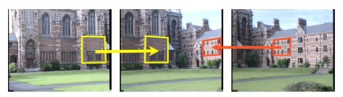

# Homography

## Homogeneous coordinates

Mapping between homogeneous coordinates and Cartesian's is about an added scaling factor $w$. Points in homogeneous coordinates given the same $(x,y)$ but a different scaling factor $w$ represent a direction. 

$$
\begin{align*}
\text{Homogeneous} & \quad\space\space\space  \text{Cartesian}
\\
(x,y,w) & \Leftrightarrow (\frac{x}{w}, \frac{y}{w})
\\
(1,2,1) & \Leftrightarrow (\frac{1}{1}, \frac{2}{1}) = (1,2)
\\
(2,4,2) & \Leftrightarrow (\frac{2}{2}, \frac{4}{2}) = (\frac{1}{1}, \frac{2}{1}) = (1,2)
\\
(3,6,3) & \Leftrightarrow (\frac{3}{3}, \frac{6}{3}) = (\frac{1}{1}, \frac{2}{1}) = (1,2)
\end{align*}
$$

By setting $w=1$, we have homogeneous coordinate $(x,y,1)$ and its Cartesian representation $(x,y)$

## Homography

A homography is an isomorphism of projective spaces, or the transformation between two camera image planes: $\bold{x}_2 \sim H \bold{x}_1$

Define $\bold{x}_1=(x_1,y_1,w_1)$ as an image point on the first camera view and $\bold{x}_2=(x_2,y_2,w_2)$ on the second camera view. $\bold{x}_1$ corresponds to $\bold{x}_2$, describing the same real world object point.

Define a transfomrmation matrix $H$ that maps this projective relationship, there is (in homogeneous coordinates)
$$
\bold{x}_2=H \bold{x}_1
$$
where
$$
H=
\begin{bmatrix}
    h_{11} & h_{12} & h_{13} \\
    h_{21} & h_{22} & h_{23} \\
    h_{31} & h_{32} & h_{33} \\
\end{bmatrix}
$$

Removed the scaling factors $w$ and $w'$, there is
$$
\begin{bmatrix}
    x_2 \\
    y_2 \\
    w_2
\end{bmatrix}
=
\begin{bmatrix}
    h_{11} & h_{12} & h_{13} \\
    h_{21} & h_{22} & h_{23} \\
    h_{31} & h_{32} & h_{33} \\
\end{bmatrix}
\begin{bmatrix}
    x_1 \\
    y_1 \\
    w_1
\end{bmatrix}
$$
where $h_{33}$ is a scaling factor that does not impact the expressions of $x_2$ and $y_2$, so that it can be set to $h_{33}=1$.

The Degree of Freedom (DoF) is $8$ for homography matrix $H$.

Set $w_1=1$ (easy for computation defining $w_1$ ) and ignore $w_2$ (do not need to compute $w_2$). $x_2'=\frac{x_2}{w_2}, y_2'=\frac{y_2}{w_2}$:
$$
x_2'=
\frac{h_{11}x_1+h_{12}y_1+h_{13}}{h_{31}x_1+h_{32}y_1+h_{33}}
\\
y_2'=
\frac{h_{21}x_1+h_{22}y_1+h_{23}}{h_{31}x_1+h_{32}y_1+h_{33}}
$$

### Least squares problem to search for $H$

Given the above $x_2'$ and $y_2'$ expressions, we have
$$
\bold{a}_x^\text{T} \bold{h} = \bold{0}
\\
\bold{a}_y^\text{T} \bold{h} = \bold{0}
$$
where
$$
\begin{align*}
\bold{h}
&=
(h_{11}, h_{12}, h_{13}, h_{21}, h_{22}, h_{23}, h_{31}, h_{32}, h_{33})^\text{T}
\\
\bold{a}_x &=
(-x_1, -y_1, -1, 0, 0, 0, x_2'x_1, x_2'y_1, x_2')^\text{T}
\\
\bold{a}_x &=
(0, 0, 0, -x_1, -y_1, -1, y_2'y_1, y_2'x_1, y_2')^\text{T}
\end{align*}
$$

Given $n$ points to compute 
$$
A \bold{h} = \bold{0}
$$
where
$$
A=
\begin{bmatrix}
    \bold{a}_{x_1}^\text{T} \\
    \bold{a}_{y_1}^\text{T} \\
    ... \\
    \bold{a}_{x_n}^\text{T} \\
    \bold{a}_{x_n}^\text{T}
\end{bmatrix}
$$

### Least squares solutions

* Solution 1: SVD
$$
A=U \Sigma V^\text{T}
=\sum^9_{i=1}\sigma_i \bold{u}_i\bold{v}_i^\text{T}
$$
Since solution $\bold{h}$ is over-determined and Dof for $H$ is $8$, the smallest $\sigma_i$ represents the residual. The other 8 homography entries $h_{ij}$ are equal to their corresponding $\sigma_i$.

* Solution 2: Derivative

The objective function for minimization problem is
$$
\begin{align*}
f(\bold{h}) &= \frac{1}{2} (A \bold{h} - \bold{0})^\text{T} (A \bold{h} - \bold{0})
\\ &=
\frac{1}{2} (A \bold{h})^\text{T} (A \bold{h})
\\ &=
\frac{1}{2} \bold{h}^\text{T} A^\text{T} A \bold{h}
\end{align*}
$$
whose derivative is
$$
\begin{align*}
\frac{df}{d\bold{h}} 
&= 
\frac{1}{2} (A^\text{T} A + (A^\text{T} A)^\text{T}) \bold{h}
\\ &= 
A^\text{T} A \bold{h}
\\ &=
0
\end{align*}
$$

Eigen-decomposition of $A^\text{T} A$ should have 8 non-zero eigenvalues, same as the result from SVD. 

## Derivation

In practice, we assume real world points on the $z=0$ plane, that is, camera plane and real world plane are parallel to each other.

$\begin{bmatrix}\bold{R} & \bold{t} \\ \bold{0} & 1 \end{bmatrix}$ is the rotation and translation operation from one camera view to the second.

### Image panorama application example

Panorama application example shows that $\bold{x}, \bold{x}' \in \bold{X}$ are on the same projective line, captured by two camera images $Image 1$ and $Image 2$. $\bold{x}$ and $\bold{x}'$ are mapped by a homography matrix $H$.

## Homography vs Fundamental matrix

Both are used to find correspondance points between two camera views, but homography is a special case where all points must be planar ($z=0$), camera views move by rotation.

