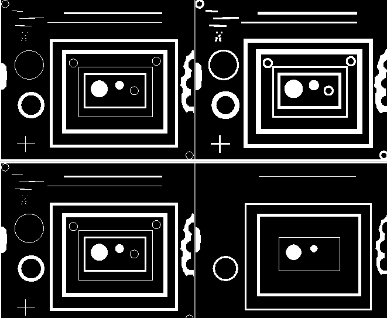

# Basic Image Process

## Erosion and Dilation

Given binary image (pixel value being either $0$ for black and $1$ for white), *erode* shrinks image object "thickness"; *dilate* "enlarges" image objects.

For example, the left hand side is src image, the upper right hand side is dilation result; the lower right hand side is erision result.

* Erode

Take $min$ operation on a pixel's neighbour peixls, such as
$$
p_{x,y}=
min\bigg(
\begin{bmatrix}
      p_{x-1,y-1} & p_{x,y-1} & p_{x,y+1} \\
      p_{x-1,y} & p_{x,y} & p_{x+1,y} \\
      p_{x-1,y+1} & p_{x,y+1} & p_{x+1,y+1}
\end{bmatrix} \bigg)
$$

* Dilate

Take $max$ operation on a pixel's neighbour peixls, such as
$$
p_{x,y}=
max\bigg(
\begin{bmatrix}
      p_{x-1,y-1} & p_{x,y-1} & p_{x,y+1} \\
      p_{x-1,y} & p_{x,y} & p_{x+1,y} \\
      p_{x-1,y+1} & p_{x,y+1} & p_{x+1,y+1}
\end{bmatrix} \bigg)
$$