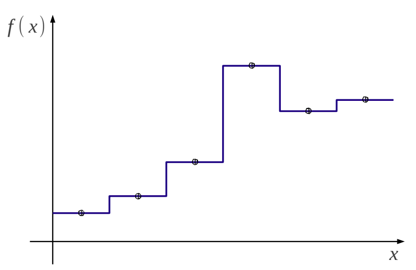
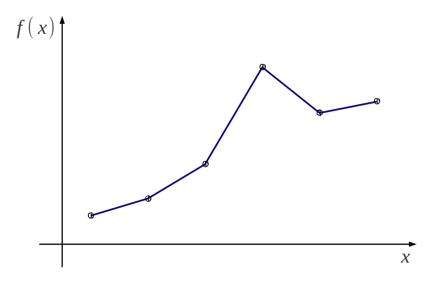
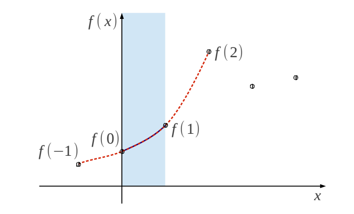
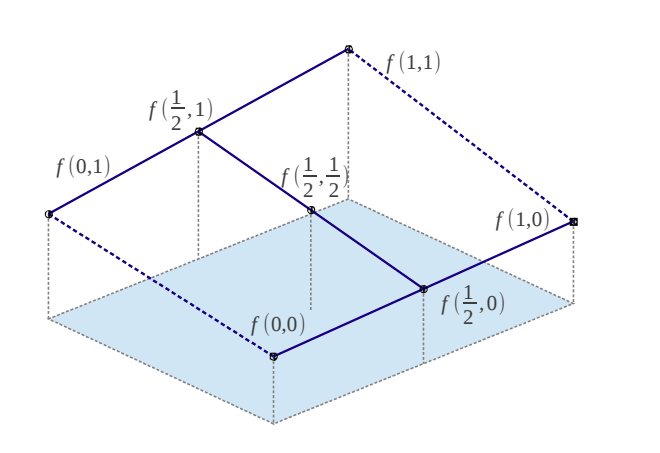
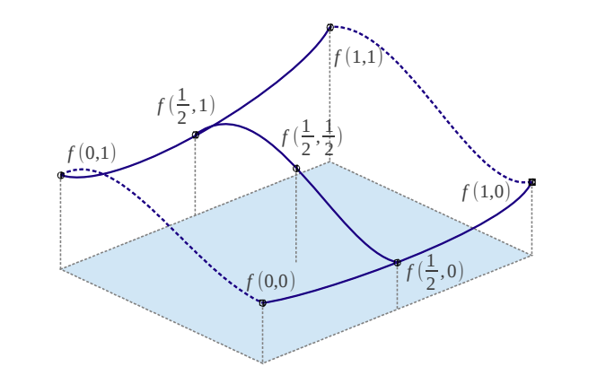

# Interpolation

Interpolation is used to fill "gaps" between each data points, such as construct a continuous function out of discrete data points. 

## Nearest

Interpolation through taking the same value as its nearest neighbour's.

## Linear

$$
f(x) = a_1 x + a_0
$$

## Cubic

$$
f(x) = \sum^3_{i=0}a_i x^i = a_3x^3 + a_2x^2 + a_1x + a_0
$$

Every curve needs four neighbour data points to determine its coefficients $a_i$

$$
f(-1)=a_3(-1)^3+a_2(-1)^2+a_1(-1)^1+a_0
\\
f(0)=a_3(0)^3+a_2(0)^2+a_1(0)^1+a_0
\\
f(1)=a_3(1)^3+a_2(1)^2+a_1(1)^1+a_0
\\
f(2)=a_3(2)^3+a_2(2)^2+a_1(2)^1+a_0
$$

## Bilinear

Given a 2-d matrix with known four corners: $f(0,0), f(0,1), f(1,0), f(1,1)$, interpolation follows

* $f(\frac{1}{2}, 0)$ interpolation by $f(0,0), f(0,1)$
* $f(\frac{1}{2}, 1)$ interpolation by $f(1,0), f(1,1)$
* $f(\frac{1}{2}, \frac{1}{2})$ interpolation by $f(\frac{1}{2},0), f(\frac{1}{2},1)$

## Bicubic

