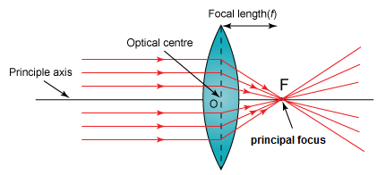
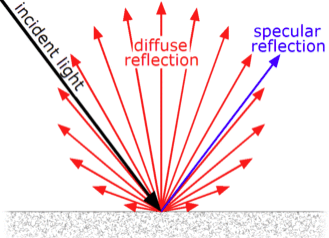

# Light and Lens

## Lambertian reflectance

Lambertian reflectance is the property that defines an ideal "matte" or diffusely reflecting surface. Surface luminous intensity obeys Lambert's cosine law.

Ideal "matte" surface's luminance is isotropic, while specular reflection sees high intensity in one direction.

## Pinhole

A pinhole camera is a simple camera without a lens and with a single small aperture.

Define Intrinsic Parameters
$$
K=
\begin{bmatrix}
      f_x & 0 & 0 \\
      s & f_y & 0 \\
      c_x & c_y & 1
\end{bmatrix}
$$
where 
* $(c_x, c_y)$ Optical center (the principal point), in pixels.
* $F$ focal length in world units, often in millimeters
* $(f_x, f_y)$ focal length in pixels, where $f_x=F/p_x$, $f_y=F/p_y$, in which $p_x \times p_y$ are the size of an image

Define Extrinsic Parameters
$$
\begin{align*}
\begin{bmatrix}
      \bold{R} \\
      \bold{T}
\end{bmatrix}_{4 \times 4}
& =
\begin{bmatrix}
      r_{11} & r_{12} & r_{13} & t_{1} \\
      r_{21} & r_{22} & r_{23} & t_{2} \\
      r_{31} & r_{32} & r_{33} & t_{3} \\
      0 & 0 & 0 & 1
\end{bmatrix}
\\
\begin{bmatrix}
      \bold{R} \\
      \bold{T}
\end{bmatrix}_{4 \times 3}
& =
\begin{bmatrix}
      r_{11} & r_{12} & t_{1} \\
      r_{21} & r_{22} & t_{2} \\
      r_{31} & r_{32} & t_{3} \\
      0 & 0 & 1
\end{bmatrix}
\end{align*}
$$
where $R$ and $T$ are rotation and translation matrices that adjust a camera physical orientation and lateral position. Here we set $z=0$ to assume that both real world and camera frame are parallel to each other (no rotation but possible translation).

The mapping relationship from world points to image pixels can be expressed as
$$
w
\begin{bmatrix}
      x_p \\
      y_p \\
      1
\end{bmatrix}^\text{T}
=
\begin{bmatrix}
      w x_w \\
      w y_w \\
      w \\
      1
\end{bmatrix}^\text{T}
\begin{bmatrix}
      \bold{R} \\
      \bold{T}
\end{bmatrix}
_{4 \times 3}
\begin{bmatrix}
      f_x & 0 & 0 \\
      s & f_y & 0 \\
      c_x & c_y & 1
\end{bmatrix}
$$
where $(x_p, y_p)$ is image pixel. $(w x_w, w y_w, w)$ is world point pixel. $w$ is the scaling factor. Usually $w=1$.

## Fisheye

### Distortion Formulation

* Radial distortion

Radial distortion occurs when light rays bend more near the edges of a lens than they do at its optical center. The smaller the lens, the greater the distortion.

* Tangent distortion

Tangential distortion occurs when the lens and the image plane are not parallel. 

Distortion correction formula:

$$
\begin{align*}
x_u = & \space x_d+(x_d-x_c)(k_1r^2+k_2r^4+k_3r^6+...)
\\ &+ 
\big(p_1(r^2+2(x_d-x_c)^2)+2p_2(x_d-x_c)(y_d-y_c)\big)
(1+p_3r^2+p_4r^4+...)
\end{align*}
\\
\begin{align*}
y_u = & \space y_d+(y_d-y_c)(k_1r^2+k_2r^4+k_3r^6+...)
\\ &+ 
\big(p_1(r^2+2p_2(x_d-x_c)(y_d-y_c))+2p_2(y_d-y_c)^2\big)
(1+p_3r^2+p_4r^4+...)
\end{align*}
$$
where 
* $(x_d, y_d)$ is the distorted image pixel as projected on image plane using specified lens
* $(x_u, y_u)$ is the undistorted image pixel after correction
* $(x_c, y_c)$ is the distortion center
* $k_n$ is the $n$-th radial distortion coefficient
* $p_n$ is the $n$-th tangential distortion coefficient
* $r=\sqrt{(x_d-x_c)^2+(y_d-y_c)^2}$ is the Euclidean distance between the distorted image point and the distortion center

Usually, for images of little distortions, $n=2$ can render good recovery result ($k_n$ s of higher $n$ are insignificant that $k_n \approx 0$). Greater the distortion, higher the power factor $n$ is required. In OpenCV, $n=4$ is used.

### Fisheye intrinsic and extrinsic parameters

Remember we have the below camera model. Fisheye distortion adds polynomials so that, define $(x_d, y_d)$ as the distortion pixel coordinate.

$$
w
\begin{bmatrix}
      x_p \\
      y_p \\
      1
\end{bmatrix}^\text{T}
=
\begin{bmatrix}
      w x_d \\
      w y_d \\
      w \\
      1
\end{bmatrix}^\text{T}
\begin{bmatrix}
      \bold{R} \\
      \bold{T}
\end{bmatrix}
_{4 \times 3}
\begin{bmatrix}
      f_x & 0 & 0 \\
      s & f_y & 0 \\
      c_x & c_y & 1
\end{bmatrix}
$$

where $(x_d, y_d)$ is the distortion mapping from the real world point $(x_w, y_w)$
$$
w\begin{bmatrix}
      x_d \\
      y_d
\end{bmatrix}
=
w(1+k_1r^2+k_2r^4+k_3r^6+k_4r^8)
\begin{bmatrix}
      x_w \\
      y_w
\end{bmatrix}
$$
where
* $(x_w, y_w)$ is a real world point
* $(x_d, y_d)$ is an ideal image projection (retaining fisheye distorted features) of a real-world point
* $w$ is a scaling factor
* $k_0, k_2, k_3, k_4$ are polynomial coefficients
* $r=\sqrt{(x_d-x_c)^2+(y_d-y_c)^2}$ is the distance of a point from the image center

Consider tangent distortion for tilted planes, $(x_d, y_d)$ can have the below expression:
$$
w\begin{bmatrix}
      x_d \\
      y_d
\end{bmatrix}
=
\begin{bmatrix}
      x_w \\
      y_w
\end{bmatrix}
+
\begin{bmatrix}
      2p_1x_wy_w+p_2(r^2+2x_w^2) \\
      2p_2x_wy_w+p_1(r^2+2y_w^2)
\end{bmatrix}
$$
where $p_1, p_2$ are tangent distortion coefficients.