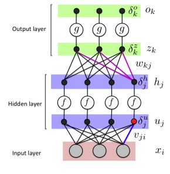

# Neural Network

## Forward Propogation

$$
h_j(\bold{x})=
f(v_{ji}+\sum_{i=1}^D x_i v_{j,i})
$$

$$
o_k(\bold{x})=
g(w_{k,j}+\sum^J_{j=1}h_j(\bold{x})w_{k,j})
$$

## Back Propogation

For the output layer, the derivative is the weighted $\delta_k^{z,n}$ sum. In the example above, $k=1,2,3$. $g$ is the activation function for this layer.
$$
\begin{align*}
\frac{\partial E}{\partial h_j^n}
&=
\sum_k 
\frac{\partial E}{\partial o_k^n}
\frac{\partial o_k^n}{\partial z_k^n}
\frac{\partial z_k^n}{\partial h_j^n}
\\ &=
\sum_k
\delta^{z,n}_k w_{k,j}
\\ &=
\delta^{h,n}_j
\end{align*}
$$

For hidden layers, there is

$$
\begin{align*}
\frac{\partial E}{\partial w_{j,i}^n}
&=
\sum_{n=1}^N
\frac{\partial E}{\partial h_j^n}
\frac{\partial h_j^n}{\partial u_j^n}
\frac{\partial u_j^n}{\partial v_{j,i}}
\\ &=
\sum_{n=1}^N
\delta^{h,n}_j
f'(u_j^n)
\frac{\partial u_j^n}{\partial v_{j,i}}
\\ &=
\sum_{n=1}^N
\delta^{u,n}_j x^n_i
\end{align*}
$$