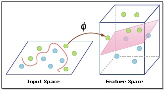
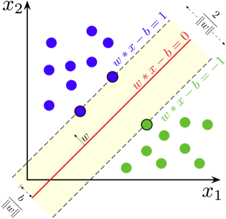

# Support Vector Machine

It attempts to add dimensionality (constructing a hyperplane by a kernel function $\phi$) for a dataset that cannot be linearly separated in the source data space, but be separable in higher dimensional space.

## Definition

Given a dataset $(\bold{x}, \bold{y})=[(x_1, y_1), (x_2, y_2), ..., (x_m, y_m)]$, where $x_i$ is a $n$-dimensional vector.

Construct a hyperplane that makes training data $\bold{x}$ satisfy
$$
\bold{w}^T \bold{x} - b = 0
$$
where $\bold{w}$  is the (not necessarily normalized) normal vector to the hyperplane.
$$
\bold{w}^T \bold{x} - b = 1,\quad \text{for } y_i=1
\\
\bold{w}^T \bold{x} - b = -1,\quad \text{for } y_i=-1
$$

This can be rewritten as
$$
y_i(\bold{w}^Tx_i-b) \ge 1, \quad \forall x_i \in \bold{x}, \space \forall y_i \in \bold{y}
$$

To achieve best separation, we want to maximize $\frac{2}{||\bold{w}||}$, which means
$$
arg \space \underset{\bold{w}}{min} ||\bold{w}||
$$
subject to
$$
y_i(\bold{w}^Tx_i-b) \ge 1
$$

### Example

$x_i = (x_{i,1}, x_{i,2})$ is a two-dimensional sample. We want to maximize $\frac{b}{||\bold{w}||}$

## Kernel Tricks

Kernel functions are used to map source data space to a higher dimensional space that makes seperation easy.

Choice of kernels depends on dataset distributions.

Some typical kernels are

* Polynomial
$$\phi(\overrightarrow{x_i}, \overrightarrow{x_j}) = (\overrightarrow{x_i} \cdot \overrightarrow{x_j})^d
$$

* Gaussian radial basis function
$$\phi(\overrightarrow{x_i}, \overrightarrow{x_j}) = e^{-\gamma||\overrightarrow{x_i} - \overrightarrow{x_j}||^2}, \quad \gamma>0
$$