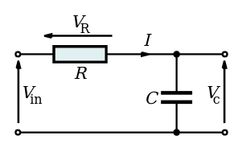

# Complex Application

## Laplace transform

### Definition:

$$
F(s)=\mathcal{L}\big(f(t)\big) = \int_0^{\infty} f(t) e^{-st} dt
$$
where $s=\sigma + i\omega$ in a complex plane. When $s=i\omega$, the aforementioned transform is a Fourier transform.

Inverse Laplace transform:
$$
f(t) = \mathcal{L}^{-1}\big\{F\big\}(t)
$$

### Application:
The output of a linear time-invariant system can be calculated by convolving its unit impulse response with the input signal. The use of Laplace transform turns convolution calculation from time-based space into multiplication in Laplace space.

### Electric circuit example

Given the nature if electricity with defined input $v_{in}(t)=V_0 e^{jωt}$ (Real-valued sinusoids noting that $V_{in} = \mathcal{R}\big\{ V_0 e^{jωt} \big\} = V_0 cos (\omega t)$ as the observed voltage for $V_{in}$).

Given the circuit following Kirchhoff’s voltage law (KVL):
$$\begin{align*}
V_{in} + V_R + V_C = 0
\end{align*}$$

then
$$\begin{align*}
V_{in} 
& = I_R R + I_C Z_C \\
& = I_R R + C \frac{V_C(t)}{dt} Z_C \\
& = I_R R + V_C
\end{align*}$$
where $Z_C$ is the impedance of a capacitor of capacitance $C$.

hence
$$
Z_C = \frac{V_C}{I_C}= \frac{V_p e^{j \omega t}}{Cj \omega V_p e^{j \omega t}}
= \frac{1}{j \omega C}
$$
where $V_p$ is amplitude of a sinusoidal signal $e^{j \omega t}$ over the capacitor.

With $s=j\omega$, here derived:
$$
Z_C = \frac{1}{sC}
$$

Here defines Capacitor Reactance $X_C=-\frac{1}{\omega C}$:
$$
V_{in}(s) = R + jX_C
$$

Inductor has property: $X_I = \omega L$, together with Capacitor Reactance $X_C$:
$$
X = X_C + X_I
$$
$$
V_{in}(s) = R + jX
$$

A physical component with a finite reactance induces a phase shift $\theta$ between the voltage across it and the current through it. Magnitude and phase of impedance are
$$
|Z| = \sqrt[2]{R^2+X^2}
$$
$$
\theta = arctan(\frac{X}{R})
$$

### Physical meaning of real and imaginary part of $s$

1. For a DC circuit, this simplifies to $s = 0$. 

2. For a steady-state sinusoidal AC signal $s = j \omega$. 

3. For an energy-gained sinusoidal signal $s = \alpha + j \omega$, in which when $\alpha > 0$ indicates an energy-amplifying system response; when $\alpha < 0$ indicates an energy-decaying system response.

For example, given a decaying energy sinusoidal system response 
$$
e^{- \alpha t}sin(\omega t) u(t)
$$
with applied Laplace transform:
$$
\frac{\omega}{(s+\alpha)^2 + \omega^2}
$$

has a pole in complex plane $s=-\alpha \pm jw$ that sit on the left side of complex plane, hence granting system stability.