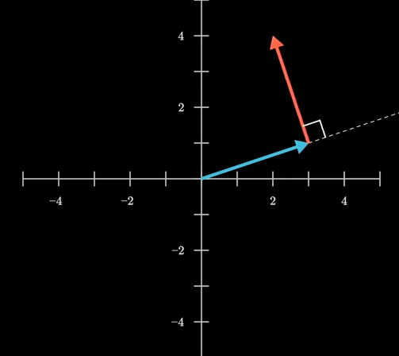

# Differential equations in matrix form

## Example: Dynamics of $x(t)$ and $y(t)$

Given a dynamic system with known $A_{2 \times 2}$ searching for analytic solutions of $x(t)$ and $y(t)$:
$$
\frac{d}{dt}
\begin{bmatrix}
      x(t) \\
      y(t) \\
\end{bmatrix}
=
\begin{bmatrix}
      a_{1,1} & a_{1,2} \\
      a_{2,1} & a_{2,2} \\
\end{bmatrix}
\begin{bmatrix}
      x(t) \\
      y(t) \\
\end{bmatrix}
$$

Assigned with values (as an example):
$$
\frac{d}{dt}
\begin{bmatrix}
      x(t) \\
      y(t) \\
\end{bmatrix}
=
\begin{bmatrix}
      0 & -1 \\
      1 & 0 \\
\end{bmatrix}
\begin{bmatrix}
      x(t) \\
      y(t) \\
\end{bmatrix}
$$
as the representation for this set of differential equations:
$$\begin{align*}
x'(t) = -y(t) \\
y'(t) = x(t)
\end{align*}
$$

This $A_{2 \times 2}$ is a counter clockwise 90 degree $2 \times 2$ rotation matrix. Hence, the rate of change for any given input $[x(t), y(t)]$ is explained as in $A_{2 \times 2}$.

Blue arrow represents an input with respect to $x(t)$ axis and $y(t)$ axix, while red arrow represents the tendency to change.

Given the nature of $(e^x)'=e^x$ (proof by Euler formula), and given any linear transformation $A$, there is (differential by $dt$)
$$
(e^{Ax})' = Ae^{Ax}x_{t_0}
$$
where $x=[x_1(t), x_2(t), ..., x_n(t)]$ is a set of functions of $t$.

Hence, it is assumed that function vector $x$ can be expressed as linear combinations of $e^{x}$.

Back to the example, there is
$$
\frac{d}{dt}
\begin{bmatrix}
      x(t) \\
      y(t) \\
\end{bmatrix}
=
\begin{bmatrix}
      0 & -1 \\
      1 & 0 \\
\end{bmatrix}
\begin{bmatrix}
      x(t) \\
      y(t) \\
\end{bmatrix}
=
\begin{bmatrix}
      0 & -1 \\
      1 & 0 \\
\end{bmatrix}
e^{
\begin{bmatrix}
      0 & -1 \\
      1 & 0 \\
\end{bmatrix} t
}
\begin{bmatrix}
      x_0 \\
      y_0 \\
\end{bmatrix}
$$

Then
$$
\begin{bmatrix}
      x(t) \\
      y(t) \\
\end{bmatrix}
=
e^{
\begin{bmatrix}
      0 & -1 \\
      1 & 0 \\
\end{bmatrix} t
}
\begin{bmatrix}
      x_0 \\
      y_0 \\
\end{bmatrix}
$$

Expand and calculate:
$$
e^{
\begin{bmatrix}
      0 & -1 \\
      1 & 0 \\
\end{bmatrix} t
}
=
t^0 \begin{bmatrix}
      0 & -1 \\
      1 & 0 \\
\end{bmatrix}^0
+
t^1 \begin{bmatrix}
      0 & -1 \\
      1 & 0 \\
\end{bmatrix}^1
\\
\frac{t^2}{2!} \begin{bmatrix}
      0 & -1 \\
      1 & 0 \\
\end{bmatrix}^2
+
\frac{t^3}{3!} \begin{bmatrix}
      0 & -1 \\
      1 & 0 \\
\end{bmatrix}^3
+ ... +
\frac{t^n}{n!} \begin{bmatrix}
      0 & -1 \\
      1 & 0 \\
\end{bmatrix}^n
$$

The calculation result resembles $sin(t)$ and $cos(t)$ in series expansion, thus
$$
e^{
\begin{bmatrix}
      0 & -1 \\
      1 & 0 \\
\end{bmatrix} t
}
=
\begin{bmatrix}
      cos(t) & -sin(t) \\
      sin(t) & cos(t) \\
\end{bmatrix}
\begin{bmatrix}
      x(t_0) \\
      y(t_0) \\
\end{bmatrix}
$$

Final solution:
$$
\begin{bmatrix}
      x(t) \\
      y(t) \\
\end{bmatrix}
=
\begin{bmatrix}
      cos(t) & -sin(t) \\
      sin(t) & cos(t) \\
\end{bmatrix}
\begin{bmatrix}
      x(t_0) \\
      y(t_0) \\
\end{bmatrix}
$$
or expressed as
$$
x(t) = cos(t)x_0 -sin(t)y_0 \\
y(t) = sin(t)x_0 + cos(t)y_0
$$
which matches the rotation nature of the aforementioned matrix $A_{2 \times 2}$.
