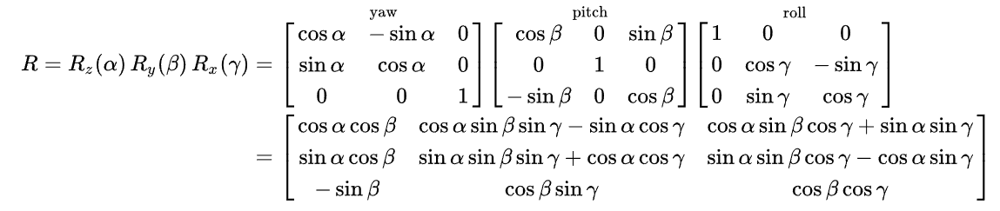

# Lie and Robotics

A 3-D rotation matrix is a *Special Orthogonal Group*. Given $3$ as the dimensionality, it is denoted as $SO(3)$.

$R$ is in the given form below

Given its changes with time $t$, it can be expressed as $R(t)$, besides, there is 
$$
R(t)R(t)^T=I
$$

By differential,
$$
\dot{R(t)}R(t)^T + R(t)\dot{R(t)^T} = 0 \\
\dot{R(t)}R(t)^T = -(\dot{R(t)}R(t)^T)^T
$$

### Note

$\dot{R(t)}$ is the tangent space (Lie Algebra) of Lie Group $R$

$R(t)R(t)^T$ is an antisymmetric matrix.

Remember one property of antisymmetric matrix:
the space of a skew-symmetric matrices $A_{n \times n}$ has dimensionality $\frac{1}{2} n (n - 1)$, its vector representation is $a^{\wedge}_{\frac{1}{2} n (n - 1)}$, for example, for a $3 \times 3$ matrix, there is

$$
a^{\wedge}
=
A =
\begin{bmatrix}
      0 & a_1 & a_2 \\
      -a_1 & 0 & a_3 \\
      -a_2 & -a_3 & 0
\end{bmatrix}
$$

Here uses $\wedge$ to represent a vector space of an antisymmetric matrix.

Since $R(t)R(t)^T$ is an antisymmetric matrix, there is 
$$
\phi^{\wedge} = \dot{R(t)}R(t)^T
$$

$$
\phi^{\wedge}R(t)^T = \dot{R(t)}
$$

First degree Taylor Series:
$$
R(t) \approx R(t_0) + \dot{R(t)} (t-t_0)
\\
= I + \phi(t_0)^{\wedge}(t)
$$

Hence,
$$
\dot{R(t)} = \phi(t_0)^{\wedge} R(t)
$$
By integral with $R(0) = I$ and $\phi(t_0)=\phi_0$ (for $\phi(t_0)$ is a constant within vicinity of $t_0$):
$$
R(t) = \int\dot{R(t)} =e^{\phi^{\wedge}_0t}
$$

Remember *Rodrigues’s Formula*
$$
R = e^{\phi^{\wedge}} 
= 
\sum_{n=0}^{\infty} \frac{{(\theta a^{\wedge}})^n}{n!}
\\
=cos \theta I + (1 - cos \theta)a a^T + sin\theta a^{\wedge}
$$

Therefore, rotation can be expressed by a vector $a^{\wedge}$

The goal of introducing Lie is to transform continuous transformation by $R_1R_2$ into sum operation.

For every rotation $R$, now apply a trivial rotation (purterbation) $\Delta R$:
$$
\begin{align*}
\Delta R \cdot R 
\\ & = 
e^{\Delta \phi^{\wedge}} e^{\phi^{\wedge}}
\\ & = 
e^{(\phi + J_l^{-1}(\phi)\Delta \phi)^{\wedge}}
\end{align*}
$$

Now a point $p$ is rotated by $R$, hence the new position is $Rp$. To calculate $\frac{\partial Rp}{\partial R}$:
$$\begin{align*}
\frac{\partial Rp}{\partial R}
\\ & =
\frac{\partial e^{\phi^{\wedge}}p}{\partial e^{\phi}}
\\ & =
lim_{\Delta \phi \rightarrow 0} \frac{e^{(\Delta \phi + \phi)^{\wedge}}p - e^{\phi^{\wedge}}p}{\Delta \phi}
\\ & =
lim_{\Delta \phi \rightarrow 0} \frac{e^{(J_l \Delta \phi)^{\wedge}}e^{\phi^{\wedge}}p - e^{\phi^{\wedge}}p}{\Delta \phi}
\\ & \approx
lim_{\Delta \phi \rightarrow 0} \frac{((I+J_l \Delta \phi)^{\wedge})e^{\phi^{\wedge}}p - e^{\phi^{\wedge}}p}{\Delta \phi}
\\ & =
(Rp)^{\wedge}J_l
\end{align*}$$

Apply purterbation $\Delta R$ to avoid computing the Jacobian $J_l$:
$$\begin{align*}
\frac{\partial Rp}{\partial R}
\\ & =
\frac{\partial e^{\phi^{\wedge}}p}{\partial e^{\phi}}
\\ & =
lim_{\Delta \phi \rightarrow 0} \frac{e^{(\Delta \phi)^{\wedge}}p - e^{\phi^{\wedge}}p}{\Delta \phi}
\\ & \approx
lim_{\Delta \phi \rightarrow 0} \frac{(1+\Delta \phi^{\wedge})e^{\phi^{\wedge}}p - e^{\phi^{\wedge}}p}{\Delta \phi}
\\ & =
(Rp)^{\wedge}
\end{align*}$$
