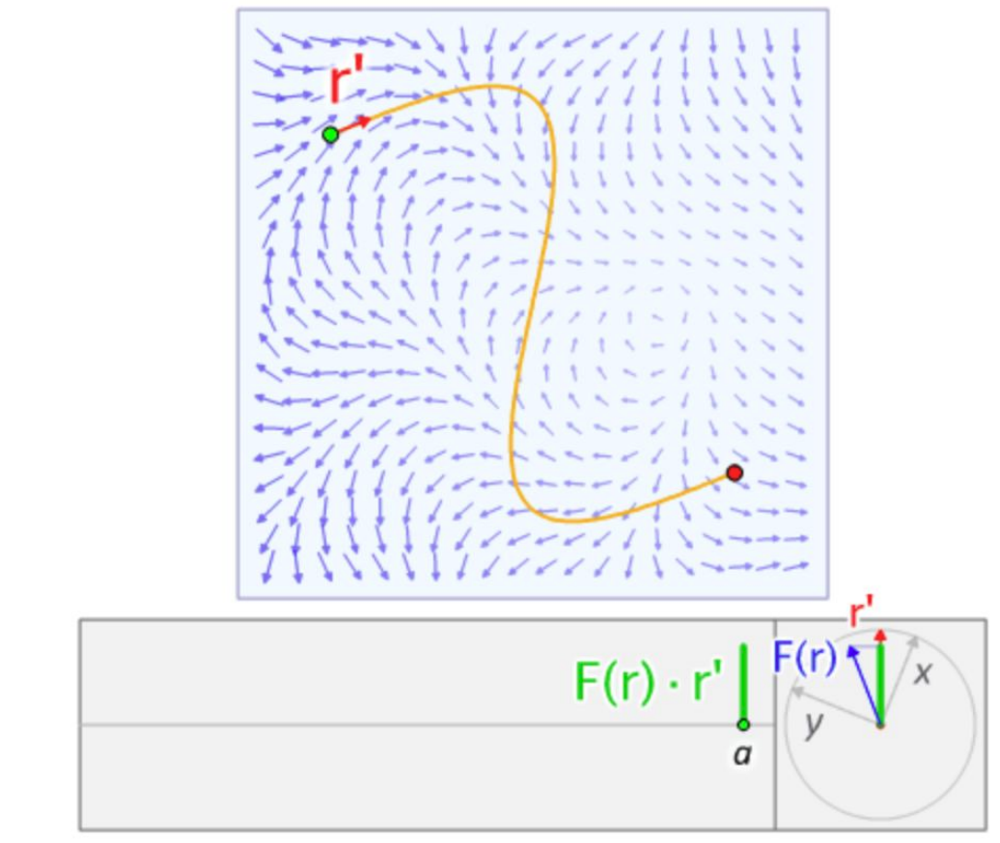

# Lie Bracket

## Vector Fields as Direvative

### Vector Function $f(x)$

Vector function $f(x):R^n \rightarrow R^n$ defines a mapping relationship from $\bold{x} \in R^n$ to $f(x) \in R^n$ which is called *Vector Field*.

Furthermore, if $f$ is of having an indefinite degree of derivative $C^{\infty}$ and is continuous, $f$ is a *Smooth Vector Field*.

### Smooth Scalar Function $h(x)$

Smooth scalar function $f(x):R^n \rightarrow R$ defines a mapping relationship from $\bold{x} \in R^n$ to $f(x) \in R$, whose *gradient* is a $1 \times n$ vector $\triangledown h = \frac{\partial h}{\partial \bold{x}}$.

### Smooth Vector Field $f(x)$

A smooth vector field $f$'s *Jacobian* is an $n \times n$ matrix $\triangledown f =  \frac{\partial f}{\partial \bold{x}}$

## Lie Derivative

A smooth scalar function $h(x)$ to a smooth vector field $f(x)$'s *Lie Derivative* is a $1 \times n$ vector $L_f h = \triangledown h \bold{f} = \frac{\partial h}{\partial \bold{x}} \bold{f}$

For example as in the below, $\bold{f}$ is represented by blue arrows as a vector field that excerts pressure on the moving object the green dot.

$\triangledown h$ is the velocity $r'$, hence, $L_f h = \triangledown h \bold{f}$ is the power（功率） by $\bold{f}$ on the object, and the work（功）is to take line integral along its trajectory (the yellow curve).

Remember, $r'$ is a scalar having no direction.

## Lie Bracket

Define two vector field functions: 
$f(x):R^n \rightarrow R^n$ and $g(x):R^n \rightarrow R^n$.

Conceptually, the Lie bracket $[f,g]$ is the derivative of $g$ along the flow generated by $f$, and is sometimes denoted $L_f g$ ("Lie derivative of $g$ along $f$"). This generalizes to the Lie derivative of any tensor field along the flow generated by $f$.

In other words, Lie bracket describes a tensor change rate $g$ under the influence of $f$.

Formally, Lie Bracket can be generalized with the below form
$$
[f,g] = \triangledown g f - \triangledown f g
=
\frac{\partial g}{\partial \bold{x}}f - \frac{\partial f}{\partial \bold{x}}g
$$

## Baker-Campbell-Hausdorff Formula

BCH is used to transform Lie Algebra exponential mapping sumation $e^A e^B = e^Z$ into a pure Lie Bracket computation, such that 
$$
\begin{align*}
Z = ln(e^A e^B)
= A + B + \frac{1}{2}[A, B] + \frac{1}{12}[A, B] - \frac{1}{12}[A, B] + ...
\end{align*}
$$

Ignore higher degree elements,
$$
Z \approx A + B + \frac{1}{2}[A, B]
$$

For a 3-d matrix $\bold{\Phi}$, here uses $\wedge$ to represent a vector space of an antisymmetric matrix., there is
$$
\bold{\Phi} = \phi^{\wedge}
=
\begin{bmatrix}
      0 & -\phi_3 & \phi_2 \\
      \phi_3 & 0 & -\phi_1 \\
      -\phi_2 & \phi_1 & 0
\end{bmatrix}
$$

Remember Lie Bracket, now here derives
$$
[\phi_1, \phi_2] = (\bold{\Phi}_1 \bold{\Phi}_2 - \bold{\Phi}_2 \bold{\Phi}_1)^{\vee}
$$

$$
\begin{equation*}
ln(exp(\phi^{\wedge}_1)exp(\phi^{\wedge}_2))
\approx
\begin{cases}
          J_l(\phi_2)^{-1}\phi_1 + \phi_2 \quad &\text{if } \phi_1 \text{is sufficiently small} \\
          J_r(\phi_1)^{-1}\phi_2 + \phi_1 \quad &\text{if } \phi_2 \text{is sufficiently small} \\
     \end{cases}
\end{equation*}
$$

where $J_l$ and $J_r$ are 

$$
J_l = \frac{sin\theta}{\theta} I + (1 - \frac{sin\theta}{\theta})aa^T + \frac{1-cos\theta}{\theta}a^{\wedge}
$$
whose derivative is 
$$
J^{-1}_l = \frac{\theta}{2}cot\frac{\theta}{2}I + (1-\frac{\theta}{2}cot\frac{\theta}{2})aa^T - \frac{\theta}{2}a^{\wedge}
$$

and for the right multiple
$$
J_r(\phi) = -J_l(\phi)
$$