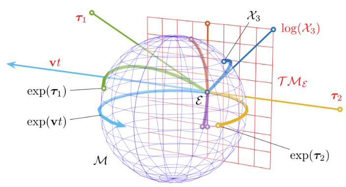

# Lie Algebra and Group

*Lie Group* is a *smooth manifold* (derivative at every point on this manifold).

*Lie Algebra* is described as the tangent space on a point of a Lie Group.

### Smoothness

Differentiability class is a classification of functions according to the properties of their derivatives. It is a measure of the highest order of derivative that exists and is continuous for a function. 

It is denoted as $C^k$, where $k$ is the highest order of derivative that exists and is continuous for a function.

Function $f$ is said to be infinitely differentiable, smooth, or of $C^{\infty}$, if it has derivatives of all orders on it domain. 

### Example

* the blue sphere $M$ is a Lie Group

* the red plane $\Tau M_{\epsilon}$ is the tangent space on the point $\epsilon$.

* the green straight line $\tau_{1}$ is mapped to the sphere with $exp(\tau_{1})$

* the navy blue curve $x_3$ on the sphere is mapped to the tangent space via $log(x_3)$

### Intuition

Since Lie Group is a manifold, it is difficult to perform arithmetics, such as plus and minus, on two Lie Group points.

We can use the tangent space of a point of a Lie Group to represent the point's local properties (with fault tolerance within first degree Taylor Series), such as derivatives with respects to different dimensionalities.

For example, by mapping to tangent space 

## Lie Group Properties

For $X , Y, Z \in G$

* Closure: 

$X \circ Y \in G$

You can compose elements of the group

* Associativity: 

Parentheses don’t matter

$(X \circ Y) \circ Z = X \circ (Y \circ Z)$

* Identity: 

$EX=XE=X$

There’s a null operator that does nothing

* Inverse: 

$X^{-1}X = XX^{-1} = E$

The action of any element can be reversed

Rotation can be regarded as a Special Orthogonal Group $SO(n)$, which is a Lie Group.

## Lie Algebra

Lie Algebra describes Lie Group local properties.

Lie Algebra and Lie Group mapping relationship is $exp$.

## Example: 2-D Lie Group

$S^1$ manifold is a unit circle (blue) in the plane $\mathbb{C}$

The unit complex circle is a 1-DoF (Depth of Field, Dimensionality) curve in 2-dimensional space.

