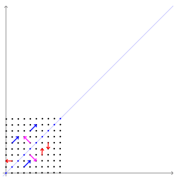

# Calculation Practices:

## Two-dimensional matrix eigenvalue and eigenvector example

To find eigenvalues and eigenvectors for $A$ as given
$$
A =
\begin{bmatrix}
2 & 1\\
1 & 2
\end{bmatrix}
$$

Solution:

$$
|A - \lambda I| = 
|
\begin{bmatrix}
2 & 1\\
1 & 2
\end{bmatrix}
-
\lambda
\begin{bmatrix}
1 & 0\\
0 & 1
\end{bmatrix}
|
=
|
\begin{bmatrix}
2-\lambda & 1\\
1 & 2-\lambda
\end{bmatrix}
|
$$

$$
= 3 - 4 \lambda + \lambda^2 
$$

hence
$\lambda_1 = 1$ and $\lambda_2 = 3$.

for eigenvectors:
$$
(A - \lambda_1 I) v_1 = 
\begin{bmatrix}
1 & 1\\
1 & 1
\end{bmatrix}
\begin{bmatrix}
v_1\\
v_2
\end{bmatrix}
=
\begin{bmatrix}
0\\
0
\end{bmatrix}
$$

thus derived 
$$
v_{\lambda=1} = 
\begin{bmatrix}
1\\
-1
\end{bmatrix}
$$

same calculation applied when $\lambda = 3$
$$
v_{\lambda=3} = 
\begin{bmatrix}
1\\
1
\end{bmatrix}
$$

Geometrically speaking, the transformation matrix $A$ can be explained as scaling with a multiple of $1$ on $v_{\lambda=1}$ and $3$ on $v_{\lambda=3}$ basis.

Illustrated as given animation below, pink arrows are parallel to $v_{\lambda=1}$ with a scaling result of $1$ (unchanged in length), and blue arrows are parallel to $v_{\lambda=3}$ with a scaling result of $3$, red arrows are transformed with a combined effect of $v_{\lambda=1}$ and $v_{\lambda=3}$.

## Calculate $X$ as given below:
$$
X = 
\begin{bmatrix}
1 & 0\\
-3 & 2
\end{bmatrix}
^{
\begin{bmatrix}
2 & -1\\
-3 & 2
\end{bmatrix}
^{-1}}
$$

Solution:

Calculate inverse:
$$
\begin{bmatrix}
1 & 0\\
-3 & 2
\end{bmatrix}
^{
\begin{bmatrix}
2 & 1\\
3 & 2
\end{bmatrix}
}
$$

Use $e$ log:
$$
e^{
ln(\begin{bmatrix}
1 & 0\\
-3 & 2
\end{bmatrix})
\begin{bmatrix}
2 & 1\\
3 & 2
\end{bmatrix}
}
$$

get the eigen values and eigen vectors 
$$
\lambda_1=1
\begin{bmatrix}
1 \\
3 
\end{bmatrix},
\lambda_2=2
0\begin{bmatrix}
0 \\
1 
\end{bmatrix}
$$
for
$$
e^{
ln(\begin{bmatrix}
1 & 0\\
-3 & 2
\end{bmatrix})
} 
$$
thus,
$$
ln(\begin{bmatrix}
1 & 0\\
-3 & 2
\end{bmatrix})
=
\begin{bmatrix}
1 & 0\\
3 & 1
\end{bmatrix}
\begin{bmatrix}
ln(1) & 0\\
0 & ln(2)
\end{bmatrix}
\begin{bmatrix}
1 & 0\\
3 & 1
\end{bmatrix}
^{-1}
$$
thus
$$
ln(\begin{bmatrix}
1 & 0\\
-3 & 2
\end{bmatrix})
=
ln(2)
\begin{bmatrix}
0 & 0\\
-3 & 1
\end{bmatrix}
$$

Consider the original equation
$$
e^{
ln(\begin{bmatrix}
1 & 0\\
-3 & 2
\end{bmatrix})
\begin{bmatrix}
2 & 1\\
3 & 2
\end{bmatrix}
}
=
e^{
ln(2)
\begin{bmatrix}
0 & 0\\
-3 & 1
\end{bmatrix}
\begin{bmatrix}
2 & 1\\
3 & 2
\end{bmatrix}
}
$$
then
$$
e^{
ln(\begin{bmatrix}
1 & 0\\
-3 & 2
\end{bmatrix})
\begin{bmatrix}
2 & 1\\
3 & 2
\end{bmatrix}
}
=
e^{
ln(2)
\begin{bmatrix}
0 & 0\\
-3 & -1
\end{bmatrix}
}
$$

again, get the eigen values and eigen vectors 
$$
\lambda_1=0
\begin{bmatrix}
1 \\
 -3
\end{bmatrix},
\lambda_2=-ln(2)
\begin{bmatrix}
0 \\
1 
\end{bmatrix}
$$
for
$$
e^{
ln(2)
\begin{bmatrix}
0 & 0\\
-3 & -1
\end{bmatrix}
}
$$
thus
$$
e^{
ln(2)
\begin{bmatrix}
0 & 0\\
-3 & -1
\end{bmatrix}
}
=
\begin{bmatrix}
1 & 0\\
-3 & -1
\end{bmatrix}
\begin{bmatrix}
e^{0} & 0\\
0 & e^{-ln(2)}
\end{bmatrix}
\begin{bmatrix}
0 & 0\\
-3 & -1
\end{bmatrix}^{-1}
$$
thus, derived the final solution
$$
X = 
\begin{bmatrix}
1 & 0\\
-3 & 2
\end{bmatrix}
^{
\begin{bmatrix}
2 & -1\\
-3 & 2
\end{bmatrix}
^{-1}}
=
e^{
ln(2)
\begin{bmatrix}
0 & 0\\
-3 & -1
\end{bmatrix}
}
=
\begin{bmatrix}
1 & 0\\
-3/2 & 1/2
\end{bmatrix}
$$