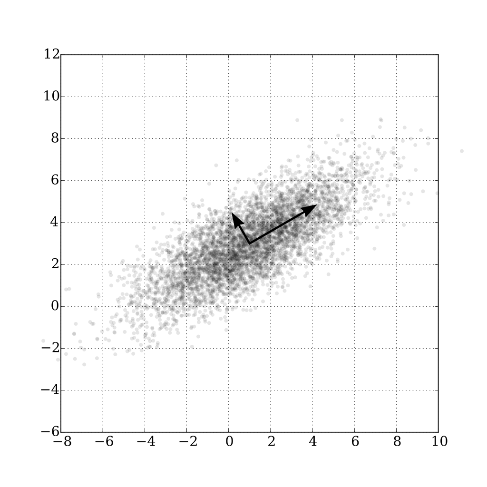

# Vector and matrix

## Rank

The rank of a matrix $A$ is the dimension of the vector space generated (or spanned) by its columns, corresponding to the max number of linearly indepent columns of $A$.

For example,
$$
A = 
\begin{bmatrix}
      1 & 4 & 5 \\
      2 & 5 & 7 \\
      3 & 6 & 9
\end{bmatrix}
$$
is of rank $2$ since the third column is the sum of the first two columns.

### Gaussian elimination

Gaussian elimination, also known as row reduction, does not change column linearity. The above matrix $A$ can be reduced to 
$$\begin{align*}
A = 
\begin{bmatrix}
      1 & 4 & 5 \\
      2 & 5 & 7 \\
      3 & 6 & 9
\end{bmatrix}
\underrightarrow{-3 R_1 + R_3}
\begin{bmatrix}
      1 & 4 & 5 \\
      2 & 5 & 7 \\
      0 & -6 & -6
\end{bmatrix}
& \underrightarrow{-2 R_1 + R_2} \\
\begin{bmatrix}
      1 & 4 & 5 \\
      0 & -3 & -3 \\
      0 & -6 & -6
\end{bmatrix}
\underrightarrow{-2 R_2 + R_3} 
\begin{bmatrix}
      1 & 4 & 5 \\
      0 & -3 & -3 \\
      0 & 0 & 0
\end{bmatrix}
& \underrightarrow{-3 R_2} \\
\begin{bmatrix}
      1 & 4 & 5 \\
      0 & 1 & 1 \\
      0 & 0 & 0
\end{bmatrix}
\underrightarrow{-4 R_2 + R_1}
\begin{bmatrix}
      1 & 0 & 1 \\
      0 & 1 & 1 \\
      0 & 0 & 0
\end{bmatrix}
\end{align*}
$$
hence proving rank $2$ for matrix $A$.

## Transpose

$A_{n \times m}$ can be expressed as row-based ($A=[r_1, r_2, ..., r_n]$) or column-based ($A=[c_1, c_2, ..., c_m]$), so that  
$$
A^T A = 
\begin{bmatrix}
      c_1^T \\
      c_2^T \\
      ... \\
      c_m^T 
\end{bmatrix}
[c_1, c_2, ..., c_m]
=
\begin{bmatrix}
      c_1^T c_1 & c_1^T c_2 & ... & c_1^T c_m \\
      c_2^T c_1 & c_2^T c_2 & ... & c_2^T c_m\\
      ... & ... & ... & ... \\
      c_m^T c_1 & c_m^T c_2& ... & c_m^T c_m
\end{bmatrix}
$$
which $A^T A$ is a Gramian matrix (inner products of column vectors). Likewise, $A A^T$ is for inner products of row vectors.

## Triangular Matrix

A square matrix is called lower triangular if all the entries above the main diagonal are zero. Similarly, a square matrix is called upper triangular if all the entries below the main diagonal are zero.

## Orthogonal matrix

An orthogonal matrix, or orthonormal matrix, is a real square matrix whose columns and rows are orthonormal vectors.

It has the below properties:

$$
Q^TQ=QQ^T=I
$$

This leads to 
$$
Q^T=Q^{-1}
$$

The determinant of any orthogonal matrix is either $+1$ or $−1$.

The set of $n \times n$ orthogonal matrices forms a group, $O(n)$, known as the orthogonal group. The subgroup $SO(n)$ consisting of orthogonal matrices with determinant $+1$ is called the *special orthogonal group*, and each of its elements is a *special orthogonal matrix*. 

## Determinant

Determinant is a scalar value that is a function of the entries of a square matrix.

Geometrically speaking, determinant is area of the $n \times n$ squared matrix, for example, for a $2 \times 2$ matrix, the area of parallellogram is
$$
|u||v|sin\theta = 
\begin{array}{c}
    \bigg (
    \begin{array}{c}
      -b \\
      a
    \end{array}
    \bigg )
\end{array}
\begin{array}{c}
    \bigg (
    \begin{array}{c}
      c \\
      d
    \end{array}
    \bigg )
\end{array}
=
ad-bc
$$

The following shows the calculation of a $3 \times 3$ matrix's determinant:
$$
\bigg |
\begin{array}{ccc}
    \begin{array}{ccc}
      a & b & c \\
      d & e & f \\
      g & h & i
    \end{array}
\end{array}
\bigg |
=
a
\big |
\begin{array}{cc}
    \begin{array}{cc}
      e & f \\
      h & i 
    \end{array}
\end{array}
\big |
-
d
\big |
\begin{array}{cc}
    \begin{array}{cc}
      b & c \\
      h & i 
    \end{array}
\end{array}
\big |
+
g
\big |
\begin{array}{cc}
    \begin{array}{cc}
      b & c \\
      e & f 
    \end{array}
\end{array}
\big |
$$

further,
$$
\bigg |
\begin{array}{ccc}
    \begin{array}{ccc}
      a & b & c \\
      d & e & f \\
      g & h & i
    \end{array}
\end{array}
\bigg |
=
a(ei-fh)-d(bi-hc)+g(bf-ec)
$$
which give the volume of a parallelotope.

## Adjugate Matrix

Adjugate, adjunct or classical adjoint of a square matrix $Adj(A)$ is the transpose of its cofactor matrix $C$.
$$
Adj(A) = C^T
$$
where 
$$
C = \big( (-1)^{i+j} M_{i,j} \big)_{1\leq i,j \leq n}
$$
where $M_{i,j}$ is the determinant of the $(i,j)$-th element of a square matrix $A$ .

For example, given
$$
A = 
\begin{bmatrix}
      a & b & c \\
      d & e & f \\
      g & h & i
\end{bmatrix}
$$
the $(1,2)$-th element is $b$, whose determinant can be expressed as
$$
M_{1,2} = 
-
\big |
\begin{array}{cc}
    \begin{array}{cc}
      d & f \\
      g & i
    \end{array}
\end{array}
\big |
= -(di-fg)
$$
Co-matirx $C$:
$$
C =
\begin{bmatrix}
      M_{1,1} & M_{1,2} & M_{1,3} \\
      M_{1,2} & M_{2,2} & M_{2,3} \\
      M_{1,3} & M_{3,2} & M_{3,3}
\end{bmatrix}
$$

Finding adjoint of a matrix is the same as applying a linear transformation which brings the coordinates of $i$ and $j$ to a square of area equal to the determinant of that matrix.

## Covariance Matrix

A $2 \times 2$ covariance matrix is defined as

$$
\Sigma = 
\begin{bmatrix}
      \sigma(x,x) & \sigma(x,y) \\
      \sigma(y,x) & \sigma(y,y)
\end{bmatrix}
$$

in which
$$
\sigma(x,y) = E [ \big(x - E(x) \big) \big(y - E(y)\big) ]
$$

where $x$ and $y$ are sample vectors, hence $\sigma(x,y)$ is scalar. 

The orientations and thickness of the point cloud are eigenvectors and eigenvalues, such as the two arrows shown as below.

