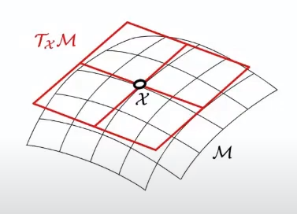

## Complex conjugate

The complex conjugate of a complex number is the number with an equal real part and an imaginary part equal in magnitude but opposite in sign, such as the complex conjugate of $a + b i$ is equal to $a − b i$.

## Isometry

An isometry (or congruence, or congruent transformation) is a distance-preserving transformation between metric spaces.

Geometrically speaking, it refers to rigid translation and rotation of geometrical figures.

### Isomorphism

In mathematics, an isomorphism is a structure-preserving mapping between two structures of the same type that can be reversed by an inverse mapping.

Rotation and translation are two typical isomorphic mapping.

## Hermitian matrix

A Hermitian matrix (or self-adjoint matrix) is a complex square matrix that is equal to its own conjugate transpose.

For example,
$$
\begin{bmatrix}
      0 & a-ib & c-id \\
      a+ib & 1 & 0 \\
      c+id & 0 & 2
\end{bmatrix}
$$

## Conjugate transpose

The conjugate transpose (or Hermitian transpose) of $A_{n \times m}$ is 
1. take the transpose of $A_{n \times m}$
2. replace each entry $a_{i,j}$ with its complex conjugate

## Permutation matrix

A permutation matrix is a square binary matrix that has exactly one entry of 1 in each row and each column and 0s elsewhere.

## Jacobian

In vector calculus, the Jacobian matrix of a vector-valued function of several variables is the matrix of all its first-order partial derivatives. 

Given a mapping: $f : R_n \rightarrow R_m$ is a function such that each of its first-order partial derivatives exist on $R_n$, with input $x \in R^n$ ($n$ dimensions for input) and output $f(x) \in R^m$ ($m$ dimensions for output), define $J_{n \times m}$

$$
J_{n \times m} = \bigg[ \frac{\partial f}{\partial x_1} ... \frac{\partial f}{\partial x_n} \bigg]
=
\begin{bmatrix}
\frac{\partial f_1}{\partial x_1} & ... & \frac{\partial f_1}{\partial x_n} 
\\
... & ... & ...
\\
\frac{\partial f_m}{\partial x_1} & ... & \frac{\partial f_m}{\partial x_n}
\end{bmatrix}
$$

### Determinant

When $m = n$, the Jacobian matrix is square, so its determinant is a well-defined function of $x$, known as the Jacobian determinant of $f$.

## Hessian

Hessian is a square matrix of second-order partial derivatives of a scalar-valued function, or scalar field. It describes the local curvature of a function of many variables.

Define $f:\mathbb{R}^n \rightarrow \mathbb{R}$ whose input is a vector $\bold{x} \in \mathbb{R}^n$ with a scalar output $f(\bold{x}) \in \mathbb{R}$. $\bold{H}$ of $f$ is an $n \times n$ matrix such as
$$
(\bold{H}_f)_{i,j}=\frac{\partial^2 f}{\partial x_i \partial x_j}
$$
or
$$
\bold{H}_f = 
\begin{bmatrix}
\frac{\partial^2 f}{\partial x_1^2} & \frac{\partial^2 f}{\partial x_1 \partial x_2} & ... & \frac{\partial^2 f}{\partial x_1 \partial x_n} 
\\
\frac{\partial^2 f}{\partial x_2 \partial x_1} & \frac{\partial^2 f}{\partial x_2^2} & ... & \frac{\partial^2 f}{\partial x_2 \partial x_n} 
\\
... & ... & ... & ...
\\
\frac{\partial^2 f}{\partial x_n \partial x_1}  & \frac{\partial^2 f}{\partial x_n \partial x_2}  & ... & \frac{\partial f}{\partial x_n^2}
\end{bmatrix}
$$

## Tangent Space

Given a manifold $M$, a tangent space at $x$ on $M$ is $\Tau_x M$.

