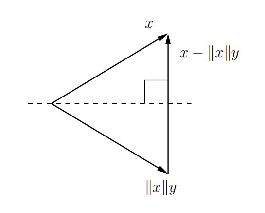

# Matrix Decomposition

## LU Decomposition/Factorization

Lower–upper (LU) decomposition or factorization factors a matrix as the product of a lower triangular matrix and an upper triangular matrix.

Gaussian elimination can be used for decomposition.

Let $A$ be a $3 \times 3$ square matrix, LU can be
$$
\begin{bmatrix}
      a_{1,1} & a_{1,2} & a_{1,3} \\
      a_{2,1} & a_{2,2} & a_{2,3} \\
      a_{3,1} & a_{3,2} & a_{3,3}
\end{bmatrix}
=
\begin{bmatrix}
      l_{1,1} & 0 & 0 \\
      l_{2,1} & l_{2,2} & 0 \\
      l_{3,1} & l_{3,2} & l_{3,3}
\end{bmatrix}
\begin{bmatrix}
      u_{1,1} & u_{1,2} & u_{1,3} \\
      0 & u_{2,2} & u_{2,3} \\
      0 & 0 & u_{3,3}
\end{bmatrix}
$$

Define $P$ as a permutation matrix, there is 
$$
PA=LU
$$

### Application

Given a system of linear equations in matrix form $A$ and we want to solve the linear system (find a solution for $\bold{x}$)
$$
A\bold{x}=\bold{b}
$$

By LU decomposition, there is 
$$
PA=LU
$$

So that
$$
LU\bold{x}=P\bold{b}
$$

Given the nature of triangular matrix, by forward and backward substitution, define a temp vector $\bold{y}$, there is
$$
L\bold{y}=P\bold{b}
$$
Then, solve $\bold{y}$, and use $\bold{y}$ to solve $\bold{x}$ by
$$
U\bold{x} = \bold{y}
$$

## Cholesky Decomposition/Factorization

Cholesky decomposition decomposes a Hermitian, positive-definite matrix $A$ into the product of a lower triangular matrix $L$ and its conjugate transpose $L^*$.

It is useful to solve Linear least squares (LLS) approximation problems.

### Application

Given a system of linear equations in matrix form $A$ ($A$ is symmetric and positive definite) and we want to solve the linear system (find solution for $\bold{x}$)
$$
A\bold{x}=\bold{b}
$$

Given the decomposition $A=LL^*$, define a temp vector $\bold{y}$, $\bold{x}$ can be solved by forward and backward substitution:

1. solve $\bold{y}$ for $L\bold{y}=\bold{b}$
2. solve $\bold{x}$ for $L\bold{x}=\bold{y}$

## QR Decomposition/Factorization

Define a decomposition of a matrix $A$ into a product $A = QR$ of an orthogonal matrix $Q$ and an upper triangular matrix $R$.

It is useful to solve Linear least squares (LLS) approximation problems.

### Householder Transformation

A Householder reflection $H$ (or Householder transformation) is a transformation that takes a vector and reflects (a.k.a, orthogonal transformation) it about some plane or hyperplane. 

It aims to achieve $A = QR$ by performing  a sequence of Householder transformations introducing zeros to $A$ so that $A$ becomes an upper triangular matrix eventually.

Define Householder reflection $H$
$$
H=I-2vv^T
$$
where $v$ is a unit normal vector to a hyperplane.

Now suppose we are given a vector $x$ and we want to find a reflection that transforms $x$ into a direction parallel to some unit vector $y=\pm e$ ($y$ is the new basis).

we can construct by taking the hyperplane normal to $x − ||x||y$. That is, letting $u = x − ||x||y$ and $v = \frac{u}{||u||}$ ($v$ is the unit normal vector to a hyperplane (indicated by a dash line))

$$\begin{align*}
(I-2vv^T)x
&=
x-2\frac{(x − ||x||y)(x^Tx − ||x||x^Ty)}{(x − ||x||y)^2}
\\ &=
x-2\frac{(x − ||x||y)(x^Tx − ||x||x^Ty)}{||x||^2+2x^Ty||x||+||x||^2||y||^2}
\\ &=
x-(x-||x||y)
\\ &=
||x||y
\end{align*}$$

By $y = \pm e_1$, we can get a reflection that zeros out all but the first
element of the vector $x$. 

The first Householder transformation can be written as
$$
H_1 A = 
(H_1 a_1 
\space\space\space\space
H_1 A_1')
=
\begin{bmatrix}
      * & * \\
      0 & \hat{A_2}
\end{bmatrix}
$$

The second Householder transformation is
$$
H_2 H_1 A
=
\begin{bmatrix}
      * & * & * \\
      0 & * & * \\
      0 & 0 & \hat{A_3}
\end{bmatrix}
$$

The sequence of operations goes on, hence
$$
H_n H_{n-1} ... H_2 H_1 A
=
R
$$

In the end, QR decomposition is
$$
A=QR
$$
where $Q=H_n H_{n-1} ... H_2 H_1$

### QR vs LU decomposition

* QR uses more stable transoformation; LU factorization on the other hand requires some variant of Gaussian elimination the stability of which requires one to assume that pivot values do not decay too rapidly.

* For the full-rank case LU factorization is cheaper; QR is good for rank-deficient least-squares cases.