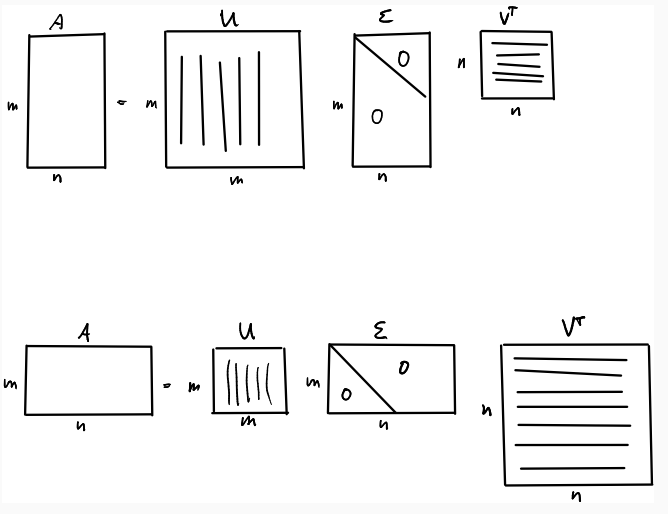

# Singular Value Decomposition (SVD)

SVD is a factorization that decompose an $m \times n$ matrix A into
$$
A=U \Sigma V^\text{T}
$$

## SVD computation

Compute the eigenvalues and eigenvectors of $A^\text{T}A$
$$
A^\text{T}A \bold{v}_1 = \lambda_1 \bold{v}_1
\\
A^\text{T}A \bold{v}_2 = \lambda_2 \bold{v}_2
\\
...
\\
A^\text{T}A \bold{v}_n = \lambda_n \bold{v}_n
$$

* So that $V$ is
$$
V=
\begin{bmatrix}
    \vdots & & \vdots \\
    \bold{v}_1 & ... & \bold{v}_n \\
    \vdots & & \vdots
\end{bmatrix}
$$

* So that $\Sigma$ is
$$
\Sigma=
\begin{bmatrix}
    \sqrt{\lambda_1} & & & \\
     & \ddots & & \bold{0} \\
     & & \sqrt{\lambda_n} & \\
\end{bmatrix}
$$
or (depending on the relative matrix sizes of $m$ vs $n$)
$$
\Sigma=
\begin{bmatrix}
    \sqrt{\lambda_1} & & \\
     & \ddots & \\
     & & \sqrt{\lambda_n} \\
     & \bold{0} &
\end{bmatrix}
$$

* So that $U$ is 
$$
U=A V \Sigma^{-1}
$$
given
$$
A=U \Sigma V^\text{T}
\Leftrightarrow
U \Sigma = A V
$$

Remember, $U$ is orthogonal
$$
U^\text{T}U=
\Sigma^{-1} V^\text{T} A^\text{T} A V \Sigma^{-1}
=
I
$$

## SVD for least squares problem

Given a least squares problem:
for a residual $\bold{r} = A \bold{x} - \bold{b}$, we attempt to minimize
$$
arg \space \underset{\bold{x}}{min} \space
||A \bold{x} - \bold{b}||^2_2
=
r_1^2 + r_2^2 + ... + r^2_m
$$

Process:
$$
\begin{align*}
& ||A \bold{x} - \bold{b}||^2_2
\\ =& 
||U \Sigma V^\text{T} \bold{x} - \bold{b}||^2_2
\\ =&
||U^\text{T}(U \Sigma V^\text{T} \bold{x} - \bold{b})||^2_2
\\ =& 
||U^\text{T}U \Sigma V^\text{T} \bold{x} - U^\text{T}\bold{b}||^2_2
\quad U\text{ is orthoganal that } U^\text{T}U=I
\\ =&
||\Sigma V^\text{T} \bold{x} - U^\text{T}\bold{b}||^2_2
\\ =&
||\Sigma \bold{y} - U^\text{T}\bold{b}||^2_2
\\ =&
\bigg|\bigg|
\begin{bmatrix}
    \sigma_1 & & & \\
     & \ddots & & \\
    & & \sigma_n & \\
    & & & \bold{0}
\end{bmatrix}
\bold{y} - \bold{z}
\bigg|\bigg|^2_2
\end{align*}
$$

$\bold{y}$ is determined as
$$
y_i=
\left\{
    \begin{array}{cc}
        \sigma_i &\quad \sigma_i \ne 0 
        \\
        0 &\quad \sigma_i = 0 
    \end{array}
\right.
$$

Then, it is easy to find $\bold{x}$ by
$$
\bold{x} = V\bold{y}
$$

## SVD for PCA