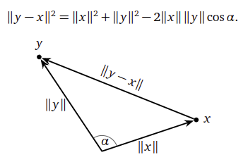

# Vector

## Orthogonal Vectors

Two vectors $\overrightarrow{x} \in \mathbb{R}^n$ and $\overrightarrow{y} \in \mathbb{R}^n$ are orthogonal or perpendicular when their inner product is zero: $\overrightarrow{x} \cdot \overrightarrow{y} = 0$

Another notation is $\overrightarrow{x} \perp \overrightarrow{y}$.

### Proof

$$
\begin{align*}
||\overrightarrow{x}||^2 + ||\overrightarrow{y}||^2
&=
||\overrightarrow{y}-\overrightarrow{x}||^2
\\
\overrightarrow{x} \cdot \overrightarrow{x} + \overrightarrow{y} \cdot \overrightarrow{y}
&=
(\overrightarrow{y}-\overrightarrow{x})(\overrightarrow{y}-\overrightarrow{x})
\\
\overrightarrow{x} \cdot \overrightarrow{x} + \overrightarrow{y} \cdot \overrightarrow{y}
&=
\overrightarrow{x} \cdot \overrightarrow{x} + \overrightarrow{y} \cdot \overrightarrow{y} + 2 \overrightarrow{x} \cdot \overrightarrow{y}
\\
2 \overrightarrow{x} \cdot \overrightarrow{y}
&=
0
\end{align*}
$$

## Conjugate to A Matrix

Let $u$ and $v$ be vectors in $\mathbb{R}^n$, $A$ be a positive definite $n \times n$ matirx, $u, v$ are mutally $A$-conjugate if and only if $u^T A v = 0$.

Any vector parallel to $u$ or $v$ is conjugate to $u$ or $v$.

### Example

Given $u=[1,1]^T, v=[1,-1]^T$, and an identity matrix $I=\begin{bmatrix}1 & 0 \\ 0 & 1\end{bmatrix}$, there is
$$
u^T A v
=
\begin{bmatrix}
1 & 1
\end{bmatrix}
\begin{bmatrix}
1 & 0 \\ 
0 & 1
\end{bmatrix}
\begin{bmatrix}
1 \\
-1
\end{bmatrix}
= 0
$$