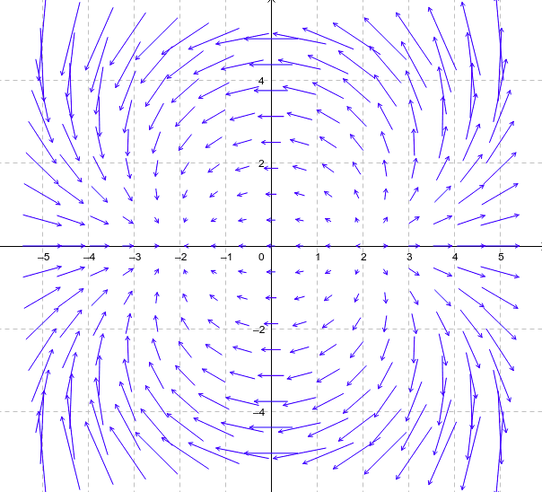

# Vector Field

A vector field is an assignment of a vector to each point in a subset of space.

## Tensor Field

A tensor field is a generalization of a scalar field or vector field that assigns, respectively, a scalar or vector to each point of space.

## Vector fields on subsets of Euclidean space

Given a subset $S$ in $R^n$, a vector field is represented by a vector-valued function $V: S \rightarrow R^n$ in standard Cartesian coordinates $(x_1, …, x_n)$. 

For example, visualization for 
$$
\begin{bmatrix}
      x^2 - y^2 -4 \\
      2xy  \\
\end{bmatrix}
$$

is

## Vector fields on manifolds

Given a differentiable manifold $M$, a vector field on $M$ is an assignment of a tangent vector to each point in $M$.

More precisely, a vector field $F$ is a mapping from $M$ into the tangent bundle $TM$ so that $p \circ F$ is the identity mapping where $p denotes the projection from $TM$ to $M$.

### Tangent bundle

In differential geometry, the tangent bundle of a differentiable manifold $M$ is a manifold $TM$ which assembles all the tangent vectors in $M$.
$$
\begin{align*}
TM 
& = \sqcup_{x \in M} T_x M
\\
& =
\{(x,y) | x \in M, y \in T_x M \}
\end{align*}
$$
where $T_{x}M$ denotes the tangent space to $M$ at the point $x$, so that every vector $(x,y)$ is a vector on $T_x M$.
