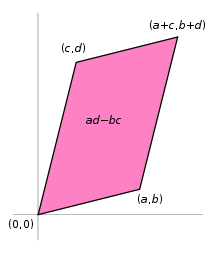

# Products: dot, cross and exterior

## dot product: scalar product
$$
u * v = |u| |v| cos\theta 
= v_1u_1 + v_2u_2 + v_3u_3 + ... + v_nu_n
$$

Applications: $u$ represents a 8 lb force applied pulling a wagon with an upward force direction, while $v$ represents 50 ft distance. $u * v$ express the *work* ($W = \overrightarrow{F} * \overrightarrow{D}$) for this effort.

## cross product: vector quantity product
$$
u \times v = |u| |v| \space n \space sin\theta
= \bigg |
\begin{array}{ccc}
    \begin{array}{ccc}
      \overrightarrow{i} & \overrightarrow{j} & \overrightarrow{k} \\
      u_1 & u_2 & u_3 \\
      v_1 & v_2 & v_3
    \end{array}
\end{array}
\bigg |
$$
where $n$ is a unit vector perpendicular to the plane containing $u$ and $v$.

hence,
$$
u \times v =
\overrightarrow{i}|u_2v_3-u_3v_2| - \overrightarrow{j}|u_1v_3-u_3v1| + \overrightarrow{k}|u_1v_2-u_2v_1|
$$
where $u$ and $v$ are two vectors and $n=(\overrightarrow{i},\overrightarrow{j},\overrightarrow{k})$ is a unit vector (3-dimensional in this example) perpendicular to the plane containing $u$ and $v$. $u \times v$ itself represents the area of a parallelogram.

Applications: Twisting a bolt with a spanner, Torque is cross product of force multiplying length $\overrightarrow{T} = \overrightarrow{F} \times \overrightarrow{L}$, that means the resultant force either pulling up or pushing down the bolt.

## exterior product: wedge product

Wedge/exterior product of vectors is an algebraic construction used in geometry to study areas, volumes, and their higher-dimensional analogues, operator denoted as below:

$$\begin{align*}
u \space ∧ \space v \\
& = (a e_1 + b e_2)∧(c e_1 + d e_2) \\
& = ac (e_1 ∧ e1) + ad (e_1 ∧ e_2) + bc (e_2 ∧ e_1) + bd (e_2 ∧ e_2) \\
& = ad (e_1 ∧ e_2) - bc (e_1 ∧ e_2) \\
& = (ad-bc)(e_1 ∧ e_2)
\end{align*}
$$
where 
$$
e_1=
\begin{array}{c}
    \bigg (
    \begin{array}{c}
      1 \\
      0
    \end{array}
    \bigg )
\end{array}
,
e_2=
\begin{array}{c}
    \bigg (
    \begin{array}{c}
      0 \\
      1
    \end{array}
    \bigg )
\end{array}
$$
that constructs a real Cartesian plane $R^2$.

Geometric definition is observed as in the examples below, indicating the area/volume of multi-dimensional vectors.

