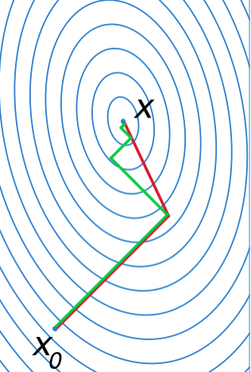

# Conjugate Gradient

Conjugate gradient finds out residual $\bold{r}$ 's orthogonality, descending along with each orthogonal vector direction.

It has only $O(n)$ for $n$-dimensional space, much faster than steepest descent.

## Definition

### Step $\lambda_k$ Formulation

Given an objective function ($A$ being positive definite, $f(\bold{x})$ must have at least first-order derivative):
$$
f(\bold{x})
=
\frac{1}{2} \bold{x}^T A \bold{x} + \bold{b}^T \bold{x} + \bold{c}
$$

The first-order derivative is
$$
\frac{\partial f(\bold{x})}{\partial \bold{x}}
=
A \bold{x} + \bold{b}
$$

Define $n$ mutually conjugate vectors $P$ with respect to $A$, such as $\bold{p}_j^\text{T} A \bold{p}_i = 0, i \ne j$:
$$
P=\{ \bold{p}_1, \bold{p}_2, ..., \bold{p}_n \}
$$

Set $\bold{x}^*$ to denote the solution to $A \bold{x} + \bold{b} = 0$.

$$
\bold{x}^* = \sum_{i=1}^{n} \lambda_i \bold{p}_i 
\Rightarrow
A \bold{x}^* = \sum_{i=1}^{n} \lambda_i A \bold{p}_i
$$

Multiplying by $\bold{p}_k^\text{T}$ yields
$$
\begin{align*}
\bold{p}_k^\text{T} \bold{b}
&=
\bold{p}_k^\text{T} A \bold{x}^*
\\ &=
\sum_{i=1}^{n} \lambda_i \bold{p}_k^\text{T} A \bold{p}_i
\\ &=
\sum_{i=1}^{n} \lambda_i <\bold{p}_k, \bold{p}_i>_A
\\ &=
\lambda_i <\bold{p}_k, \bold{p}_k>_A
\end{align*}
$$
where $<\cdot>_A$ and $<\cdot>$ denote inner product operation with or without respect to $A$: 

* $<\bold{p}_j, \bold{p}_i>_A=\bold{p}_j^\text{T} A \bold{p}_i$

* $<\bold{p}_j, \bold{p}_i>=\bold{p}_j^\text{T} \bold{p}_i$.

Finally,
$$
\lambda_k = 
\frac{<\bold{p}_k, \bold{b}>}{<\bold{p}_k, \bold{p}_k>_A}
$$

### Iterative approach

Let $\bold{r}_k$ be the residual at the $k$-th step:
$$
\bold{r}_k = \bold{b} - A \bold{x}_k
$$

Gram-Schmidt orthonormalization gives update for the $k$-th step conjugate vector $\bold{p}_k$:
$$
\bold{p}_k = 
\bold{r}_k - \sum_{i < k} \frac{<\bold{p}_i, \bold{r}_k>_A}{<\bold{p}_i, \bold{p}_i>_A} \bold{p}_i
$$

The $k$-th update is
$$
\bold{x}_{k+1} = \bold{x}_k + \lambda_k \bold{p}_k
$$

## Intuition

For $f(\bold{x}), \bold{x} \in \mathbb{R}^n$, the minima can be found when its derivative is zero: $A\bold{x}+\bold{b}=0$.

To find $\bold{x}^*$ (optimal solution to $f(\bold{x})$), first find the $k$-th conjugate direction $\bold{p}_k$ then compute the descent distance $\lambda_k$.

$\bold{p}_k$ computation takes into consideration that, $\bold{x}^* - \bold{x}_k$ can be decomposed into a set of orthogonal vector additions.
$$
\bold{r}_k = \bold{p}_k + \sum_{i < k} \frac{<\bold{p}_i, \bold{r}_k>_A}{<\bold{p}_i, \bold{p}_i>_A} \bold{p}_i
$$

## Conjugate Gradient vs Steepest Descent

Green lines indicate steepest descent; red lines indicate conjugate descent.

The first steps for both steepest descent and conjugate descent are by steepest descent (descent perpendicular to tagent space).

Steepest descent continues descending along with $\frac{\bold{r}_k^T \bold{r}_k}{\bold{r}_k^T A \bold{r}_k} \triangledown f$, while conjugate descent uses orthogonality of residual $\bold{r}$ for descent route.

