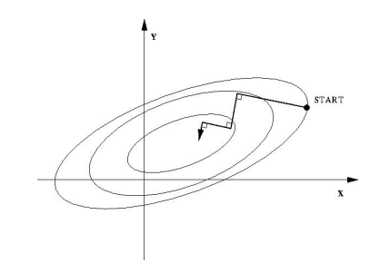

# Gradient Descent

Gradient descent (also often called steepest descent) is a first-order iterative optimization algorithm for finding a local minimum of a differentiable function. 

Define a multi-variable function ${f}(\bold{x})$ being differentiable in a neighbourhood of a point $\bold{x}_k$, then ${f}(\bold{x})$ decreases fastest updating $\bold{x}_k$ to its local minimum following
$$
\bold{x}_{k+1}=\bold{x}_k+\gamma \triangledown {f}(\bold{x})
$$
where $\gamma$ is learning rate.

Gradient descent refers to any class of algorithms that calculate the gradient $\triangledown {f}(\bold{x})$ of the objective function, then move "downhill" in the indicated direction;

## Steepest Descent

Steepest descent is a special case of gradient descent where the step length is chosen to minimize the objective function value. The iterative step $\Delta \bold{x} = \lambda \triangledown f(\bold{x}_k)$ is carefully chosen to give the route a fastest descent.

### Intuition

Steepest descent finds every step $\bold{x}_k$ 's gradient $A\bold{x}_k + \bold{b}$, and travels descending down along this gradient's direction by a distance of $\lambda = \frac{\bold{r}_k^T \bold{r}_k}{\bold{r}_k^T A \bold{r}_k}$.

$\bold{r}_k$ is the residual to optimal solution $\bold{x}^*$ given by $\bold{r}_k = \bold{b} - A \bold{x}_k$. Ideally, $A\bold{x}^* + \bold{b} = 0$.

The distance $\lambda = \frac{\bold{r}_k^T \bold{r}_k}{\bold{r}_k^T A \bold{r}_k}$ is computed by 
$$\frac{d f(\bold{x_k})}{d\lambda} 
= 
\frac{d f(\bold{x_{k-1}+\Delta \bold{x}})}{d\lambda} 
=
\frac{d f(\bold{x_{k-1} + \lambda \triangledown f})}{d\lambda} 
=
0
$$ 
This means update step $\lambda$ is optimized (giving the longest descending distance). Shorter $\lambda$ might not travel far enough; Longer $\lambda$ might see gradient ascent.

* Example

Inner circle represents lower $f(\bold{x})$ value, where $\bold{x}=(x,y)$.

Every step $\lambda_k$ reaches the point $\bold{x}_k$ where $\lambda_k$ goes longer might see gradient ascent. Given this observation, next step $\lambda_{k+1}$ 's direction is perpendicular to the last step's.

### Formulation

Given an objective function ($A$ being positive definite, $f(\bold{x})$ must have at least first-order derivative):
$$
f(\bold{x})
=
\frac{1}{2} \bold{x}^T A \bold{x} + \bold{b}^T \bold{x} + \bold{c}
$$

The first-order derivative is
$$
\frac{\partial f(\bold{x})}{\partial \bold{x}}
=
A \bold{x} + \bold{b}
$$

Define an iterative step $\Delta \bold{x}$ for gradient descent updating $\bold{x}_k$, there is $\bold{x}_{k+1}=\bold{x}_k + \Delta \bold{x}_k = \bold{x}_k + \lambda \triangledown f(\bold{x}_k)$

$$
\begin{align*}
f(\bold{x}+\Delta{\bold{x}})
&=
\frac{1}{2} (\bold{x}+\Delta{\bold{x}})^T A (\bold{x}+\Delta{\bold{x}}) + \bold{b}^T (\bold{x}+\Delta{\bold{x}}) + \bold{c}
\\ &=
\frac{1}{2} \bold{x}^T A \bold{x} + \bold{b}^T \bold{x} + \bold{c} + \frac{1}{2} \Delta{\bold{x}}^T A \Delta{\bold{x}}
\end{align*}
$$

Because $A$ is positive definit, there is $f(\bold{x}+\Delta{\bold{x}}) > f(\bold{x})$

Define residual $\bold{r}$ from the optimal solution $\bold{x}^*$ as $\bold{r}_k = \bold{b} - A \bold{x}_k$ 

Remember, $f(\bold{x})$ is a convex function and there must exist a solution that makes $\bold{b} - A \bold{x}$ approaching to zero, which is the point that holds the location of minima.

$$
\begin{align*}
\frac{d f(\bold{x_k})}{d\lambda}
&=
f'(\bold{x}_k)\frac{d \bold{x}_k}{d \lambda}
\\ &=
f'(\bold{x}_k)\bold{r}_{k-1}
\\ &=
-\bold{r}^\text{T}_{k} \bold{r}_{k-1}
\\ &=
-(\bold{b}-A\bold{x}_k)^{\text{T}} \bold{r}_{k-1}
\\ &=
-(\bold{b}-A (\bold{x}_{k-1} + \lambda \bold{r}_{k-1}))^{\text{T}} \bold{r}_{k-1}
\\ &=
-(\bold{r}_{k-1}-\lambda A \bold{r}_{k-1})^{\text{T}} \bold{r}_{k-1}
\\ &=
0
\end{align*}
$$

So that we have
$$
\lambda = \frac{\bold{r}_k^T \bold{r}_k}{\bold{r}_k^T A \bold{r}_k}
$$

Back to the iteration, this loop keeps going on $\bold{x}_{k+1}=\bold{x}_k + \Delta \bold{x}_k = \bold{x}_k + \lambda \triangledown f(\bold{x}_k)$, until residual $\bold{r}$ is small.