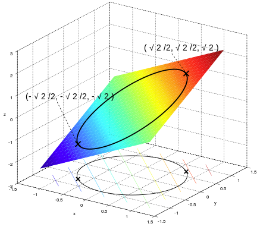

# Lagrangian Multiplier

In order to find the maximum or minimum of a function $f:\mathbb{R}^n \rightarrow \mathbb{R}$, $f(\bold{x})$ subjected to an equality constraint function $g:\mathbb{R}^n \rightarrow \mathbb{R}^c$ with a contraint expression $g(\bold{x})=0$, given both $f, g \in C^1$ (indicating both having at least first-order derivative), here constructs Lagrangian function 
$$
L(\bold{x}, \lambda)=f(\bold{x})+\lambda g(\bold{x})
$$

Partial derivatives $\frac{\partial L}{\partial \bold{x}}$, $\frac{\partial L}{\partial \lambda}$ should be zero for stationary point discovery.

$\lambda$ is known as Lagrangian Multiplier.

## Intuition

$f$ and $g$ are continuous and stationary points $\bold{x}_{stationary}$ (local/global maxima/minima) can be found when the tangents of stationary points $\bold{x}_{stationary}$ for both $f$ and $g$ are parallel, which can be described as
$$
\triangledown f = \lambda \triangledown g
$$ 

## Example

Define $f(x, y)=x+y$ subject to a constraint $x^2 + y^2 = 1$, which can be further defined as $g(x,y)=x^2+y^2-1=0$

Lagrange function can be defined
$$
\begin{align*}
L(x,y,\lambda)
&=
f(x,y)+\lambda g(x,y)
\\ &=
x+y+\lambda (x^2+y^2-1)
\end{align*}
$$

Gradient can be computed
$$
\begin{align*}
\triangledown L(x,y,\lambda)
&=
(
    \frac{\partial L}{\partial x},
    \frac{\partial L}{\partial y},
    \frac{\partial L}{\partial \lambda}
)
\\ &=
(1+2\lambda x, 1+2\lambda y, x^2+y^2-1)
\end{align*}
$$

since $\triangledown L(x,y,\lambda)=0$, there is
$$
\left \{ \begin{array}{c}
    1+2\lambda x = 0 \\
    1+2\lambda y = 0 \\
    x^2+y^2-1 = 0
\end{array}
\right.
$$
whose solutions $(x,y,\lambda)$ are
$$
(\frac{\sqrt{2}}{2}, \frac{\sqrt{2}}{2}, -\frac{1}{\sqrt{2}}), 
\quad 
(-\frac{\sqrt{2}}{2}, -\frac{\sqrt{2}}{2}, \frac{1}{\sqrt{2}})
$$

The maxima and minima are
$$
f(\frac{\sqrt{2}}{2}, \frac{\sqrt{2}}{2})=\sqrt{2},
\quad
f(-\frac{\sqrt{2}}{2}, -\frac{\sqrt{2}}{2})=-\sqrt{2}
$$

