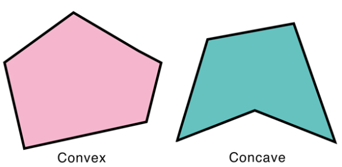
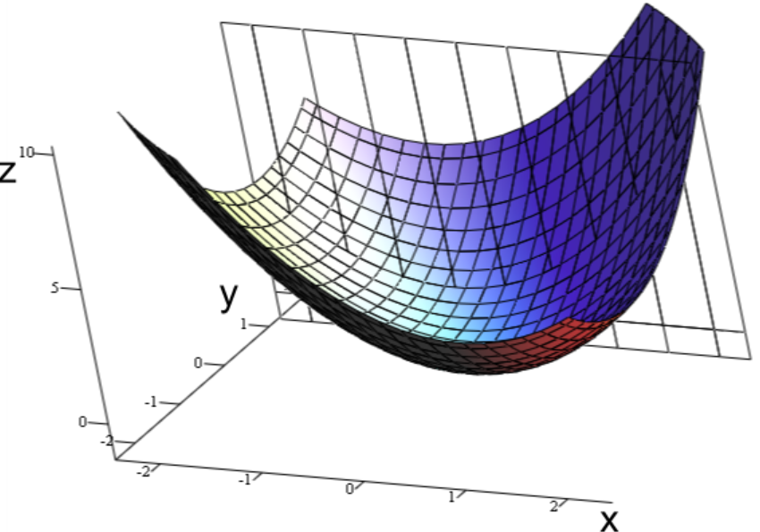

# Convex Optimization

## Convex Set

A subset is a convex set when: given any two points in the subset, the subset contains the whole line segment that joins them. 

Geometrically speaking, it is a convex polygon. The opposite is a concave polygon.

## Convex Function

Given any two points in the subset, a convex subset contains the whole line segment that joins them.

Let $\bold{X}$ be a convex subset of a real vector space and let $f:\bold{X} \rightarrow \mathbb{R}$ be a function.

$f$ is a convex function when
$$
\forall \quad 0 \le t \le 1, \space (x_1, x_2) \in \bold{X}
$$
satisfied
$$
f(tx_1 + (1-t)x_2) \le t f(x_1) + (1-t)f(x_2)
$$

This difenition makes a convex function **monotonic**.

### Example

A graph of the bivariate convex function
$$
z=x^2+xy+y^2
$$

## Convex Optimization

Convex optimization: when an objective function is a convex function and the feasible set is a convex set.

It has one property:

* every local minimum is a global minimum