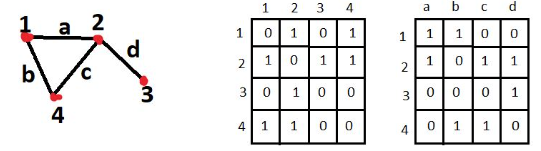
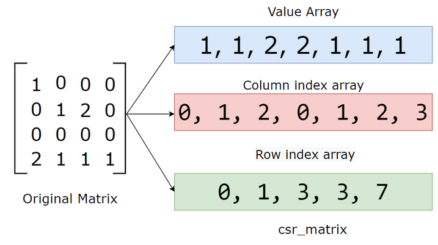

# Graph Optimization

## Graph-related matrices

The left hand side matrix (adjacency matrix) shows topologies of the graph; the right hand side matrix (incidence matrix) shows the edges/events between vertices.



### Adjacency Matrix

An adjacency matrix is a square matrix used to represent a finite graph. The elements of the matrix indicate whether pairs of vertices are adjacent or not in the graph.

### Incidence matrix

An incidence matrix is a logical matrix that shows the relationship between two classes of objects, usually called an incidence relation. 

## Sparse Matrix Optimization

Sparse matrix is a matrix with the majority of entries being zeros. This is an overhead when performing matrix multiplications that zero multiplying any value returns zero.

Given matrix zero entry distributions, there can be many sparse matrix compression methods. One most commonly used is using row's and column's index to represent non-zero entries. 

This method is coined *Compressed Sparse Row* (CSR).



Graph in representation by matrix often results in sparse matrices, since often is that not many graph topoloies see every node in connection to the rest of all nodes. 

This holds truth for many SLAM problems that given a robot's state $\bold{x}_k$ and its constraints $\bold{z}_k$ at the $k$-th timestamp, previous state $\bold{x}_{k-1}$ and earliers' does not necessarily account for future state $\bold{x}_{k+1}$.

## Hyper-Graph Optimization

A hyper-graph is an extension
of a graph where an edge can connect multiple nodes and not only two.

Graph optimization in nature is a least squares minimization problem:
$$
\bold{F}_k(\bold{x})=
arg \space \underset{\bold{x}}{min}
\sum_{k \in C} \bold{e}_k(\bold{x}_k, \bold{z}_k)^\text{T} \Omega_k \bold{e}_k(\bold{x}_k, \bold{z}_k)
$$
where 
* $\bold{x}$ is a vector of parameters, in which $\bold{x}_i$ represents a generic parameter block
* $\bold{x}_k$ represents the set of parameters given the $k$-th constraints, such as the state of a robot at the $k$-th time
* $\bold{z}_k$ is the measurements/observations.
* $\Omega_k$ is the information matrix relating to $\bold{x}_k$, usually defined as inversed covariance matrix about $\bold{x}$ (do not confuse with Fisher information, just some config/constraint parameters to $\bold{x}_k$)
* $\bold{e}_k(\bold{x}_k, \bold{z}_k)$ is a vector error function that measures how well the parameter block $\bold{x}_k$ satifies the observation $\bold{z}_k$

Minimization can be done by Gauss-Newton, Levenber-Marquardt, or dogleg methods.

## G2O implementation example

We want to find the optimal robot state $\bold{x}^s_t$ at the time $t$ given measurements of itself $\bold{z}^s_{t, t+1}$ (transformation measurement such as by odometry) and observation from a number of landmarks $\bold{z}^l_i, i=1,2,...,n$.

### Concepts

* Robot state at the $t$ time: 

$\bold{x}_t^s=(x_t^s, y_t^s, \theta_t^s) \in SE(2)$

* The $i$-th landmark position: 

$\bold{x}^l_i=(x_i^l, y_i^l) \in \mathbb{R}^2$

* Motion measurement between $\bold{x}_{t}^s$ and $\bold{x}_{t+1}^s$: 

$\bold{z}_{t,t+1}^s$ is sensor measured robot state, such as by IMU.

* Inverse covariance of motion measurements: $\Omega^s_{t,t+1} \in \mathbb{R}^{3 \times 3}$

* Motion prediction between $\bold{x}_{t}^s$ and $\bold{x}_{t+1}^s$: 

$$
\bold{h}^s_{t,t+1}(\bold{x}_{t}^s, \bold{x}_{t+1}^s)
=
\bold{x}_{t+1}^s \ominus \bold{x}_{t}^s
$$

where $\ominus$ is defined for $SE(2)$ motion:
$$
\bold{x}_t^s \ominus \Delta\bold{ x}_{t-1,t}^s
=
\bigg(\begin{array}{cc}
    x - \Delta x cos\theta + \Delta y sin\theta\\\
    y - \Delta x sin\theta - \Delta y cos\theta \\
    normAngle(\theta - \Delta\theta)
\end{array}
\bigg)
$$

$\bold{h}^s_{t,t+1}(\bold{x}_{t}^s, \bold{x}_{t+1}^s)$ shows an edge between the two robot states'/vertices.

* Error Function for $\bold{h}^s_{t,t+1}(\bold{x}_{t}^s, \bold{x}_{t+1}^s)$ is
$$
\bold{e}^s_{t,t+1}(\bold{x}_{t}^s, \bold{x}_{t+1}^s)
=
\bold{z}_{t,t+1} \ominus \bold{h}^s_{t,t+1}(\bold{x}_{t}^s, \bold{x}_{t+1}^s)
$$

Intuition: we want to minimize the gap between self-sensored state and computed motion $\Delta \bold{x}$.

* Landmark position observed/expressed at $\bold{x}^s_t$ 

the sensor measured landmark position relative to the current robot state: $\bold{z}^l_{t,i} \in \mathbb{R}^2$

* Inverse covariance of landmark measurements: $\Omega^l_{t,i} \in \mathbb{R}^{2 \times 2}$

* Landmark measurement by motion 

landmark position relative to the current state of a robot, computed by last step motion: 

$$
\begin{align*}
\bold{x}_{i,t}^l 
&= 
\bold{x}_{i,t-1}^l + (\bold{x}_{t}^s \ominus \bold{x}_{t-1}^s)
\\
\bold{h}^l_{t,i}(\bold{x}_{t}^s, \bold{x}_{i}^l)
&=
\bold{x}_{i,t}^l - \bold{x}_{t}^s
\end{align*}
$$

$\bold{h}^l_{t,i}(\bold{x}_{t}^s, \bold{x}_{i}^l)$ shows an edge between a robot state and the $i$-th landmark.

* Error Function for $\bold{h}^l_{t,i}(\bold{x}_{t}^s, \bold{x}_{i}^l)$ is

$$
\bold{e}^l_{t,i}(\bold{x}_{t}^s, \bold{x}_{i}^l)
=
\bold{z}_{t,i} - \bold{h}^l_{t,i}(\bold{x}_{t}^s, \bold{x}_{i}^l)
$$

Intuition: we want to minimize the error/gap between measured landmark distance and motion-based computed distance.

### Code

An error function takes two inputs: $\bold{e}_t(\bold{x}_t, \bold{z}_t)$ for estimation and measurement. They are defined in g2o internal classes `BaseVertex` and `BaseEdge`, respectively. Information $\bold{\Omega}_t$ (defined in `BaseEdge`) should be defined to take into consideration of covariances.

`_estimate`, `_measurement` and `_information` should be set by overriden virtual functions from their base classes.
```cpp
// BaseVertex
void setEstimate(const EstimateType& et) {
  _estimate = et;
}

// BaseEdge
void setMeasurement(const VertexPointXY& m) {
  _measurement = m;
}

// BaseEdge
void setInformation(const InformationType& information) {
    _information = information;
}
```

For optimization, `OptimizableGraph::Edge` has a pure vurtual function `computeError` awaiting being overriden for how you want to customize error calculation. The return errors are stored in `ErrorVector _error;` inside `BaseEdge`.
```cpp
// class BaseVertex
protected:
  EstimateType _estimate;

// class BaseEdge
protected:
  Measurement _measurement;      ///< the measurement of the edge
  InformationType _information;  ///< information matrix of the edge.
                                 ///< Information = inv(covariance)
  ErrorVector _error;  ///< error vector, stores the result after computeError()
                       ///< is called

// class Edge
public:
  virtual void computeError() = 0;
```

* Vertex Type definition

Landmarks $\bold{x}^l_i=(x_i^l, y_i^l)$ is defined as `Eigen::Vector2d`. 

`SE2` is defined for $\bold{x}^s$. `operator`s are customized and used to compute errors, transoformations, etc.
```cpp
class SE2 {
 public:
  SE2() : _R(0), _t(0, 0) {}

  SE2 operator*(const SE2& tr2) const {
    SE2 result(*this);
    result._t += _R * tr2._t;
    result._R.angle() += tr2._R.angle();
    result._R.angle() = normalize_theta(result._R.angle());
    return result;
  }

  SE2& operator*=(const SE2& tr2) {
    _t += _R * tr2._t;
    _R.angle() += tr2._R.angle();
    _R.angle() = normalize_theta(_R.angle());
    return *this;
  }

  Eigen::Vector2d operator*(const Eigen::Vector2d& v) const {
    return _t + _R * v;
  }

  SE2 inverse() const {
    SE2 ret;
    ret._R = _R.inverse();
    ret._R.angle() = normalize_theta(ret._R.angle());
    ret._t = ret._R * (Eigen::Vector2d(-1 * _t));
    return ret;
  }

  Eigen::Vector3d toVector() const {
    Eigen::Vector3d ret;
    for (int i = 0; i < 3; i++) {
      ret(i) = (*this)[i];
    }
    return ret;
  }
};
```

* Vertex definitions

A robot state representation in graph can be defined in `VertexPointSE2`
```cpp
class VertexPointSE2
    : public BaseVertex<3, SE2> {
 public:
  VertexPointSE2(){};

  virtual void setToOriginImpl() { _estimate = SE2(); }

  virtual void oplusImpl(const double* update) {
    SE2 up(update[0], update[1], update[2]);
    _estimate *= up;
  }

  virtual bool read(std::istream& is);
  virtual bool write(std::ostream& os) const;
};
```

Similarly, obstacle/landmark position can be defined in `VertexPointXY`. `_estimate` is `Eigen::Vector2d`
```cpp
class VertexPointXY
    : public BaseVertex<2, Eigen::Vector2d> {
 public:
  VertexPointXY(){};

  virtual void setToOriginImpl() { _estimate.setZero(); }

  virtual void oplusImpl(const double* update) {
    _estimate[0] += update[0];
    _estimate[1] += update[1];
  }

  virtual bool read(std::istream& is);
  virtual bool write(std::ostream& os) const;
};
```

* Edge definitions

$\bold{e}^s_{t,t+1}(\bold{x}_{t}^s, \bold{x}_{t+1}^s)$ can be defined in `EdgeSE2PointSE2`
```cpp
class EdgeSE2PointSE2
    : public BaseBinaryEdge<3, SE2, VertexPointSE2, VertexPointSE2> {
 public:
  EdgeSE2PointSE2(): BaseBinaryEdge<3, SE2, VertexPointSE2, VertexPointSE2>(){};

  void computeError(){
      const VertesPointSE2* v1 = static_cast<const VertexPointSE2*>(_vertices[0]);
      const VertesPointSE2* v2 = static_cast<const VertexPointSE2*>(_vertices[1]);
      SE2 delta = _measurement.inverse() * v1->estimate().inverse() * v2->estimate();
      _error = delta.toVector();
    }
};
```

$\bold{e}^l_{t,i}(\bold{x}_{t}^s, \bold{x}_{i}^l)$ is defined `EdgeSE2PointXY`.
```cpp
class EdgeSE2PointXY
    : public BaseBinaryEdge<2, Eigen::Vector2d, VertexPointSE2, VertexPointXY> {
 public:
  EdgeSE2PointXY(): BaseBinaryEdge<2, Vector2d, VertexSE2, VertexPointXY>(){};

  void computeError(){
    const VertesPointSE2* v1 = static_cast<const VertexPointSE2*>(_vertices[0]);
    const VertexPointXY* l2 = static_cast<const VertexPointXY*>(_vertices[1]);
    _error = (v1->estimate().inverse() * l2->estimate()) - _measurement;
  }
};
```

* Simulatioin generating fake data

Measurements are under the assumption of white Gaussian noise, hence reasonable being expressed by covariances.

For example, for landmark observation simulation, the information matrix is defined with its diagonal entries fiilled with Gaussian noises.
```cpp
Matrix2d covariance;
covariance.fill(0.);
covariance(0, 0) = landmarkNoise[0] * landmarkNoise[0];
covariance(1, 1) = landmarkNoise[1] * landmarkNoise[1];
Matrix2d information = covariance.inverse();

for (int i = 0; i < poses.size(); i++){
  for (int j = 0; j < landmarks.size(); j++){
    const GridPose& p = poses[i];
    Landmark* l = p.landmarks[j];

    Vector2d trueObservation = (p.truePose * sensorOffset).inverse() * l->truePose;
    Vector2d observation = trueObservation;
    observation[0] += Sampler::gaussRand(0., landmarkNoise[0]);
    observation[1] += Sampler::gaussRand(0., landmarkNoise[1]);

    _landmarkObservations.push_back(LandmarkEdge());
    LandmarkEdge& le = _landmarkObservations.back();
    le.from = p.id;
    le.to = l->id;
    le.trueMeas = trueObservation;
    le.simulatorMeas = observation;
    le.information = information;
  }
}
```

* Setup and running for optimization

```cpp
// setup and choose a solver
SparseOptimizer optimizer;
auto linearSolver = g2o::make_unique<SlamLinearSolver>();
linearSolver->setBlockOrdering(false);
OptimizationAlgorithmGaussNewton* solver =
    new OptimizationAlgorithmGaussNewton(
        g2o::make_unique<SlamBlockSolver>(std::move(linearSolver)));
optimizer.setAlgorithm(solver);

// poses as vertices added to the graph
for (size_t i = 0; i < simulator.poses().size(); ++i) {
  const Simulator::GridPose& p = simulator.poses()[i];
  const SE2& t = p.simulatorPose;
  VertexSE2* robot = new VertexSE2;
  robot->setId(p.id);
  robot->setEstimate(t);
  optimizer.addVertex(robot);
}

// odom as edges added to the graph
for (size_t i = 0; i < simulator.odometry().size(); ++i) {
  const Simulator::GridEdge& simEdge = simulator.odometry()[i];

  EdgeSE2* odometry = new EdgeSE2;
  odometry->vertices()[0] = optimizer.vertex(simEdge.from);
  odometry->vertices()[1] = optimizer.vertex(simEdge.to);
  odometry->setMeasurement(simEdge.simulatorTransf);
  odometry->setInformation(simEdge.information);
  optimizer.addEdge(odometry);
}

// landmark as vertices added to the graph
for (size_t i = 0; i < simulator.landmarks().size(); ++i) {
  const Simulator::Landmark& l = simulator.landmarks()[i];
  VertexPointXY* landmark = new VertexPointXY;
  landmark->setId(l.id);
  landmark->setEstimate(l.simulatedPose);
  optimizer.addVertex(landmark);
}

// landmark observations (such as by lidar or vision) added to the graph
// simulator.landmarkObservations()[i].from is robot state
// simulator.landmarkObservations()[i].to is landmark position
for (size_t i = 0; i < simulator.landmarkObservations().size(); ++i) {
  const Simulator::LandmarkEdge& simEdge =
      simulator.landmarkObservations()[i];
  EdgeSE2PointXY* landmarkObservation = new EdgeSE2PointXY;
  landmarkObservation->vertices()[0] = optimizer.vertex(simEdge.from);
  landmarkObservation->vertices()[1] = optimizer.vertex(simEdge.to);
  landmarkObservation->setMeasurement(simEdge.simulatorMeas);
  landmarkObservation->setInformation(simEdge.information);
  landmarkObservation->setParameterId(0, sensorOffset->id());
  optimizer.addEdge(landmarkObservation);
}

// run the optimizer with 10 iterations
optimizer.initializeOptimization();
optimizer.optimize(10);

// free this optimizer
optimizer.clear();
```