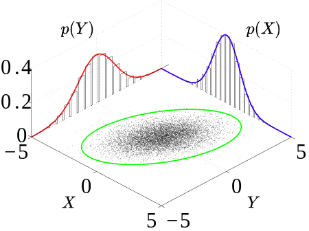

# Probability density function

A probability density function (PDF), or density of a continuous random variable, is a function whose value at any given sample (or point) in the sample space (the set of possible values taken by the random variable) can be interpreted as providing a relative likelihood that the value of the random variable would be close to that sample.

## Joint probability distribution

### Marginal probability distribution

$$
f_{X}(x) = \int f_{X,Y}(x,y)dy
\\
f_{Y}(x) = \int f_{X,Y}(x,y)dx
$$

## Product of PDF

reference:
https://www.mariushobbhahn.com/2021-04-29-RV_vs_pdf/