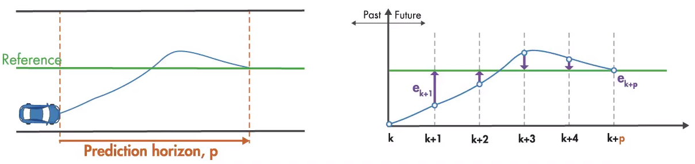

# Model Predictive Control (MPC)

MPC optimizes/adjusts near future inputs $[u_{k+1}, u_{k+2}, u_{k+3}, ...]$ to make a robot/car approach to its goal/reference as fast as possible by minimizing reference error $[e_{k+1}, e_{k+2}, e_{k+3}, ...]$, given a number of constraints such as no abrupt changes on input ($\Delta u$ should be small)

Given a linear system:
$$
\begin{align*}
x(t+1)&=Ax(t)+Bu(t)
\\
e(t)&=y(t)-x(t)
\end{align*}
$$
where 

* $A$ is the state update matrix on the current robot state $x(t)$
* $B$ is the transformation for unit input $u(t)$
* $e(t)$ is the error/gap given expected/goal state $y(t)$ and the current state $x(t)$

Define an objective function $J$ to be minimized
$$
arg \space \underset{u}{min} \space J
=
\sum_{i=1}^N w_{x_i}e_i^2
+
\sum_{i=1}^N w_{u_i}\Delta u_i^2
$$
where $w_{x_i}$ and $w_{u_i}$ are wight coefficients. $N$ is the number of future inputs to take into consideration.

This objective function talks about two items:

1.  The sum of $N$ future errors $e_{i, i=1,2,3,...N}$ should be kept small
2. There should be no sudden changes on input action $u$