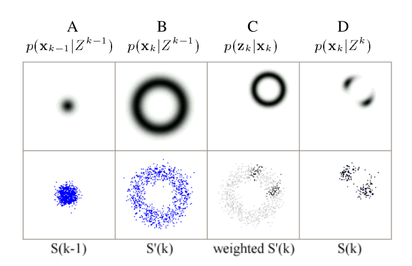

# Lidar Localization - AMCL Adaptive Monte Carlo Localization

Localization problem is described as estimating a posterior belief of the robot’s pose at present moment conditioned on the whole history of available data.
Generic Problem
For a 2-d localization problem, to estimate the state of the robot at the current time-step $k$. Given knowledge about the initial state $x_0$ and all measurements $z^k = \{ Z_k, i = 1:k \}$, to work out $\bold{x}=[x,y,\theta]^T$

we are interested in constructing the posterior density $p ( x_k | Z_k )$ of the current state conditioned on all
measurements.

## Localization Problem Generalization

### Prediction

$$
p(\bold{x}_k | Z^{k-1}) = \int p(\bold{x_k}|\bold{x}_{k-1}, \bold{u}_{k-1}) p(\bold{x}_{k-1}|Z^{k-1}) d{\bold{x}_{k-1}}
$$

where
$p(\bold{x_k}|\bold{x}_{k-1}, \bold{u}_{k-1})$ is motion/transformation model Probability Density Function (PDF) for $\bold{x}_k$, that takes control input $\bold{u}_{k-1}$ on previous state $\bold{x}_{k-1}$. 

$p(\bold{x}_{k-1}|Z^{k-1})$ is the previous state PDF. $p(\bold{x_k}|\bold{x}_{k-1}, \bold{u}_{k-1}) p(\bold{x}_{k-1}|Z^{k-1})$ is a two dimensional distribution over $\bold{x}_k$ and $\bold{x}_{k-1}$, $\int$ is to sum up the marginalized distribution to only one dimension distribution $\bold{x}_k$.

### Update

$$
p(\bold{x_k}|Z^k) = \frac{p(\bold{z_k}|\bold{x_k})p(\bold{x_k}|Z^{k-1})}{p(\bold{z}_k|Z^{k-1})}
$$

where, $\bold{z}_k$ is the sensor measurement data. $p(\bold{z}_k|Z^{k-1})$ is same as $p(\bold{z}_k)$ since each sensor measurement is independently from its previous. 

Measurement model is given in terms of a likelihood $p ( \bold{z}_k | \bold{x}_k )$ , describing the likelihood that a robot is at $\bold{x}_k$ given observation $\bold{z}_k$.

## Monte Carlo Localization

In sampling-based methods one represents the density $p ( \bold{x}_k | Z^k )$ by a set of $N$ random samples or particles $S_k = \{ s^i_k ; i = 1,2, ..., N \}$ drawn from it.

### Example

* A

The previous state $p(\bold{x}_{k-1}|Z^{k-1})$ is recorded in PDF represented as a black continuous dot, and by Monte Carlo it is discretized to $N$ blue samples $S_{k-1}$.

* B

Now the motion model says the robot moved $1$ meter away from the last state.

* C

Observation $\bold{z}_k$ says the robot is nearer to a top-right corner landmark (about $0.5$ meter)

* D

Combine the information from step B and C, $p(\bold{z_k}|\bold{x_k})p(\bold{x_k}|Z^{k-1})$ gives the estimations of the sampled states $\bold{x}_k$

## Adaptive Monte Carlo Localization

"Adaptive" here means using an adaptive particle filter which converges much faster and is computationally much more efficient than a basic particle filter.

It uses KL-Distance to measure the relative entropy between true posterior $p$ and max likelihood estimated probability $\hat{p}$, and make sure that the relative entropy is smaller than a threshold $\epsilon$. Otherwise, the number of particles should increase.