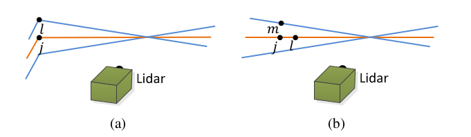
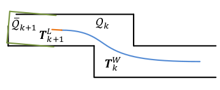

# LOAM: Lidar Odometry and Mapping

## IMU as Prior

IMU orientation is obtained by integrating angular rates from a gyro and readings from an accelerometer in a Kalman filter. 

Point clouds are first transformed with IMU's motion estimation before any further computation.

## Lidar Odometry

Define every scan sweep as $k, k \in Z^+$.

Define Lidar coordinate system in which each point $i, i \in P_k$ is part of point cloud $P_k$, $i$ in this coordinate is denoted as $\bold{X}^L_{(k,i)}$

Accordingly, in the world coordinate, $i$ is denoted as $\bold{X}^W_{(k,i)}$

Let $S$ be the set of consecutive points of $i$ returned by the laser scanner in
the same scan.

### Point Cloud Feature Extraction

This step is to find planes and edges of scanned obstacles.

Define a term $c$ to evaluate the smoothness of local surface
$$
c=\frac{1}{|S|\cdot||\bold{X}^L_{(k,i)}||}
\big|\big|
\sum_{j \in S, j\ne i} (\bold{X}^L_{(k,i)}-\bold{X}^L_{(k,j)})
\big|\big|
$$
where large/max values of $c$ indicate edges, small/minimum values of $c$ indicate planes.

In other words, point curvatures are computed to determine if this point is part of planar or edge. 

### Feature Point Correspondance

Let $t_k$ be the starting time of a sweep $k$. By the end of the sweep, received point cloud $P_k$ is reprojected (here denoted as $\overline{P}_k$) to timestamp $t_{k+1}$.

The difference between $P_k$ and $\overline{P}_k$ is that during this sweep $k$, robot is moving (movement defined by a transformation matrix $T^L_k$), hence $\overline{P}_k=T^L_k P_k$.

Let $E_k$ and $H_k$ be the source sets of edge points and planar points after a sweep $k$, respectively. Reprojection sets are denoted as and $\tilde{E}_k$ and $\tilde{H}_k$, accordingly.

During each sweep $k$, there are multiple scans.

* Edge Feature Detection

For edge feature detection, Let $i, i \in \tilde{E}_k$, its two consecutive scan closest neighbour points are $j, l$.

Figure (a) shows scan detection of an edge (notice there are twist points $l, j \in E_k$ in different scans).

The distance of $i$ to its two neighbour points are computed by

$$
d_{i, E} = \frac
{\big|
    (\tilde{\bold{X}}^L_{(k+1, i)} - \overline{\bold{X}}^L_{(k, j)}) 
        \times
    (\tilde{\bold{X}}^L_{(k+1, i)} - \overline{\bold{X}}^L_{(k, l)})
\big|}
{\big|
    \tilde{\bold{X}}^L_{(k, j)} - \overline{\bold{X}}^L_{(k, l)}
\big|}
$$

* Planar Feature Detection

For planar feature detection, Let $i, i \in \tilde{H}_k$, and it has neighbour points: $j, l$ are two on the same scan, $m$ on another scan.

Figure (b) shows planar feature scans (all $m, j, l \in H_k$ are on a shared plane, $j, l$ share a same scan, $m$ on another).

The distance of $i$ to its three neighbour points are computed by

$$
d_{i, H} = \frac
{\bigg|
    \begin{array}{c}
    (\tilde{\bold{X}}^L_{(k+1, i)} - \overline{\bold{X}}^L_{(k, j)}) 
    \\
    \big(
        (\tilde{\bold{X}}^L_{(k, j)} - \overline{\bold{X}}^L_{(k, l)}) 
        \times
        (\tilde{\bold{X}}^L_{(k, j)} - \overline{\bold{X}}^L_{(k, m)})
    \big)
    \end{array}
\bigg|}
{\big|
    (\tilde{\bold{X}}^L_{(k, j)} - \overline{\bold{X}}^L_{(k, l)}) 
        \times
        (\tilde{\bold{X}}^L_{(k, j)} - \overline{\bold{X}}^L_{(k, m)})
\big|}
$$

Notice here $i$ is chosen from the $k+1$ sweep's point cloud $P_{k+1}$, $t_i \in [t_{k+1}, t_{k+2})$ while $j, l, m$ are from $\overline{P}_k$. $\overline{P}_k$ is the reprojected point cloud at $t_{k+1}$ ($t_l = t_{k+1}, t_j = t_{k+1}, t_m = t_{k+1}$).

### Motion Estimation

We want to do linear interpolation the pose transform within a sweep for the points that are received at different times by minimizing $d_E$ and $d_H$.

Let $T^L_{k+1} = [t_x, t_y, t_z, \theta_x, \theta_y, \theta_z]^T$ be the lidar pose transform for 3-d translation $[t_x, t_y, t_z]^T$ and rotation $[\theta_x, \theta_y, \theta_z]^T$ bewteen the time range $[t_{k+1}, t_k]$

For a point $i, i \in P_{k+1}$ that is received by lidar sensor machine by a fixed interval between neighbour points, there exists a linear mapping relationship for this point $i, i \in P_{k+1}$:
$$
T^L_{(k+1, i)}
=
\frac{t_i-t_{k+1}}{t-t_{k+1}}T^L_{k+1}
$$

Define an objective function $\bold{f}$ to minimize distances
$$
\bold{f}(T^L_{k+1})=\bold{d}
$$
where each row of $\bold{f}$ corresponds to a feature point either $i \in H_{k+1}$ or $i \in E_{k+1}$ with respect to distance $d_i$.

Jacobian $\bold{J}$ is computed for $\bold{f}$, where 
$$
\bold{J}=\frac{\partial \bold{f}}{\partial T^L_{k+1}}
$$

We want to minimize $\bold{d}$:

$$
arg \space \underset{T^L_{k+1}}{min} \space \bold{d}
$$

by Levenberg-Marquardt method
$$
T^L_{k+1} \leftarrow
T^L_{k+1}-\big(\bold{J}^T \bold{J} + \lambda diag(\bold{J}^T \bold{J})\big)^{-1}\bold{J}^T \bold{d}
$$

## Lidar Mapping

Define $T^W_k$ (indicated as the blue curve) as the transformation from origin to robot's pose at the time $t_{k+1}$, $Q_k$ is the point cloud over the history path. till $t_{k+1}$.

After the applied transformation $T^L_{k+1}$, $\overline{Q}_{k+1}$ (indicated as blue lines) is the mapped point cloud.

The goal if to best fit $\overline{Q}_{k+1}$ to $Q_k$ by feature points (edge and planar points) rendering minimized distances $d_E$ and $d_H$ by optimizing $T^W_{k+1}$ with again Levenberg-Marquardt method.

Mapping uses ten times of the number of points that are selected when dealing with odometry computation.

